# Design Document: Unified Identity Control Plane (UICP) — Enterprise Edition v2

## 1. Overview

The Unified Identity Control Plane (UICP) is a production-grade, multi-tenant identity and access management platform built with TypeScript and NestJS. It implements Hexagonal Architecture (Ports & Adapters) combined with CQRS, Event Sourcing, and the Transactional Outbox Pattern to deliver a fully DB-agnostic, zero-trust identity system capable of handling enterprise-scale authentication, authorization, session management, and security operations.

The system is designed around four core principles: **correctness** (formal domain invariants enforced via Value Objects and Aggregates with event sourcing), **resilience** (circuit breakers, distributed locking, adaptive tuning, bulkheads), **observability** (OpenTelemetry traces, Prometheus metrics, structured Pino logging with CLS correlation), and **security** (field-level AES-256-GCM encryption, HMAC-based searchable encryption, peppered credentials, zero-trust ABAC).

### 1.1 System Capabilities Matrix

| Capability | In Scope | Out of Scope |
|---|---|---|
| Multi-tenant user identity management | ✅ | Single-tenant only deployments |
| Email + phone credential authentication | ✅ | Biometric authentication |
| OAuth 2.0 / OIDC social login (Google, GitHub, Apple) | ✅ | SAML 2.0 IdP federation |
| MFA via OTP (email/SMS) | ✅ | Hardware TOTP (FIDO2/WebAuthn) |
| JWT access + refresh token lifecycle | ✅ | Opaque token introspection |
| ABAC policy engine with JIT compilation | ✅ | XACML policy language |
| UEBA threat scoring + SOC alerting | ✅ | ML-based anomaly detection |
| Distributed session management (Redis) | ✅ | Browser cookie session management |
| Field-level AES-256-GCM encryption | ✅ | Homomorphic encryption |
| Transactional Outbox + Event Sourcing | ✅ | Kafka event streaming |
| DB-agnostic via adapter pattern | ✅ | NoSQL document stores |
| Horizontal scaling (stateless pods) | ✅ | Vertical scaling only |
| Adaptive bcrypt/argon2id tuning | ✅ | Static credential hashing |
| Impossible travel detection (local GeoIP) | ✅ | Real-time IP reputation feeds |
| Audit log immutability + HMAC integrity | ✅ | Blockchain-based audit trails |

### 1.2 Tenant Isolation Model

The UICP enforces strict data plane / control plane separation:

- **Control Plane**: Tenant provisioning, plan management, policy configuration. Operates on the `tenants` table with no cross-tenant joins.
- **Data Plane**: All user, identity, session, credential, and audit data. Every table carrying user data includes `tenant_id` as a partition key and every query includes `WHERE tenant_id = ?` as a mandatory predicate enforced at the repository layer.
- **Isolation Enforcement**: The `TenantId` value object is injected into every repository method signature. Repository implementations MUST include `tenant_id` in all WHERE clauses. Integration tests verify that a query with `tenantId=A` cannot return rows belonging to `tenantId=B` even when row IDs are known.
- **Encryption Isolation**: Each tenant's sensitive fields are encrypted with a context key derived from `HKDF(masterKey, tenantId || context)`, meaning a key compromise for one context cannot decrypt another tenant's data.

### 1.3 SLA Targets

| Operation | p50 | p95 | p99 | Throughput Target |
|---|---|---|---|---|
| Token validation (JWT, no DB) | 2ms | 5ms | 10ms | 10,000 RPS |
| Login (full flow) | 80ms | 200ms | 400ms | 500 RPS |
| Signup | 120ms | 300ms | 600ms | 200 RPS |
| Refresh token rotation | 20ms | 60ms | 120ms | 2,000 RPS |
| OTP verify | 15ms | 40ms | 80ms | 1,000 RPS |
| ABAC policy evaluation (cached) | 1ms | 3ms | 8ms | 20,000 RPS |
| Session read (Redis hit) | 1ms | 3ms | 6ms | 15,000 RPS |
| Audit log write (async outbox) | 5ms | 15ms | 30ms | 5,000 RPS |

**Availability Target**: 99.99% (52 minutes downtime/year). Achieved via: multi-replica deployment, Redis Sentinel/Cluster, MySQL read replicas, circuit breakers with fallback, graceful shutdown with 25s drain window.

### 1.4 Scalability Model

- **Stateless Services**: All application state lives in Redis (sessions, locks, rate limit counters, OTP codes) or MySQL (persistent data). NestJS pods carry zero in-memory state that cannot be lost on restart.
- **Horizontal Scaling**: HPA scales pods based on CPU (70% threshold) and custom metrics (`uicp_request_queue_depth`). Minimum 2 replicas for HA; maximum 20 replicas.
- **Redis Cluster Topology**: 3 primary shards × 1 replica each (6 nodes total). Hash slots distributed evenly. Lua scripts use `KEYS` on single-slot operations only. Session keys use `{userId}` hash tags to co-locate user's sessions on one shard.
- **DB Read Replicas**: 1 primary (writes) + 2 read replicas (reads). Replica lag monitored; queries requiring strong consistency (token rotation, OTP consume) always route to primary.
- **Outbox SKIP LOCKED**: Multiple pods can poll the outbox table concurrently without duplicate processing. Each pod acquires a row-level lock via `SELECT ... FOR UPDATE SKIP LOCKED`.

### 1.5 Technology Decision Rationale

| Decision | Chosen | Alternatives Considered | Rationale |
|---|---|---|---|
| Framework | NestJS | Express standalone, Fastify standalone | NestJS provides DI container, module system, interceptors, guards, pipes — all required for clean hexagonal architecture. Express/Fastify standalone require manual wiring of all these concerns. |
| Primary DB | MySQL 8.0 | PostgreSQL, CockroachDB | MySQL 8.0 has superior `SKIP LOCKED` support, `BINARY(16)` UUID storage, and `PARTITION BY HASH` for tenant sharding. PostgreSQL is equally valid; adapter pattern makes swap trivial. |
| Queue | BullMQ | AWS SQS, RabbitMQ | BullMQ runs on Redis (already a dependency), provides job priorities, rate limiting, and repeatable jobs without additional infrastructure. SQS adds AWS vendor lock-in; RabbitMQ adds operational complexity. |
| Encryption | node:crypto (AES-256-GCM + HKDF) | AWS KMS, HashiCorp Vault | Local crypto avoids external API latency on every encrypt/decrypt call. KMS/Vault are valid for key management but add 5-20ms per operation. Envelope encryption pattern bridges both worlds. |
| JWT Algorithm | RS256 (RSA-4096) | HS256, ES256 | RS256 allows any downstream service to verify tokens using only the public key (JWKS endpoint) without sharing a secret. ES256 is equally valid but RS256 has broader library support. |
| GeoIP | MaxMind GeoLite2 (local) | ip-api.com, ipstack | Local DB eliminates external API dependency, latency, and rate limits. GeoLite2 accuracy is sufficient for impossible travel detection (city-level). |
| Logging | Pino | Winston, Bunyan | Pino is the fastest Node.js logger (2-5x faster than Winston). NDJSON output integrates directly with log aggregators. |
| Tracing | OpenTelemetry | Datadog APM, New Relic | OTel is vendor-neutral. Exporters can be swapped (Jaeger, Zipkin, OTLP) without code changes. |


---

## 2. Architecture

### 2.1 Full Directory / File Structure

```
src/
├── main.ts                          # Bootstrap, graceful shutdown
├── app.module.ts                    # Root module
│
├── domain/                          # Pure TypeScript — zero framework imports
│   ├── value-objects/
│   │   ├── user-id.vo.ts
│   │   ├── tenant-id.vo.ts
│   │   ├── identity-id.vo.ts
│   │   ├── session-id.vo.ts
│   │   ├── token-id.vo.ts
│   │   ├── email.vo.ts
│   │   ├── phone-number.vo.ts
│   │   ├── raw-password.vo.ts
│   │   └── abac-condition.vo.ts
│   ├── aggregates/
│   │   ├── user.aggregate.ts        # User + Identity aggregate root
│   │   └── session.aggregate.ts
│   ├── entities/
│   │   ├── identity.entity.ts
│   │   ├── credential.entity.ts
│   │   └── device.entity.ts
│   ├── events/
│   │   ├── user-created.event.ts
│   │   ├── user-activated.event.ts
│   │   ├── user-suspended.event.ts
│   │   ├── identity-linked.event.ts
│   │   ├── identity-verified.event.ts
│   │   ├── session-created.event.ts
│   │   ├── session-revoked.event.ts
│   │   ├── login-succeeded.event.ts
│   │   ├── login-failed.event.ts
│   │   ├── token-refreshed.event.ts
│   │   ├── token-reuse-detected.event.ts
│   │   ├── otp-verified.event.ts
│   │   ├── password-changed.event.ts
│   │   └── threat-detected.event.ts
│   ├── services/
│   │   ├── auth-policy.domain-service.ts
│   │   └── abac-policy.domain-service.ts
│   └── exceptions/
│       ├── domain.exception.ts
│       └── domain-error-codes.ts
│
├── application/                     # Use cases — orchestrates domain + ports
│   ├── ports/
│   │   ├── driven/
│   │   │   ├── i-user.repository.ts
│   │   │   ├── i-identity.repository.ts
│   │   │   ├── i-session.store.ts
│   │   │   ├── i-token.repository.ts
│   │   │   ├── i-event-store.ts
│   │   │   ├── i-outbox.repository.ts
│   │   │   ├── i-abac-policy.repository.ts
│   │   │   ├── i-alert.repository.ts
│   │   │   ├── i-encryption.port.ts
│   │   │   ├── i-otp.port.ts
│   │   │   ├── i-cache.port.ts
│   │   │   ├── i-queue.port.ts
│   │   │   ├── i-metrics.port.ts
│   │   │   ├── i-tracer.port.ts
│   │   │   └── i-lock.port.ts
│   │   └── injection-tokens.ts
│   ├── commands/
│   │   ├── signup-email/
│   │   │   ├── signup-email.command.ts
│   │   │   └── signup-email.handler.ts
│   │   ├── login/
│   │   │   ├── login.command.ts
│   │   │   └── login.handler.ts
│   │   ├── refresh-token/
│   │   │   ├── refresh-token.command.ts
│   │   │   └── refresh-token.handler.ts
│   │   ├── verify-otp/
│   │   │   ├── verify-otp.command.ts
│   │   │   └── verify-otp.handler.ts
│   │   ├── logout/
│   │   │   ├── logout.command.ts
│   │   │   └── logout.handler.ts
│   │   ├── logout-all/
│   │   │   ├── logout-all.command.ts
│   │   │   └── logout-all.handler.ts
│   │   ├── oauth-callback/
│   │   │   ├── oauth-callback.command.ts
│   │   │   └── oauth-callback.handler.ts
│   │   ├── change-password/
│   │   │   ├── change-password.command.ts
│   │   │   └── change-password.handler.ts
│   │   └── rotate-keys/
│   │       ├── rotate-keys.command.ts
│   │       └── rotate-keys.handler.ts
│   ├── queries/
│   │   ├── get-user/
│   │   ├── get-user-sessions/
│   │   ├── list-audit-logs/
│   │   ├── get-threat-history/
│   │   ├── get-jwks/
│   │   └── validate-token/
│   ├── sagas/
│   │   └── identity-verification.saga.ts
│   └── services/
│       ├── credential.service.ts
│       ├── token.service.ts
│       ├── session.service.ts
│       ├── otp.service.ts
│       ├── distributed-lock.service.ts
│       └── idempotency.service.ts
│
├── infrastructure/                  # Adapters — implements ports
│   ├── db/
│   │   ├── mysql/
│   │   │   ├── mysql.module.ts
│   │   │   ├── mysql-user.repository.ts
│   │   │   ├── mysql-identity.repository.ts
│   │   │   ├── mysql-session.repository.ts
│   │   │   ├── mysql-token.repository.ts
│   │   │   ├── mysql-event-store.repository.ts
│   │   │   ├── mysql-outbox.repository.ts
│   │   │   ├── mysql-abac-policy.repository.ts
│   │   │   └── mysql-alert.repository.ts
│   │   └── postgres/
│   │       └── (mirror of mysql/ structure)
│   ├── cache/
│   │   └── redis-cache.adapter.ts
│   ├── session/
│   │   └── redis-session.store.ts
│   ├── queue/
│   │   ├── bullmq-queue.adapter.ts
│   │   └── workers/
│   │       ├── otp-send.worker.ts
│   │       ├── audit-write.worker.ts
│   │       ├── soc-alert.worker.ts
│   │       └── outbox-relay.worker.ts
│   ├── encryption/
│   │   └── aes256-gcm.encryption.adapter.ts
│   ├── otp/
│   │   ├── firebase-otp.adapter.ts
│   │   └── smtp-otp.adapter.ts
│   ├── geo/
│   │   └── maxmind-geo.adapter.ts
│   ├── metrics/
│   │   └── prom-client.metrics.adapter.ts
│   ├── tracing/
│   │   └── otel-tracer.adapter.ts
│   └── lock/
│       └── redis-lock.adapter.ts
│
├── interface/                       # Driving adapters
│   ├── http/
│   │   ├── controllers/
│   │   │   ├── auth.controller.ts
│   │   │   ├── session.controller.ts
│   │   │   ├── user.controller.ts
│   │   │   ├── admin.controller.ts
│   │   │   └── jwks.controller.ts
│   │   ├── guards/
│   │   │   ├── jwt-auth.guard.ts
│   │   │   └── tenant.guard.ts
│   │   ├── interceptors/
│   │   │   ├── idempotency.interceptor.ts
│   │   │   ├── cls-context.interceptor.ts
│   │   │   └── response-envelope.interceptor.ts
│   │   ├── pipes/
│   │   │   └── zod-validation.pipe.ts
│   │   └── filters/
│   │       └── global-exception.filter.ts
│   ├── grpc/
│   │   ├── auth.grpc.handler.ts
│   │   └── token-validate.grpc.handler.ts
│   └── ws/
│       └── soc-dashboard.gateway.ts
│
└── shared/
    ├── cls/
    │   └── cls.module.ts
    ├── config/
    │   └── config.module.ts
    └── utils/
        ├── timing-safe-equal.ts
        └── haversine.ts
```

### 2.2 Module Dependency Graph

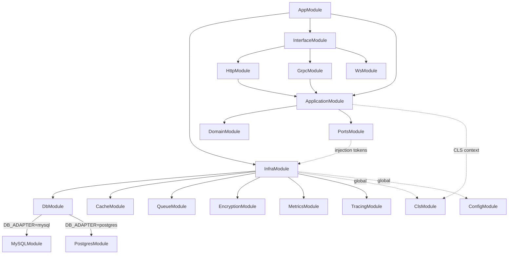

### 2.3 Request Lifecycle Diagram

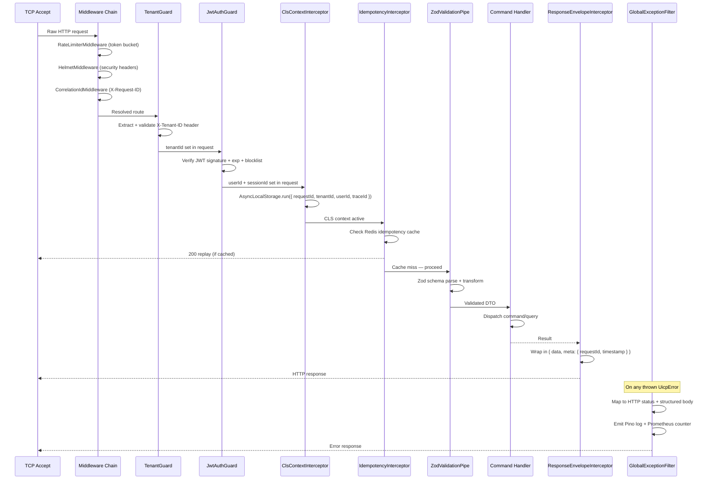

### 2.4 CLS Context Propagation Diagram

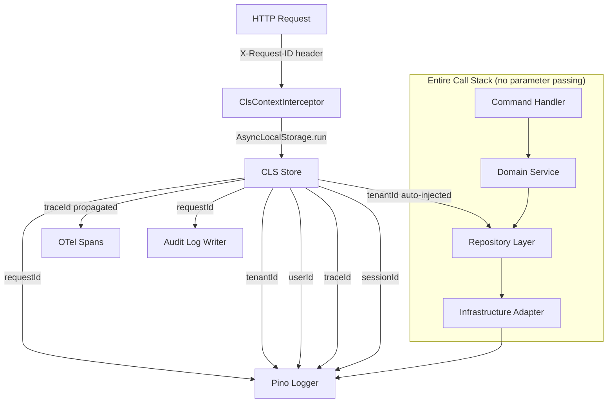

All components access `ClsService.get('tenantId')` directly — no need to thread `tenantId` through every function parameter. The CLS store is populated once per request in the interceptor and is available throughout the entire async call stack via `AsyncLocalStorage`.

### 2.5 Outbox Pattern Flow Diagram

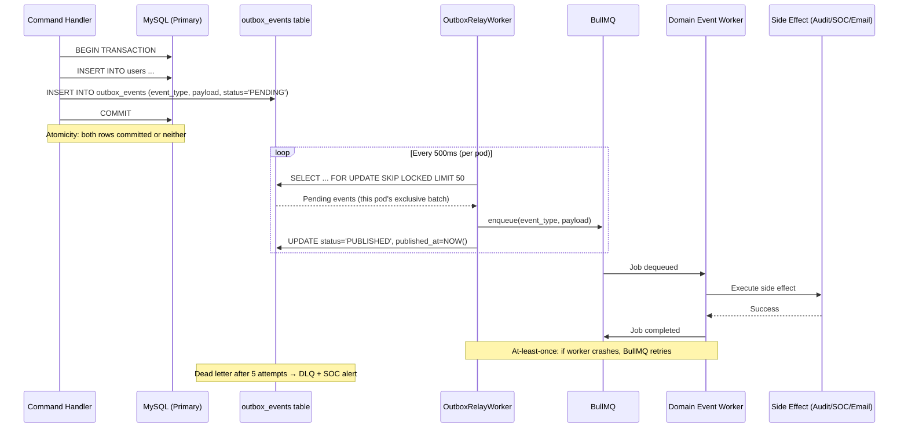

### 2.6 Event Sourcing Replay Diagram

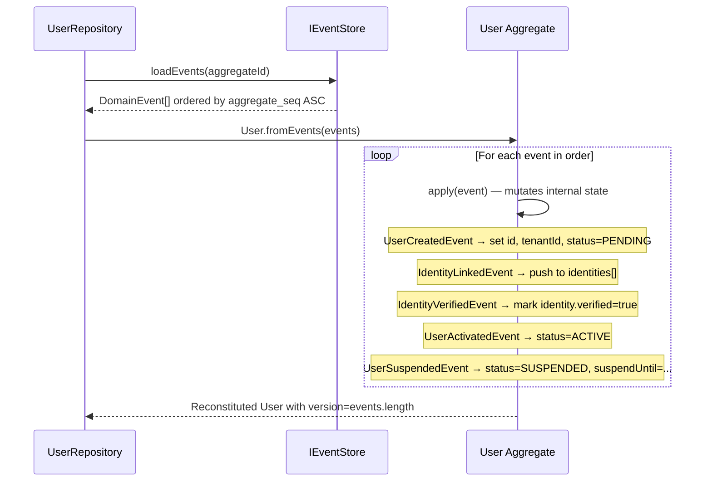

### 2.7 Multi-Replica Deployment Diagram

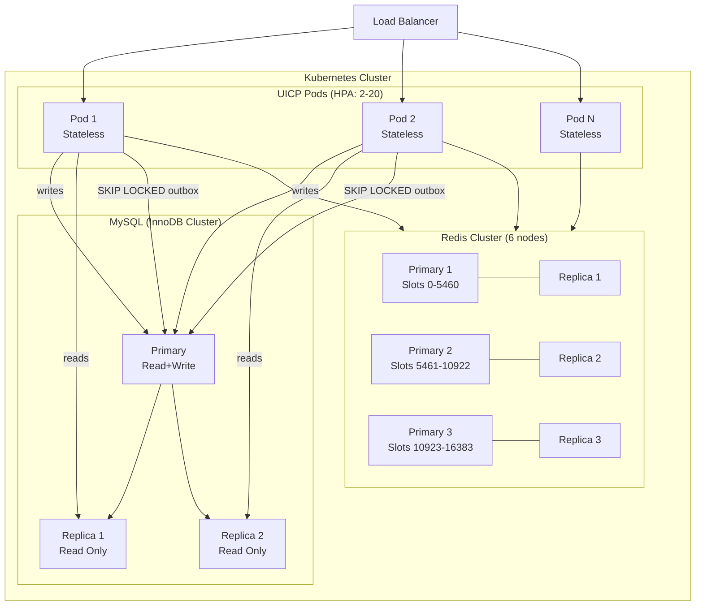


---

## 3. Domain Layer

### 3.1 Value Objects

```typescript
// ── TenantId ──────────────────────────────────────────────────────────────
class TenantId {
  private constructor(private readonly value: string) {}
  static create(): TenantId                          // generates UUID v4
  static from(value: string): TenantId               // validates UUID format
  static fromOptional(v?: string): TenantId | undefined
  equals(other: TenantId): boolean
  toString(): string
  // Invariants: must be valid UUID v4; throws DomainException(INVALID_TENANT_ID)
}

// ── IdentityId ────────────────────────────────────────────────────────────
class IdentityId {
  private constructor(private readonly value: string) {}
  static create(): IdentityId
  static from(value: string): IdentityId
  equals(other: IdentityId): boolean
  toString(): string
}

// ── SessionId ─────────────────────────────────────────────────────────────
class SessionId {
  private constructor(private readonly value: string) {}
  static create(): SessionId
  static from(value: string): SessionId
  equals(other: SessionId): boolean
  toString(): string
}

// ── TokenId ───────────────────────────────────────────────────────────────
class TokenId {
  private constructor(private readonly value: string) {}
  static create(): TokenId                           // UUID v4 used as JWT jti
  static from(value: string): TokenId
  toString(): string
}

// ── Email ─────────────────────────────────────────────────────────────────
class Email {
  private constructor(private readonly value: string) {}
  static create(raw: string): Email
  // Invariants:
  //   - RFC 5322 regex match
  //   - max 320 chars
  //   - lowercased + trimmed
  //   - domain not in disposable-email-domains list (10K+ domains)
  //   - throws DomainException(INVALID_EMAIL)
  getValue(): string
  getDomain(): string
  toHmacInput(): string                              // normalized form for HMAC
}

// ── PhoneNumber ───────────────────────────────────────────────────────────
class PhoneNumber {
  private constructor(private readonly value: string) {}
  static create(raw: string): PhoneNumber
  // Invariants:
  //   - E.164 format: +[1-3 digit country code][4-14 digits]
  //   - total length 8-15 digits after +
  //   - throws DomainException(INVALID_PHONE_NUMBER)
  getValue(): string
  getCountryCode(): string
}

// ── RawPassword ───────────────────────────────────────────────────────────
class RawPassword {
  private constructor(private readonly value: string) {}
  static create(raw: string): RawPassword
  // Invariants:
  //   - min 10 chars, max 128 chars
  //   - ≥1 uppercase letter
  //   - ≥1 lowercase letter
  //   - ≥1 digit
  //   - ≥1 special character (!@#$%^&*...)
  //   - not in top-10K common passwords list
  //   - throws DomainException(WEAK_PASSWORD) with specific reason
  getValue(): string                                 // only used by CredentialService
}

// ── AbacCondition ─────────────────────────────────────────────────────────
class AbacCondition {
  private constructor(private readonly ast: ConditionNode) {}
  static parse(dsl: string): AbacCondition           // parses DSL string to AST
  evaluate(context: EvaluationContext): boolean
  toJSON(): object
  // DSL Grammar (BNF):
  //   condition  ::= expr
  //   expr       ::= term (('AND' | 'OR') term)*
  //   term       ::= 'NOT' term | '(' expr ')' | comparison
  //   comparison ::= attribute operator value
  //   attribute  ::= 'subject.' IDENT | 'resource.' IDENT | 'env.' IDENT
  //   operator   ::= '==' | '!=' | '<' | '<=' | '>' | '>=' | 'IN' | 'NOT IN' | 'CONTAINS'
  //   value      ::= STRING | NUMBER | BOOLEAN | '[' value (',' value)* ']'
}
```

### 3.2 Identity Aggregate (Full)

```typescript
// Identity is an entity within the User aggregate
class Identity {
  readonly id: IdentityId
  readonly tenantId: TenantId
  readonly userId: UserId
  readonly type: IdentityType
  private valueEnc: EncryptedValue                   // AES-256-GCM
  private valueHash: string                          // HMAC-SHA256 for lookups
  private providerSub?: string                       // OAuth dedup key
  private providerDataEnc?: EncryptedValue
  private verified: boolean
  private verifiedAt?: Date
  readonly createdAt: Date

  // Factory
  static createEmail(params: CreateEmailIdentityParams): Identity
  static createPhone(params: CreatePhoneIdentityParams): Identity
  static createOAuth(params: CreateOAuthIdentityParams): Identity

  // Mutations
  verify(): void
  // Invariants: throws DomainException(IDENTITY_ALREADY_VERIFIED) if already verified

  updateProviderData(data: EncryptedValue): void

  // Queries
  isVerified(): boolean
  getValueHash(): string
  getType(): IdentityType
}
```

### 3.3 User Aggregate (Complete)

```typescript
class User {
  private readonly id: UserId
  private readonly tenantId: TenantId
  private status: UserStatus
  private displayNameEnc?: EncryptedValue
  private identities: Identity[]
  private suspendUntil?: Date
  private metadataEnc?: EncryptedValue
  private version: number                            // optimistic lock counter
  private readonly createdAt: Date
  private updatedAt: Date
  private readonly domainEvents: DomainEvent[]       // uncommitted events

  // ── State Machine ──────────────────────────────────────────────────────
  // PENDING ──[verifyIdentity]──► ACTIVE
  // ACTIVE  ──[suspend]──────────► SUSPENDED
  // SUSPENDED ──[unsuspend]──────► ACTIVE
  // ACTIVE | SUSPENDED ──[delete]► DELETED
  // DELETED: terminal state, no transitions

  // ── Factory Methods ────────────────────────────────────────────────────
  static createWithEmail(email: Email, tenantId: TenantId): User
  // Raises: UserCreatedEvent

  static createWithPhone(phone: PhoneNumber, tenantId: TenantId): User
  // Raises: UserCreatedEvent

  static fromEvents(events: DomainEvent[]): User
  // Reconstitutes aggregate from event store; applies each event in order

  // ── Commands ───────────────────────────────────────────────────────────
  activate(): void
  // Precondition: status === PENDING
  // Precondition: ≥1 verified identity exists
  // Postcondition: status === ACTIVE
  // Raises: UserActivatedEvent
  // Throws: DomainException(CANNOT_ACTIVATE_WITHOUT_VERIFIED_IDENTITY)
  //         DomainException(INVALID_STATUS_TRANSITION) if not PENDING

  suspend(reason: string, until?: Date): void
  // Precondition: status === ACTIVE
  // Postcondition: status === SUSPENDED, suspendUntil = until
  // Raises: UserSuspendedEvent
  // Throws: DomainException(INVALID_STATUS_TRANSITION) if not ACTIVE

  unsuspend(): void
  // Precondition: status === SUSPENDED
  // Postcondition: status === ACTIVE, suspendUntil = undefined
  // Raises: UserUnsuspendedEvent
  // Throws: DomainException(INVALID_STATUS_TRANSITION) if not SUSPENDED

  delete(): void
  // Precondition: status !== DELETED
  // Postcondition: status === DELETED
  // Raises: UserDeletedEvent
  // Throws: DomainException(INVALID_STATUS_TRANSITION) if already DELETED

  linkIdentity(identity: Identity): void
  // Precondition: count of identities with same type < 3
  // Precondition: no existing identity with same valueHash + type
  // Postcondition: identity added to identities[]
  // Raises: IdentityLinkedEvent
  // Throws: DomainException(MAX_IDENTITIES_PER_TYPE_EXCEEDED)
  //         DomainException(IDENTITY_ALREADY_LINKED)

  verifyIdentity(identityId: IdentityId): void
  // Precondition: identity with identityId exists in identities[]
  // Postcondition: identity.verified = true
  // Raises: IdentityVerifiedEvent
  // Side effect: if status === PENDING and this is first verified identity → activate()
  // Throws: DomainException(IDENTITY_NOT_FOUND)

  changePassword(newCredential: Credential): void
  // Raises: PasswordChangedEvent
  // Throws: DomainException(INVALID_STATUS_TRANSITION) if DELETED

  // ── Queries ────────────────────────────────────────────────────────────
  getId(): UserId
  getTenantId(): TenantId
  getStatus(): UserStatus
  getVersion(): number
  getIdentity(type: IdentityType): Identity | undefined
  getVerifiedIdentities(): Identity[]
  isActive(): boolean
  isSuspended(): boolean
  isSuspendedNow(): boolean                          // checks suspendUntil vs now()
  pullDomainEvents(): DomainEvent[]                  // returns + clears uncommitted events
}
```

### 3.4 Session Aggregate

```typescript
// Session lifecycle state machine:
// CREATED ──[mfaRequired]──► MFA_PENDING
// CREATED ──[mfaNotRequired]──► ACTIVE
// MFA_PENDING ──[verifyMfa]──► VERIFIED → ACTIVE
// MFA_PENDING ──[timeout]──► EXPIRED
// ACTIVE ──[expire]──► EXPIRED
// ACTIVE ──[revoke]──► REVOKED
// VERIFIED ──[expire]──► EXPIRED
// VERIFIED ──[revoke]──► REVOKED

class Session {
  readonly id: SessionId
  readonly tenantId: TenantId
  readonly userId: UserId
  private status: SessionStatus                      // CREATED | MFA_PENDING | ACTIVE | EXPIRED | REVOKED
  private mfaVerified: boolean
  private mfaVerifiedAt?: Date
  readonly ipHash: string                            // HMAC of IP address
  readonly uaBrowser: string
  readonly uaOs: string
  readonly uaDeviceType: string                      // desktop | mobile | tablet | bot
  readonly deviceFingerprint?: string
  readonly createdAt: Date
  private expiresAt: Date
  private revokedAt?: Date
  private revokedReason?: string

  static create(params: CreateSessionParams): Session
  requireMfa(): void
  verifyMfa(): void
  revoke(reason: string): void
  isExpired(): boolean
  isActive(): boolean
  extendTtl(seconds: number): void                   // sliding TTL
}
```

### 3.5 AuthPolicy Domain Service

```typescript
// Evaluates whether a login attempt is permitted given current state
class AuthPolicyDomainService {
  evaluate(params: AuthPolicyParams): AuthPolicyDecision

  // Checks (in order):
  // 1. User status: DELETED → DENY(ACCOUNT_DELETED)
  // 2. User status: SUSPENDED + suspendUntil > now() → DENY(ACCOUNT_SUSPENDED, retryAfter)
  // 3. User status: PENDING → DENY(ACCOUNT_NOT_ACTIVATED)
  // 4. Tenant MFA policy: 'required' → REQUIRE_MFA
  // 5. Tenant MFA policy: 'adaptive' + threatScore > 0.35 → REQUIRE_MFA
  // 6. All checks pass → ALLOW
}

interface AuthPolicyParams {
  user: User
  tenantPolicy: TenantPolicy
  threatScore: number
  deviceTrusted: boolean
}

type AuthPolicyDecision =
  | { decision: 'ALLOW' }
  | { decision: 'REQUIRE_MFA' }
  | { decision: 'DENY'; reason: AuthDenyReason; retryAfter?: Date }
```

### 3.6 ABAC Policy Domain Object

```typescript
// Condition DSL Grammar (BNF):
//
// condition  ::= expr
// expr       ::= term (('AND' | 'OR') term)*
// term       ::= 'NOT' term | '(' expr ')' | comparison
// comparison ::= attribute operator value
// attribute  ::= 'subject.' IDENT | 'resource.' IDENT | 'env.' IDENT
// operator   ::= '==' | '!=' | '<' | '<=' | '>' | '>=' | 'IN' | 'NOT IN' | 'CONTAINS'
// value      ::= STRING | NUMBER | BOOLEAN | '[' value (',' value)* ']'
// IDENT      ::= [a-zA-Z_][a-zA-Z0-9_.]*
// STRING     ::= '"' [^"]* '"'
// NUMBER     ::= [0-9]+ ('.' [0-9]+)?
// BOOLEAN    ::= 'true' | 'false'
//
// Example DSL expressions:
//   subject.role IN ["admin", "editor"] AND resource.tenantId == subject.tenantId
//   env.time >= 9 AND env.time <= 17 AND subject.department == "finance"
//   NOT (resource.classification == "secret" AND subject.clearance < 3)

class AbacPolicy {
  readonly id: string
  readonly tenantId: TenantId
  readonly name: string
  readonly effect: 'ALLOW' | 'DENY'
  readonly priority: number                          // higher = evaluated first
  readonly subjectCondition: AbacCondition
  readonly resourceCondition: AbacCondition
  readonly actionCondition: AbacCondition
  private compiledFn?: CompiledPolicyFn              // JIT-compiled JS function

  evaluate(context: EvaluationContext): boolean
  compile(): CompiledPolicyFn                        // compiles DSL to native JS
  // Compilation: DSL AST → JS function string → new Function(...)
  // Cached in LRU(500) by policy ID + version
}

// Evaluation algorithm:
// 1. Load all policies for tenant (from LRU cache or DB)
// 2. Sort by priority DESC
// 3. For each policy:
//    a. Evaluate subjectCondition(context.subject)
//    b. Evaluate resourceCondition(context.resource)
//    c. Evaluate actionCondition(context.action)
//    d. If all three match:
//       - If effect=DENY → return DENY immediately (deny override)
//       - If effect=ALLOW → record as potential ALLOW
// 4. If any ALLOW recorded and no DENY → return ALLOW
// 5. Default → DENY (implicit deny)
```

### 3.7 Domain Event Catalog

```typescript
// All domain events extend DomainEvent base:
abstract class DomainEvent {
  readonly eventId: string                           // UUID v4
  readonly aggregateId: string
  readonly aggregateType: string
  readonly aggregateSeq: number                      // monotonic per aggregate
  readonly occurredAt: Date
  readonly tenantId: string
}

// ── User Events ────────────────────────────────────────────────────────────
interface UserCreatedEvent extends DomainEvent {
  eventType: 'UserCreated'
  payload: { userId: string; tenantId: string; createdAt: string }
}

interface UserActivatedEvent extends DomainEvent {
  eventType: 'UserActivated'
  payload: { userId: string; activatedAt: string }
}

interface UserSuspendedEvent extends DomainEvent {
  eventType: 'UserSuspended'
  payload: { userId: string; reason: string; until?: string }
}

interface UserUnsuspendedEvent extends DomainEvent {
  eventType: 'UserUnsuspended'
  payload: { userId: string }
}

interface UserDeletedEvent extends DomainEvent {
  eventType: 'UserDeleted'
  payload: { userId: string; deletedAt: string }
}

// ── Identity Events ────────────────────────────────────────────────────────
interface IdentityLinkedEvent extends DomainEvent {
  eventType: 'IdentityLinked'
  payload: { identityId: string; type: IdentityType; userId: string }
}

interface IdentityVerifiedEvent extends DomainEvent {
  eventType: 'IdentityVerified'
  payload: { identityId: string; type: IdentityType; verifiedAt: string }
}

// ── Session Events ─────────────────────────────────────────────────────────
interface SessionCreatedEvent extends DomainEvent {
  eventType: 'SessionCreated'
  payload: { sessionId: string; userId: string; ipHash: string; uaBrowser: string }
}

interface SessionRevokedEvent extends DomainEvent {
  eventType: 'SessionRevoked'
  payload: { sessionId: string; reason: string; revokedAt: string }
}

// ── Auth Events ────────────────────────────────────────────────────────────
interface LoginSucceededEvent extends DomainEvent {
  eventType: 'LoginSucceeded'
  payload: { userId: string; sessionId: string; mfaRequired: boolean; threatScore: number }
}

interface LoginFailedEvent extends DomainEvent {
  eventType: 'LoginFailed'
  payload: { identityHash: string; reason: string; ipHash: string; threatScore: number }
}

interface TokenRefreshedEvent extends DomainEvent {
  eventType: 'TokenRefreshed'
  payload: { userId: string; oldJti: string; newJti: string; familyId: string }
}

interface TokenReuseDetectedEvent extends DomainEvent {
  eventType: 'TokenReuseDetected'
  payload: { userId: string; familyId: string; reuseJti: string; revokedCount: number }
}

interface OtpVerifiedEvent extends DomainEvent {
  eventType: 'OtpVerified'
  payload: { userId: string; purpose: OtpPurpose; channel: OtpChannel }
}

interface PasswordChangedEvent extends DomainEvent {
  eventType: 'PasswordChanged'
  payload: { userId: string; algorithm: string; changedAt: string }
}

// ── Security Events ────────────────────────────────────────────────────────
interface ThreatDetectedEvent extends DomainEvent {
  eventType: 'ThreatDetected'
  payload: {
    userId?: string
    ipHash: string
    threatScore: number
    killChainStage: KillChainStage
    signals: SignalResult[]
    responseActions: string[]
  }
}
```

### 3.8 Invariant Violation Matrix

| Method | Condition | Exception | Code |
|---|---|---|---|
| `Email.create()` | Invalid RFC format | `DomainException` | `INVALID_EMAIL` |
| `Email.create()` | Disposable domain | `DomainException` | `DISPOSABLE_EMAIL_DOMAIN` |
| `PhoneNumber.create()` | Not E.164 | `DomainException` | `INVALID_PHONE_NUMBER` |
| `RawPassword.create()` | < 10 chars | `DomainException` | `WEAK_PASSWORD` |
| `RawPassword.create()` | In top-10K list | `DomainException` | `COMMON_PASSWORD` |
| `User.activate()` | No verified identity | `DomainException` | `CANNOT_ACTIVATE_WITHOUT_VERIFIED_IDENTITY` |
| `User.activate()` | Status ≠ PENDING | `DomainException` | `INVALID_STATUS_TRANSITION` |
| `User.suspend()` | Status ≠ ACTIVE | `DomainException` | `INVALID_STATUS_TRANSITION` |
| `User.delete()` | Status = DELETED | `DomainException` | `INVALID_STATUS_TRANSITION` |
| `User.linkIdentity()` | ≥3 of same type | `DomainException` | `MAX_IDENTITIES_PER_TYPE_EXCEEDED` |
| `User.linkIdentity()` | Duplicate valueHash | `DomainException` | `IDENTITY_ALREADY_LINKED` |
| `User.verifyIdentity()` | Identity not found | `DomainException` | `IDENTITY_NOT_FOUND` |
| `Identity.verify()` | Already verified | `DomainException` | `IDENTITY_ALREADY_VERIFIED` |
| `Session.requireMfa()` | Status ≠ CREATED | `DomainException` | `INVALID_SESSION_TRANSITION` |
| `Session.verifyMfa()` | Status ≠ MFA_PENDING | `DomainException` | `INVALID_SESSION_TRANSITION` |
| `Session.revoke()` | Already REVOKED/EXPIRED | `DomainException` | `SESSION_ALREADY_TERMINATED` |


---

## 4. Port Interfaces

### 4.1 Injection Token Constants

```typescript
// src/application/ports/injection-tokens.ts
export const INJECTION_TOKENS = {
  USER_REPOSITORY:        Symbol('USER_REPOSITORY'),
  IDENTITY_REPOSITORY:    Symbol('IDENTITY_REPOSITORY'),
  SESSION_STORE:          Symbol('SESSION_STORE'),
  TOKEN_REPOSITORY:       Symbol('TOKEN_REPOSITORY'),
  EVENT_STORE:            Symbol('EVENT_STORE'),
  OUTBOX_REPOSITORY:      Symbol('OUTBOX_REPOSITORY'),
  ABAC_POLICY_REPOSITORY: Symbol('ABAC_POLICY_REPOSITORY'),
  ALERT_REPOSITORY:       Symbol('ALERT_REPOSITORY'),
  ENCRYPTION_PORT:        Symbol('ENCRYPTION_PORT'),
  OTP_PORT:               Symbol('OTP_PORT'),
  CACHE_PORT:             Symbol('CACHE_PORT'),
  QUEUE_PORT:             Symbol('QUEUE_PORT'),
  METRICS_PORT:           Symbol('METRICS_PORT'),
  TRACER_PORT:            Symbol('TRACER_PORT'),
  LOCK_PORT:              Symbol('LOCK_PORT'),
} as const
```

### 4.2 IIdentityRepository

```typescript
interface IIdentityRepository {
  // Find by HMAC hash (no decryption needed for equality checks)
  // MUST include tenant_id in WHERE clause
  // MUST route to read replica
  findByHash(valueHash: string, type: IdentityType, tenantId: TenantId): Promise<Identity | null>

  // Find all identities for a user
  // MUST include tenant_id in WHERE clause
  findByUserId(userId: UserId, tenantId: TenantId): Promise<Identity[]>

  // Find by OAuth provider subject ID (dedup)
  findByProviderSub(providerSub: string, type: IdentityType, tenantId: TenantId): Promise<Identity | null>

  // Persist new identity (INSERT)
  // MUST be called within an existing DB transaction
  save(identity: Identity): Promise<void>

  // Mark identity as verified
  // MUST use optimistic lock (version check)
  verify(identityId: IdentityId, tenantId: TenantId): Promise<void>

  // Contract guarantees:
  // - findByHash is O(1) via UNIQUE KEY on (tenant_id, type, value_hash)
  // - save throws ConflictException(IDENTITY_ALREADY_EXISTS) on duplicate key
  // - All methods MUST throw InfrastructureException(DB_UNAVAILABLE) on connection failure
}
```

### 4.3 IAbacPolicyRepository

```typescript
interface IAbacPolicyRepository {
  // Load all active policies for a tenant (used by ABAC engine)
  // MUST be cached in LRU(100 tenants) with 60s TTL
  findByTenantId(tenantId: TenantId): Promise<AbacPolicy[]>

  // Find single policy by ID
  findById(policyId: string, tenantId: TenantId): Promise<AbacPolicy | null>

  // Persist new or updated policy
  save(policy: AbacPolicy): Promise<void>

  // Soft-delete policy
  delete(policyId: string, tenantId: TenantId): Promise<void>

  // Contract guarantees:
  // - findByTenantId returns policies sorted by priority DESC
  // - Cache invalidated on save() or delete()
  // - Tenant isolation: findByTenantId MUST NOT return policies from other tenants
}
```

### 4.4 IAlertRepository

```typescript
interface IAlertRepository {
  // Persist SOC alert (INSERT only — alerts are immutable)
  save(alert: SocAlert): Promise<void>

  // Query alerts for SOC dashboard
  findByTenantId(tenantId: TenantId, params: AlertQueryParams): Promise<PaginatedResult<SocAlert>>

  // Update workflow state (OPEN → ACKNOWLEDGED → RESOLVED | FALSE_POSITIVE)
  updateWorkflow(alertId: string, workflow: AlertWorkflow, tenantId: TenantId): Promise<void>

  // Get threat history for a user (for UEBA baseline)
  findByUserId(userId: UserId, tenantId: TenantId, since: Date): Promise<SocAlert[]>

  // Contract guarantees:
  // - save() is INSERT only; no UPDATE on core alert fields
  // - updateWorkflow() only updates the workflow column
  // - HMAC checksum verified on read; throws if tampered
}
```

### 4.5 IOutboxRepository

```typescript
interface IOutboxRepository {
  // Insert outbox event within an existing transaction
  // MUST be called within the same DB transaction as the command's data changes
  insertWithinTransaction(event: OutboxEvent, tx: DbTransaction): Promise<void>

  // Claim a batch of pending events for processing (SKIP LOCKED)
  // Returns at most `limit` events; locks them for this pod
  claimPendingBatch(limit: number): Promise<OutboxEvent[]>

  // Mark event as published
  markPublished(eventId: string): Promise<void>

  // Mark event as failed (increment attempt count)
  markFailed(eventId: string, error: string): Promise<void>

  // Move to dead letter after max attempts
  moveToDlq(eventId: string): Promise<void>

  // Contract guarantees:
  // - insertWithinTransaction participates in caller's transaction (atomicity)
  // - claimPendingBatch uses SELECT ... FOR UPDATE SKIP LOCKED (multi-replica safe)
  // - markPublished is idempotent
  // - Events with attempts >= 5 are moved to DLQ automatically
}
```

### 4.6 ITracerPort

```typescript
interface ITracerPort {
  // Start a new span as child of current active span
  startSpan(name: string, attributes?: SpanAttributes): Span

  // Add attributes to current active span
  setAttributes(attributes: SpanAttributes): void

  // Record an exception on current span
  recordException(error: Error): void

  // Get current trace ID (for log correlation)
  getCurrentTraceId(): string | undefined

  // Wrap async operation in a span
  withSpan<T>(name: string, fn: () => Promise<T>, attributes?: SpanAttributes): Promise<T>

  // Contract guarantees:
  // - startSpan propagates W3C TraceContext headers
  // - recordException sets span status to ERROR
  // - withSpan always ends the span (even on exception)
}
```

### 4.7 ILockPort

```typescript
interface ILockPort {
  // Acquire distributed lock via Redis SET NX PX
  // Returns lock token on success
  // Throws ConflictException if lock not acquired after maxRetries
  acquire(key: string, ttlMs: number, options?: LockOptions): Promise<LockToken>

  // Release lock via Lua script (atomic check-and-delete)
  // Throws if token doesn't match (prevents releasing another owner's lock)
  release(token: LockToken): Promise<void>

  // Extend lock TTL (for long-running operations)
  extend(token: LockToken, additionalMs: number): Promise<void>

  // Contract guarantees:
  // - acquire is atomic (SET NX PX — no TOCTOU race)
  // - release is atomic (Lua script: GET + compare + DEL in one round trip)
  // - At most one holder per key at any time (Property 15)
  // - extend is atomic (Lua script: GET + compare + PEXPIRE)
}

interface LockOptions {
  maxRetries?: number          // default: 3
  retryDelayMs?: number        // default: 200ms base, exponential + jitter
}

interface LockToken {
  key: string
  value: string                // random UUID — owner proof
  acquiredAt: Date
  ttlMs: number
}
```


---

## 5. CQRS — Commands, Queries, and Sagas

### 5.1 Login Flow (Complete — 14 Steps)

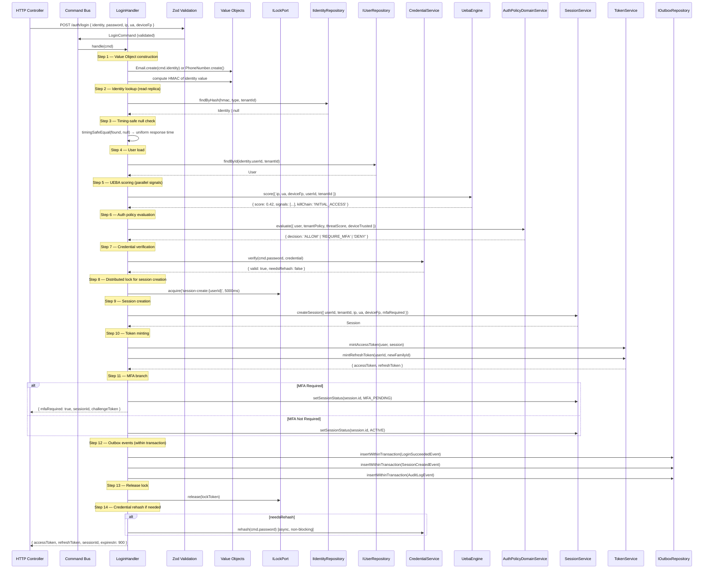

### 5.2 RefreshToken Flow (Pessimistic Lock + Reuse Detection)

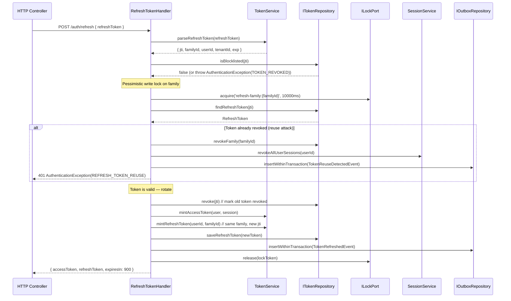

### 5.3 VerifyOTP Flow (Atomic Consume + Identity Verification)

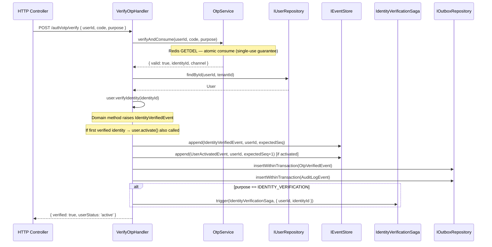

### 5.4 LogoutAll Flow

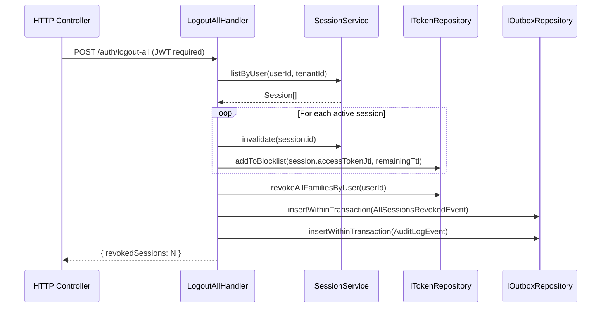

### 5.5 OAuth Callback Flow (Google / GitHub / Apple)

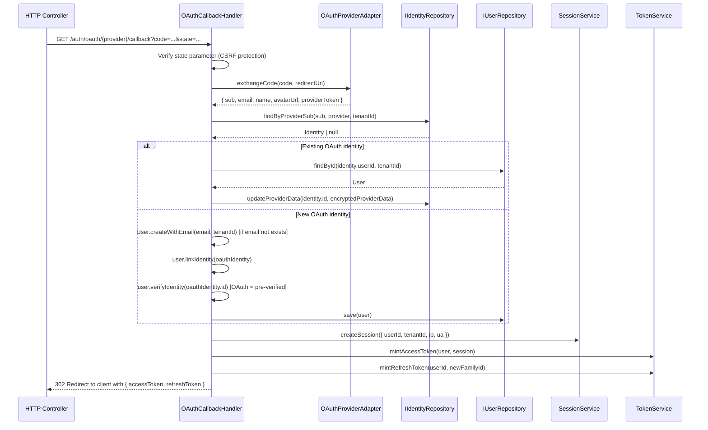

### 5.6 Query Handlers

```typescript
// GetUserSessionsQuery
interface GetUserSessionsQuery {
  tenantId: string
  userId: string
  requestingUserId: string    // must match userId or be admin
}
// Returns: Session[] with device info, last active, mfaVerified status

// ListAuditLogsQuery
interface ListAuditLogsQuery {
  tenantId: string
  actorId?: string
  action?: string
  resourceType?: string
  since?: Date
  until?: Date
  cursor?: string             // pagination cursor
  limit: number               // max 100
}
// Returns: PaginatedResult<AuditLog> with HMAC integrity verification

// GetThreatHistoryQuery
interface GetThreatHistoryQuery {
  tenantId: string
  userId: string
  since: Date                 // default: 30 days ago
}
// Returns: SocAlert[] with signal breakdown and kill-chain stage

// GetJwksQuery
// No parameters — returns all non-revoked public keys
// Returns: JsonWebKeySet (RFC 7517)

// ValidateTokenQuery
interface ValidateTokenQuery {
  token: string
  requiredType?: 'access' | 'refresh'
  requiredScopes?: string[]
}
// Returns: TokenClaims | throws AuthenticationException
// Zero DB round trips for access tokens (embedded claims)
// Blocklist check via Redis O(1) lookup
```

### 5.7 IdentityVerificationSaga

```typescript
// State machine for identity verification workflow
// Triggered after OTP verification for new user signup

enum SagaState {
  STARTED              = 'STARTED',
  WELCOME_EMAIL_SENT   = 'WELCOME_EMAIL_SENT',
  AUDIT_LOGGED         = 'AUDIT_LOGGED',
  COMPLETED            = 'COMPLETED',
  // Compensation states
  COMPENSATING         = 'COMPENSATING',
  COMPENSATION_FAILED  = 'COMPENSATION_FAILED',
}

class IdentityVerificationSaga {
  // Step 1: Send welcome email via OTP port
  async sendWelcomeEmail(userId: UserId): Promise<void>
  // On failure: log warning, continue (non-critical)

  // Step 2: Write audit log entry
  async writeAuditLog(userId: UserId, identityId: IdentityId): Promise<void>
  // On failure: enqueue to outbox for retry

  // Step 3: Trigger downstream provisioning (via queue)
  async triggerProvisioning(userId: UserId, tenantId: TenantId): Promise<void>
  // On failure: compensation → mark user as PENDING_PROVISIONING

  // Compensation steps (if saga fails after partial completion):
  // - If welcome email sent but provisioning failed: no compensation needed (email is informational)
  // - If audit log failed: retry via outbox (at-least-once guarantee)
  // - If provisioning failed: set user metadata flag PROVISIONING_FAILED, alert SOC
}
```

### 5.8 Command Validation Pipeline

```typescript
// Order of validation for every command:
// 1. Zod schema parse (HTTP layer — structural validation)
//    - Type coercion, required fields, string length limits
//    - Throws SchemaValidationException(400) on failure

// 2. Value Object construction (application layer)
//    - Email.create(), PhoneNumber.create(), RawPassword.create()
//    - Throws DomainException(422) on invariant violation

// 3. Business rule checks (handler layer)
//    - Idempotency key lookup
//    - Distributed lock acquisition
//    - Duplicate identity check
//    - Throws ConflictException(409) on business rule violation

// 4. Domain method invocation (domain layer)
//    - User.activate(), user.linkIdentity(), etc.
//    - Throws DomainException(422) on aggregate invariant violation

// Validation is fail-fast: first failure stops processing
// All validation errors include field path and human-readable message
```


---

## 6. Database Schema

### 6.1 Full Production Schema

```sql
-- ─────────────────────────────────────────────────────────────────────────
-- TENANTS
-- Partition: HASH(id) — even distribution across 32 partitions
-- Indexes: slug for tenant lookup by subdomain/slug
-- ─────────────────────────────────────────────────────────────────────────
CREATE TABLE tenants (
  id                      BINARY(16)    NOT NULL,
  slug                    VARCHAR(63)   NOT NULL,
  plan                    ENUM('free','pro','enterprise') NOT NULL,
  status                  ENUM('active','suspended','deleted') NOT NULL DEFAULT 'active',
  settings_enc            VARBINARY(4096),
  settings_enc_kid        VARCHAR(36),
  max_users               INT UNSIGNED  NOT NULL DEFAULT 1000,
  max_sessions_per_user   INT UNSIGNED  NOT NULL DEFAULT 5,
  mfa_policy              ENUM('optional','required','adaptive') NOT NULL DEFAULT 'optional',
  session_ttl_s           INT UNSIGNED  NOT NULL DEFAULT 86400,
  password_policy_json    JSON,
  allowed_domains_json    JSON,
  version                 INT UNSIGNED  NOT NULL DEFAULT 0,
  created_at              DATETIME(3)   NOT NULL,
  updated_at              DATETIME(3)   NOT NULL,
  PRIMARY KEY (id),
  UNIQUE KEY uq_slug (slug)
) PARTITION BY HASH(id) PARTITIONS 32;
-- Index rationale: slug lookup for tenant resolution from X-Tenant-Slug header

-- ─────────────────────────────────────────────────────────────────────────
-- USERS
-- Partition: HASH(tenant_id) — all user data for a tenant on same partition
-- Indexes: tenant_id for tenant-scoped queries; status for admin queries
-- ─────────────────────────────────────────────────────────────────────────
CREATE TABLE users (
  id                      BINARY(16)    NOT NULL,
  tenant_id               BINARY(16)    NOT NULL,
  display_name_enc        VARBINARY(512),
  display_name_enc_kid    VARCHAR(36),
  status                  ENUM('pending','active','suspended','deleted') NOT NULL DEFAULT 'pending',
  suspend_until           DATETIME(3),
  suspend_reason          VARCHAR(255),
  metadata_enc            VARBINARY(4096),
  metadata_enc_kid        VARCHAR(36),
  version                 INT UNSIGNED  NOT NULL DEFAULT 0,
  created_at              DATETIME(3)   NOT NULL,
  updated_at              DATETIME(3)   NOT NULL,
  PRIMARY KEY (id),
  KEY idx_tenant_status (tenant_id, status),
  KEY idx_tenant_created (tenant_id, created_at)
) PARTITION BY HASH(tenant_id) PARTITIONS 32;
-- idx_tenant_status: admin user listing with status filter
-- idx_tenant_created: pagination by creation time

-- ─────────────────────────────────────────────────────────────────────────
-- IDENTITIES
-- Partition: HASH(tenant_id) — co-located with users
-- Indexes: UNIQUE on (tenant_id, type, value_hash) for O(1) login lookup
-- ─────────────────────────────────────────────────────────────────────────
CREATE TABLE identities (
  id                      BINARY(16)    NOT NULL,
  tenant_id               BINARY(16)    NOT NULL,
  user_id                 BINARY(16)    NOT NULL,
  type                    ENUM('email','phone','google','github','apple','microsoft') NOT NULL,
  value_enc               VARBINARY(512) NOT NULL,
  value_enc_kid           VARCHAR(36)   NOT NULL,
  value_hash              BINARY(32)    NOT NULL,
  provider_sub            VARCHAR(255),
  provider_data_enc       VARBINARY(4096),
  provider_data_enc_kid   VARCHAR(36),
  verified                TINYINT(1)    NOT NULL DEFAULT 0,
  verified_at             DATETIME(3),
  created_at              DATETIME(3)   NOT NULL,
  PRIMARY KEY (id),
  UNIQUE KEY uq_tenant_type_hash (tenant_id, type, value_hash),
  KEY idx_user_id (user_id),
  KEY idx_provider_sub (tenant_id, type, provider_sub)
) PARTITION BY HASH(tenant_id) PARTITIONS 32;
-- uq_tenant_type_hash: login lookup + duplicate prevention (O(1))
-- idx_user_id: load all identities for a user
-- idx_provider_sub: OAuth dedup by provider subject ID

-- ─────────────────────────────────────────────────────────────────────────
-- CREDENTIALS
-- No partition (user_id is PK, one row per user)
-- Indexes: user_id UNIQUE (already PK)
-- ─────────────────────────────────────────────────────────────────────────
CREATE TABLE credentials (
  id                      BINARY(16)    NOT NULL,
  user_id                 BINARY(16)    NOT NULL,
  hash                    VARCHAR(255)  NOT NULL,
  algorithm               ENUM('bcrypt_v1','argon2id_v1') NOT NULL DEFAULT 'bcrypt_v1',
  rounds                  TINYINT UNSIGNED NOT NULL,
  prev_hash               VARCHAR(255),
  prev_expires_at         DATETIME(3),
  pwned                   TINYINT(1)    NOT NULL DEFAULT 0,
  created_at              DATETIME(3)   NOT NULL,
  updated_at              DATETIME(3)   NOT NULL,
  PRIMARY KEY (id),
  UNIQUE KEY uq_user_id (user_id)
);
-- No partition: credentials are always looked up by user_id (point query)

-- ─────────────────────────────────────────────────────────────────────────
-- SESSIONS
-- Partition: RANGE on UNIX_TIMESTAMP(expires_at) — enables partition pruning
--   for expired session cleanup (DROP PARTITION instead of DELETE)
-- Indexes: user_id for session listing; tenant+user for scoped queries
-- ─────────────────────────────────────────────────────────────────────────
CREATE TABLE sessions (
  id                      BINARY(16)    NOT NULL,
  tenant_id               BINARY(16)    NOT NULL,
  user_id                 BINARY(16)    NOT NULL,
  ip_hash                 BINARY(32)    NOT NULL,
  ua_browser              VARCHAR(64),
  ua_os                   VARCHAR(64),
  ua_device_type          ENUM('desktop','mobile','tablet','bot','unknown') NOT NULL DEFAULT 'unknown',
  device_fingerprint      VARCHAR(64),
  mfa_verified            TINYINT(1)    NOT NULL DEFAULT 0,
  mfa_verified_at         DATETIME(3),
  access_token_jti        BINARY(16),
  status                  ENUM('created','mfa_pending','active','expired','revoked') NOT NULL DEFAULT 'created',
  revoked_reason          VARCHAR(255),
  expires_at              DATETIME(3)   NOT NULL,
  created_at              DATETIME(3)   NOT NULL,
  PRIMARY KEY (id, expires_at),
  KEY idx_user_id (user_id),
  KEY idx_tenant_user (tenant_id, user_id)
) PARTITION BY RANGE (UNIX_TIMESTAMP(expires_at)) (
  PARTITION p_2024_q1 VALUES LESS THAN (UNIX_TIMESTAMP('2024-04-01')),
  PARTITION p_2024_q2 VALUES LESS THAN (UNIX_TIMESTAMP('2024-07-01')),
  PARTITION p_2024_q3 VALUES LESS THAN (UNIX_TIMESTAMP('2024-10-01')),
  PARTITION p_2024_q4 VALUES LESS THAN (UNIX_TIMESTAMP('2025-01-01')),
  PARTITION p_future   VALUES LESS THAN MAXVALUE
);
-- RANGE partition: expired sessions pruned by ALTER TABLE DROP PARTITION (O(1))
-- idx_user_id: list active sessions for a user
-- idx_tenant_user: admin session management

-- ─────────────────────────────────────────────────────────────────────────
-- REFRESH TOKENS
-- Partition: RANGE on expires_at — same pruning strategy as sessions
-- Indexes: family_id for family revocation; user_id for logout-all
-- ─────────────────────────────────────────────────────────────────────────
CREATE TABLE refresh_tokens (
  jti                     BINARY(16)    NOT NULL,
  family_id               BINARY(16)    NOT NULL,
  parent_jti              BINARY(16),
  user_id                 BINARY(16)    NOT NULL,
  tenant_id               BINARY(16)    NOT NULL,
  revoked                 TINYINT(1)    NOT NULL DEFAULT 0,
  revoked_at              DATETIME(3),
  expires_at              DATETIME(3)   NOT NULL,
  created_at              DATETIME(3)   NOT NULL,
  PRIMARY KEY (jti, expires_at),
  KEY idx_family_id (family_id),
  KEY idx_user_id (user_id)
) PARTITION BY RANGE (UNIX_TIMESTAMP(expires_at)) (
  PARTITION p_2024_q1 VALUES LESS THAN (UNIX_TIMESTAMP('2024-04-01')),
  PARTITION p_2024_q2 VALUES LESS THAN (UNIX_TIMESTAMP('2024-07-01')),
  PARTITION p_2024_q3 VALUES LESS THAN (UNIX_TIMESTAMP('2024-10-01')),
  PARTITION p_2024_q4 VALUES LESS THAN (UNIX_TIMESTAMP('2025-01-01')),
  PARTITION p_future   VALUES LESS THAN MAXVALUE
);
-- idx_family_id: O(1) family revocation (UPDATE WHERE family_id = ?)
-- idx_user_id: logout-all (revoke all families for user)

-- ─────────────────────────────────────────────────────────────────────────
-- JWT SIGNING KEYS
-- No partition (small table, global)
-- Indexes: status for JWKS endpoint (only active/deprecated keys)
-- ─────────────────────────────────────────────────────────────────────────
CREATE TABLE jwt_signing_keys (
  kid                     VARCHAR(36)   NOT NULL,
  private_key_enc         VARBINARY(8192) NOT NULL,
  private_key_enc_kid     VARCHAR(36)   NOT NULL,
  public_jwk              JSON          NOT NULL,
  algorithm               VARCHAR(16)   NOT NULL DEFAULT 'RS256',
  key_size                SMALLINT UNSIGNED NOT NULL DEFAULT 4096,
  status                  ENUM('active','deprecated','revoked') NOT NULL DEFAULT 'active',
  created_at              DATETIME(3)   NOT NULL,
  deprecated_at           DATETIME(3),
  revoked_at              DATETIME(3),
  PRIMARY KEY (kid),
  KEY idx_status (status)
);
-- idx_status: JWKS endpoint fetches WHERE status IN ('active','deprecated')

-- ─────────────────────────────────────────────────────────────────────────
-- OTP ATTEMPTS (rate limiting + audit)
-- Partition: RANGE on created_at — auto-pruned after 24h
-- ─────────────────────────────────────────────────────────────────────────
CREATE TABLE otp_attempts (
  id                      BINARY(16)    NOT NULL,
  tenant_id               BINARY(16)    NOT NULL,
  user_id                 BINARY(16)    NOT NULL,
  purpose                 ENUM('identity_verification','password_reset','mfa','login') NOT NULL,
  channel                 ENUM('email','sms') NOT NULL,
  success                 TINYINT(1)    NOT NULL DEFAULT 0,
  ip_hash                 BINARY(32)    NOT NULL,
  created_at              DATETIME(3)   NOT NULL,
  PRIMARY KEY (id, created_at),
  KEY idx_user_purpose (user_id, purpose, created_at)
) PARTITION BY RANGE (UNIX_TIMESTAMP(created_at)) (
  PARTITION p_old VALUES LESS THAN (UNIX_TIMESTAMP('2024-01-01')),
  PARTITION p_current VALUES LESS THAN MAXVALUE
);

-- ─────────────────────────────────────────────────────────────────────────
-- DEVICES (trusted device registry)
-- ─────────────────────────────────────────────────────────────────────────
CREATE TABLE devices (
  id                      BINARY(16)    NOT NULL,
  tenant_id               BINARY(16)    NOT NULL,
  user_id                 BINARY(16)    NOT NULL,
  fingerprint             VARCHAR(64)   NOT NULL,
  name                    VARCHAR(128),
  trusted                 TINYINT(1)    NOT NULL DEFAULT 0,
  trusted_at              DATETIME(3),
  last_seen_at            DATETIME(3)   NOT NULL,
  created_at              DATETIME(3)   NOT NULL,
  PRIMARY KEY (id),
  UNIQUE KEY uq_user_fingerprint (user_id, fingerprint),
  KEY idx_tenant_user (tenant_id, user_id)
);

-- ─────────────────────────────────────────────────────────────────────────
-- CLIENT APPS (OAuth clients / API keys)
-- ─────────────────────────────────────────────────────────────────────────
CREATE TABLE client_apps (
  id                      BINARY(16)    NOT NULL,
  tenant_id               BINARY(16)    NOT NULL,
  name                    VARCHAR(128)  NOT NULL,
  client_id               VARCHAR(64)   NOT NULL,
  client_secret_hash      VARCHAR(255),
  redirect_uris_json      JSON          NOT NULL,
  allowed_scopes_json     JSON          NOT NULL,
  grant_types_json        JSON          NOT NULL,
  status                  ENUM('active','suspended','deleted') NOT NULL DEFAULT 'active',
  created_at              DATETIME(3)   NOT NULL,
  PRIMARY KEY (id),
  UNIQUE KEY uq_client_id (client_id),
  KEY idx_tenant (tenant_id)
);

-- ─────────────────────────────────────────────────────────────────────────
-- ROLES & PERMISSIONS (RBAC foundation for JWT claims)
-- ─────────────────────────────────────────────────────────────────────────
CREATE TABLE roles (
  id                      BINARY(16)    NOT NULL,
  tenant_id               BINARY(16)    NOT NULL,
  name                    VARCHAR(64)   NOT NULL,
  description             VARCHAR(255),
  created_at              DATETIME(3)   NOT NULL,
  PRIMARY KEY (id),
  UNIQUE KEY uq_tenant_name (tenant_id, name)
);

CREATE TABLE permissions (
  id                      BINARY(16)    NOT NULL,
  tenant_id               BINARY(16)    NOT NULL,
  resource                VARCHAR(64)   NOT NULL,
  action                  VARCHAR(64)   NOT NULL,
  created_at              DATETIME(3)   NOT NULL,
  PRIMARY KEY (id),
  UNIQUE KEY uq_tenant_resource_action (tenant_id, resource, action)
);

CREATE TABLE role_permissions (
  role_id                 BINARY(16)    NOT NULL,
  permission_id           BINARY(16)    NOT NULL,
  PRIMARY KEY (role_id, permission_id)
);

CREATE TABLE user_roles (
  user_id                 BINARY(16)    NOT NULL,
  role_id                 BINARY(16)    NOT NULL,
  tenant_id               BINARY(16)    NOT NULL,
  granted_at              DATETIME(3)   NOT NULL,
  granted_by              BINARY(16),
  PRIMARY KEY (user_id, role_id),
  KEY idx_tenant_user (tenant_id, user_id)
);

-- ─────────────────────────────────────────────────────────────────────────
-- ABAC POLICIES
-- ─────────────────────────────────────────────────────────────────────────
CREATE TABLE abac_policies (
  id                      BINARY(16)    NOT NULL,
  tenant_id               BINARY(16)    NOT NULL,
  name                    VARCHAR(128)  NOT NULL,
  effect                  ENUM('allow','deny') NOT NULL,
  priority                INT           NOT NULL DEFAULT 0,
  subject_condition       TEXT          NOT NULL,
  resource_condition      TEXT          NOT NULL,
  action_condition        TEXT          NOT NULL,
  enabled                 TINYINT(1)    NOT NULL DEFAULT 1,
  version                 INT UNSIGNED  NOT NULL DEFAULT 0,
  created_at              DATETIME(3)   NOT NULL,
  updated_at              DATETIME(3)   NOT NULL,
  PRIMARY KEY (id),
  KEY idx_tenant_priority (tenant_id, priority DESC, enabled)
);
-- idx_tenant_priority: load policies in evaluation order

-- ─────────────────────────────────────────────────────────────────────────
-- AUDIT LOGS (IMMUTABLE — INSERT only at application level)
-- Partition: RANGE on created_at — quarterly partitions for archival
-- DB-level immutability: revoke UPDATE/DELETE grants on this table
-- ─────────────────────────────────────────────────────────────────────────
CREATE TABLE audit_logs (
  id                      BINARY(16)    NOT NULL,
  tenant_id               BINARY(16)    NOT NULL,
  actor_id                BINARY(16),
  actor_type              ENUM('user','system','admin') NOT NULL DEFAULT 'user',
  action                  VARCHAR(128)  NOT NULL,
  resource_type           VARCHAR(64)   NOT NULL,
  resource_id             BINARY(16),
  metadata_enc            VARBINARY(4096),
  metadata_enc_kid        VARCHAR(36),
  ip_hash                 BINARY(32),
  checksum                BINARY(32)    NOT NULL,
  created_at              DATETIME(3)   NOT NULL,
  PRIMARY KEY (id, created_at),
  KEY idx_tenant_time (tenant_id, created_at),
  KEY idx_actor (tenant_id, actor_id, created_at),
  KEY idx_resource (tenant_id, resource_type, resource_id, created_at)
) PARTITION BY RANGE (UNIX_TIMESTAMP(created_at)) (
  PARTITION p_2024_q1 VALUES LESS THAN (UNIX_TIMESTAMP('2024-04-01')),
  PARTITION p_2024_q2 VALUES LESS THAN (UNIX_TIMESTAMP('2024-07-01')),
  PARTITION p_2024_q3 VALUES LESS THAN (UNIX_TIMESTAMP('2024-10-01')),
  PARTITION p_2024_q4 VALUES LESS THAN (UNIX_TIMESTAMP('2025-01-01')),
  PARTITION p_future   VALUES LESS THAN MAXVALUE
);
-- RANGE partition: quarterly archival via ALTER TABLE DROP PARTITION
-- idx_tenant_time: time-range queries for audit dashboard
-- idx_actor: "what did this user do?" queries
-- idx_resource: "what happened to this resource?" queries

-- ─────────────────────────────────────────────────────────────────────────
-- SOC ALERTS
-- ─────────────────────────────────────────────────────────────────────────
CREATE TABLE soc_alerts (
  id                      BINARY(16)    NOT NULL,
  tenant_id               BINARY(16)    NOT NULL,
  user_id                 BINARY(16),
  ip_hash                 BINARY(32),
  threat_score            DECIMAL(4,3)  NOT NULL,
  kill_chain_stage        ENUM('RECONNAISSANCE','INITIAL_ACCESS','CREDENTIAL_ACCESS','LATERAL_MOVEMENT','ACCOUNT_TAKEOVER'),
  signals_json            JSON          NOT NULL,
  response_actions_json   JSON          NOT NULL,
  workflow                ENUM('open','acknowledged','resolved','false_positive') NOT NULL DEFAULT 'open',
  acknowledged_by         BINARY(16),
  acknowledged_at         DATETIME(3),
  resolved_by             BINARY(16),
  resolved_at             DATETIME(3),
  checksum                BINARY(32)    NOT NULL,
  created_at              DATETIME(3)   NOT NULL,
  PRIMARY KEY (id),
  KEY idx_tenant_workflow (tenant_id, workflow, created_at),
  KEY idx_tenant_user (tenant_id, user_id, created_at),
  KEY idx_threat_score (tenant_id, threat_score DESC)
);

-- ─────────────────────────────────────────────────────────────────────────
-- DOMAIN EVENTS (Event Store)
-- global_seq: AUTO_INCREMENT for global ordering across all aggregates
-- aggregate_seq: per-aggregate monotonic counter for optimistic concurrency
-- ─────────────────────────────────────────────────────────────────────────
CREATE TABLE domain_events (
  id                      BINARY(16)    NOT NULL,
  aggregate_id            VARCHAR(36)   NOT NULL,
  aggregate_type          VARCHAR(64)   NOT NULL,
  event_type              VARCHAR(128)  NOT NULL,
  global_seq              BIGINT UNSIGNED NOT NULL AUTO_INCREMENT,
  aggregate_seq           INT UNSIGNED  NOT NULL,
  payload_enc             VARBINARY(65535) NOT NULL,
  payload_enc_kid         VARCHAR(36)   NOT NULL,
  tenant_id               BINARY(16)    NOT NULL,
  created_at              DATETIME(3)   NOT NULL,
  PRIMARY KEY (id),
  UNIQUE KEY uq_aggregate_seq (aggregate_id, aggregate_seq),
  KEY idx_global_seq (global_seq),
  KEY idx_aggregate_id (aggregate_id, aggregate_seq ASC)
);
-- uq_aggregate_seq: optimistic concurrency (append throws on duplicate)
-- idx_global_seq: event projection / catch-up subscriptions
-- idx_aggregate_id: load all events for an aggregate in order

-- ─────────────────────────────────────────────────────────────────────────
-- OUTBOX EVENTS (Transactional Outbox Pattern)
-- ─────────────────────────────────────────────────────────────────────────
CREATE TABLE outbox_events (
  id                      BINARY(16)    NOT NULL,
  event_type              VARCHAR(128)  NOT NULL,
  payload_json            JSON          NOT NULL,
  status                  ENUM('PENDING','PUBLISHED','FAILED','DLQ') NOT NULL DEFAULT 'PENDING',
  attempts                TINYINT UNSIGNED NOT NULL DEFAULT 0,
  last_error              TEXT,
  published_at            DATETIME(3),
  created_at              DATETIME(3)   NOT NULL,
  PRIMARY KEY (id),
  KEY idx_status_created (status, created_at)
);
-- idx_status_created: outbox relay polls WHERE status='PENDING' ORDER BY created_at

-- ─────────────────────────────────────────────────────────────────────────
-- SCHEMA VERSIONS (migration tracking)
-- ─────────────────────────────────────────────────────────────────────────
CREATE TABLE schema_versions (
  version                 INT UNSIGNED  NOT NULL,
  description             VARCHAR(255)  NOT NULL,
  checksum                CHAR(64)      NOT NULL,  -- SHA-256 of migration SQL
  applied_at              DATETIME(3)   NOT NULL,
  applied_by              VARCHAR(128)  NOT NULL,  -- hostname of migrator
  duration_ms             INT UNSIGNED  NOT NULL,
  PRIMARY KEY (version)
);
```

### 6.2 Index Strategy Rationale

| Table | Index | Query Pattern | Rationale |
|---|---|---|---|
| `identities` | `uq_tenant_type_hash` | Login lookup by email/phone | O(1) equality check via HMAC hash; no decryption needed |
| `identities` | `idx_provider_sub` | OAuth dedup | Prevents duplicate OAuth accounts |
| `users` | `idx_tenant_status` | Admin user listing | Tenant-scoped status filter |
| `sessions` | `idx_user_id` | List user's sessions | Session management UI |
| `refresh_tokens` | `idx_family_id` | Family revocation | Batch UPDATE on reuse detection |
| `audit_logs` | `idx_tenant_time` | Audit dashboard | Time-range queries |
| `audit_logs` | `idx_actor` | User activity report | Actor-scoped queries |
| `domain_events` | `uq_aggregate_seq` | Optimistic concurrency | Prevents duplicate event seq |
| `domain_events` | `idx_global_seq` | Event projection | Catch-up subscriptions |
| `outbox_events` | `idx_status_created` | Outbox relay polling | FIFO processing of pending events |

### 6.3 Partition Strategy

| Table | Strategy | Key | Rationale |
|---|---|---|---|
| `tenants` | `HASH(id)` 32 partitions | `id` | Even distribution; tenant lookups by ID |
| `users` | `HASH(tenant_id)` 32 partitions | `tenant_id` | Co-locates all users of a tenant |
| `identities` | `HASH(tenant_id)` 32 partitions | `tenant_id` | Co-located with users for JOIN efficiency |
| `sessions` | `RANGE(expires_at)` quarterly | `expires_at` | Expired sessions pruned by DROP PARTITION |
| `refresh_tokens` | `RANGE(expires_at)` quarterly | `expires_at` | Same pruning strategy |
| `audit_logs` | `RANGE(created_at)` quarterly | `created_at` | Archival by quarter |
| `otp_attempts` | `RANGE(created_at)` | `created_at` | Auto-pruned after 24h |

**Partition Pruning**: MySQL optimizer prunes partitions when `WHERE expires_at < ?` or `WHERE created_at BETWEEN ? AND ?` is present. All queries include these predicates.

**Foreign Key Strategy**: No FK constraints on partitioned tables (MySQL limitation). Referential integrity enforced at application layer (repository methods validate existence before insert). Non-partitioned tables (`credentials`, `jwt_signing_keys`) use FK constraints.

### 6.4 Migration Strategy

```sql
-- schema_versions tracks every migration with checksum validation
-- Migration procedure:
-- 1. Generate migration SQL file: migrations/V{N}__{description}.sql
-- 2. Compute SHA-256 checksum of file content
-- 3. Run migration in transaction (DDL is non-transactional in MySQL — use advisory lock)
-- 4. INSERT INTO schema_versions (version, description, checksum, applied_at, applied_by, duration_ms)
-- 5. On startup: verify all applied migrations match their stored checksums
--    → Throws if checksum mismatch (detects manual schema changes)

-- Zero-downtime migration strategy:
-- Phase 1: Add new column as nullable (no table lock for ADD COLUMN in MySQL 8.0)
-- Phase 2: Backfill new column in batches (UPDATE ... LIMIT 1000 with sleep)
-- Phase 3: Add NOT NULL constraint + default (after backfill complete)
-- Phase 4: Deploy new code that reads new column
-- Phase 5: Drop old column (after old code fully retired)

-- Read replica routing:
-- Writes: always primary (INSERT, UPDATE, DELETE, SELECT FOR UPDATE)
-- Reads: replica (SELECT without FOR UPDATE, unless strong consistency required)
-- Strong consistency reads: token rotation, OTP consume, version check
```


---

## 7. Encryption

### 7.1 HKDF Derivation Chain

```
Master Key (256-bit, from ENCRYPT_KEY_{kid} env var)
    │
    ▼
HKDF-Extract (SHA-256)
    salt = random 32-byte salt (stored with encrypted value)
    ikm  = masterKey
    ──────────────────────────────────────────────────────
    PRK (Pseudo-Random Key, 256-bit)
    │
    ├──► HKDF-Expand(PRK, info="IDENTITY_VALUE" || tenantId, L=32)
    │        → context key for identity value encryption
    │
    ├──► HKDF-Expand(PRK, info="USER_PII" || tenantId, L=32)
    │        → context key for display name / metadata encryption
    │
    ├──► HKDF-Expand(PRK, info="AUDIT_METADATA" || tenantId, L=32)
    │        → context key for audit log metadata encryption
    │
    ├──► HKDF-Expand(PRK, info="SETTINGS" || tenantId, L=32)
    │        → context key for tenant settings encryption
    │
    ├──► HKDF-Expand(PRK, info="PROVIDER_DATA" || tenantId, L=32)
    │        → context key for OAuth provider data encryption
    │
    └──► HKDF-Expand(PRK, info="JWT_PRIVATE_KEY", L=32)
             → context key for JWT signing key encryption
```

**Isolation Proof**: Each context key is derived with a different `info` string. Even if an attacker obtains the `IDENTITY_VALUE` context key, they cannot use it to decrypt `USER_PII` fields because the derived keys are cryptographically independent. The `tenantId` in the `info` string further ensures cross-tenant isolation.

### 7.2 Encrypted Value Format

```typescript
interface EncryptedValue {
  ciphertext: Buffer   // AES-256-GCM encrypted plaintext
  iv: Buffer           // 12-byte random nonce (unique per encryption)
  tag: Buffer          // 16-byte GCM authentication tag
  kid: string          // key ID — identifies which master key was used
  // Serialized as: base64(iv) + '.' + base64(tag) + '.' + base64(ciphertext) + '.' + kid
}
```

### 7.3 Key Rotation Procedure

```
Step 1: Generate new master key
  - Generate 32 random bytes: crypto.randomBytes(32)
  - Assign new kid: UUID v4
  - Set env var: ENCRYPT_KEY_{newKid}=hex(newKey)

Step 2: Update active key pointer
  - Set env var: ENCRYPT_ACTIVE_KID={newKid}
  - Deploy new pods (they will encrypt new data with newKid)
  - Old pods continue to decrypt old data using old kid

Step 3: Background re-encryption
  - Run re-encryption job: SELECT rows WHERE *_enc_kid = oldKid LIMIT 1000
  - For each row: decrypt with oldKid → re-encrypt with newKid → UPDATE
  - Repeat until no rows with oldKid remain
  - Monitor: SELECT COUNT(*) FROM users WHERE display_name_enc_kid = oldKid

Step 4: Deprecate old key
  - Verify: all *_enc_kid columns show only newKid
  - Mark old key as deprecated in config (keep for decryption only)
  - Set env var: ENCRYPT_DEPRECATED_KIDS={oldKid}

Step 5: Verify no old kid references
  - Run verification query across all encrypted tables
  - Assert COUNT(*) WHERE *_enc_kid = oldKid = 0

Step 6: Revoke old key
  - Remove ENCRYPT_KEY_{oldKid} env var
  - Remove from ENCRYPT_DEPRECATED_KIDS
  - Old key is now permanently inaccessible
```

### 7.4 Envelope Encryption (Large Fields)

For fields exceeding 4KB (e.g., large metadata blobs):

```
Data Encryption Key (DEK):
  - 32 random bytes generated per field value
  - Used to AES-256-GCM encrypt the plaintext

Key Encryption Key (KEK):
  - Derived via HKDF from master key (same as context key)
  - Used to AES-256-GCM encrypt the DEK

Stored format:
  - encrypted_dek: AES-256-GCM(DEK, KEK)
  - encrypted_data: AES-256-GCM(plaintext, DEK)
  - Both stored together; DEK is never stored in plaintext
```

### 7.5 Startup Key Validation

```typescript
// On application startup, before accepting requests:
async function validateEncryptionKeys(): Promise<void> {
  const testPlaintext = 'UICP_ENCRYPTION_ROUNDTRIP_TEST_' + Date.now()

  for (const context of Object.values(EncryptionContext)) {
    const encrypted = await encryptionService.encrypt(testPlaintext, context)
    const decrypted = await encryptionService.decrypt(encrypted, context)

    if (decrypted !== testPlaintext) {
      throw new Error(`Encryption roundtrip failed for context: ${context}`)
    }

    // Verify cross-context isolation: decrypting with wrong context must fail
    try {
      const wrongContext = getOtherContext(context)
      await encryptionService.decrypt(encrypted, wrongContext)
      throw new Error(`Cross-context isolation violated for context: ${context}`)
    } catch (e) {
      if (e.message.includes('Cross-context isolation violated')) throw e
      // Expected: decryption with wrong context key fails with auth tag mismatch
    }
  }
}
// Catches: wrong key format, wrong key length, missing env vars, key mismatch
```


---

## 8. Token Authority

### 8.1 Access Token JWT Payload

```typescript
interface AccessTokenPayload {
  // Standard JWT claims
  iss: string              // Issuer: "https://auth.uicp.io/{tenantId}"
  aud: string | string[]   // Audience: ["api.{tenantId}.uicp.io"]
  sub: string              // Subject: userId (UUID)
  iat: number              // Issued at: Unix timestamp
  exp: number              // Expiry: iat + 900 (15 minutes)
  jti: string              // JWT ID: UUID v4 (for blocklist)

  // UICP custom claims
  tid: string              // Tenant ID
  sid: string              // Session ID
  type: 'access'           // Token type discriminator

  // Authorization claims (embedded — zero DB round trips for authz)
  roles: string[]          // e.g., ["admin", "editor"]
  perms: string[]          // e.g., ["users:read", "users:write", "billing:read"]

  // Security claims
  mfa: boolean             // MFA verified in this session
  vat: number              // Verified at: Unix timestamp of last MFA verification
  amr: string[]            // Authentication methods: ["pwd", "otp"] | ["oauth_google"]

  // Device claim
  dfp?: string             // Device fingerprint hash (first 8 chars)
}
```

### 8.2 Refresh Token JWT Payload

```typescript
interface RefreshTokenPayload {
  iss: string              // Same issuer
  aud: string              // "auth.uicp.io" (refresh endpoint only)
  sub: string              // userId
  iat: number
  exp: number              // iat + 604800 (7 days)
  jti: string              // UUID v4 (unique per rotation)

  tid: string              // Tenant ID
  fid: string              // Family ID (UUID v4, stable across rotations)
  type: 'refresh'          // Token type discriminator
}
```

### 8.3 JWKS Endpoint Response Schema

```typescript
// GET /.well-known/jwks.json
interface JsonWebKeySet {
  keys: JsonWebKey[]
}

interface JsonWebKey {
  kty: 'RSA'
  use: 'sig'
  alg: 'RS256'
  kid: string              // Key ID — matches JWT header kid
  n: string                // RSA modulus (base64url)
  e: string                // RSA exponent (base64url, typically "AQAB")
  // Only public key components — private key never exposed
}
// Returns all keys with status IN ('active', 'deprecated')
// Deprecated keys still verify tokens during their TTL overlap window
// Cache-Control: public, max-age=3600
```

### 8.4 Key Rotation Overlap Window

```
Timeline:
  T=0:    Key A created (status=active)
  T=30d:  Key B created (status=active), Key A deprecated
  T=30d+: New tokens signed with Key B
  T=30d+: Old tokens (signed with Key A) still valid until exp
  T=37d:  All Key A tokens expired (max 7-day refresh token TTL)
  T=37d+: Key A can be safely revoked
  T=37d+: JWKS endpoint stops returning Key A

Overlap window = max(access_token_ttl, refresh_token_ttl) = 7 days
During overlap: JWKS returns both Key A (deprecated) and Key B (active)
Verifiers select key by JWT header kid → correct key always found
```

### 8.5 Token Validation Algorithm

```typescript
// Step-by-step token validation (ValidateTokenQuery handler):

async function validateToken(token: string): Promise<TokenClaims> {
  // Step 1: Parse JWT header (no verification yet)
  const header = parseJwtHeader(token)
  // Throws: SchemaValidationException if malformed

  // Step 2: Select verification key by kid
  const jwk = await getJwkByKid(header.kid)
  // Throws: AuthenticationException(TOKEN_INVALID_KID) if kid not found

  // Step 3: Verify signature + exp + iss + aud
  const payload = jwt.verify(token, jwk.publicKey, {
    algorithms: ['RS256'],
    issuer: expectedIssuer,
    audience: expectedAudience,
  })
  // Throws: AuthenticationException(TOKEN_EXPIRED) if exp < now
  // Throws: AuthenticationException(TOKEN_INVALID_SIGNATURE) if sig fails

  // Step 4: Check token type claim
  if (payload.type !== 'access') {
    throw new AuthenticationException('TOKEN_WRONG_TYPE')
  }

  // Step 5: Check blocklist (Redis O(1) SISMEMBER)
  const blocklisted = await tokenRepository.isBlocklisted(payload.jti)
  if (blocklisted) {
    throw new AuthenticationException('TOKEN_REVOKED')
  }

  // Step 6: Check required scopes (if specified)
  if (requiredScopes?.length) {
    const hasAll = requiredScopes.every(s => payload.perms.includes(s))
    if (!hasAll) throw new SecurityException('INSUFFICIENT_PERMISSIONS')
  }

  return payload as TokenClaims
}
```

### 8.6 Embedded Permissions Format

```typescript
// Roles and permissions are embedded in the JWT at mint time
// This enables zero-DB authorization for every request

// At mint time (LoginHandler):
const user = await userRepository.findById(userId, tenantId)
const userRoles = await roleRepository.findByUserId(userId, tenantId)
const permissions = await permissionRepository.findByRoles(userRoles.map(r => r.id))

const accessToken = await tokenService.mintAccessToken(user, session, {
  roles: userRoles.map(r => r.name),           // ["admin", "editor"]
  perms: permissions.map(p => `${p.resource}:${p.action}`), // ["users:read", "billing:read"]
})

// At validation time (any service):
// No DB call needed — roles and perms are in the JWT payload
// ABAC engine uses payload.roles and payload.perms as subject attributes
```

### 8.7 Token Size Optimization

RS256 (RSA-4096) produces a 512-byte signature. A typical access token with 5 roles and 20 permissions is ~800 bytes. Strategies to keep tokens under 1KB:

- Permission strings use compact format: `resource:action` (not full URIs)
- Roles are short names (max 32 chars)
- Custom claims use short keys (`tid`, `sid`, `mfa`, `vat`, `dfp`)
- If permissions exceed 30 entries: store permission set hash in JWT, validate against Redis cache


---

## 9. Session Service

### 9.1 Redis Key Schema

```
# Session data (Hash)
Key:   session:{tenantId}:{sessionId}
TTL:   session_ttl_s (from tenant config, default 86400s)
Value: Hash {
  userId, status, mfaVerified, mfaVerifiedAt,
  ipHash, uaBrowser, uaOs, uaDeviceType,
  deviceFingerprint, accessTokenJti,
  createdAt, expiresAt
}

# User session index (Sorted Set — score = createdAt timestamp)
Key:   user-sessions:{tenantId}:{userId}
TTL:   none (managed by session limit enforcement)
Value: ZADD score=createdAt member=sessionId

# Session limit enforcement (LRU eviction)
# When ZCARD > maxSessionsPerUser:
#   ZRANGE ... 0 0 → oldest sessionId
#   DEL session:{tenantId}:{oldestSessionId}
#   ZREM user-sessions:{tenantId}:{userId} {oldestSessionId}

# OTP code (String)
Key:   otp:{tenantId}:{userId}:{purpose}
TTL:   300s (5 minutes)
Value: {code}:{channel}:{identityId}
# GETDEL for atomic single-use consume

# MFA challenge flag (String)
Key:   mfa-required:{tenantId}:{userId}
TTL:   3600s (1 hour, set by UEBA engine)
Value: "1"

# IP throttle multiplier (String)
Key:   throttle:ip:{ipHash}
TTL:   900s (15 minutes)
Value: "0.2"  # rate limit multiplier (0.0-1.0)

# Distributed lock (String)
Key:   lock:{lockKey}
TTL:   {ttlMs}ms
Value: {ownerUUID}  # random UUID for ownership proof

# Rate limit counter (String)
Key:   rl:{tier}:{identifier}:{windowStart}
TTL:   {windowSizeSeconds}
Value: {count}  # INCR atomic counter

# Token blocklist (Set)
Key:   blocklist:{tenantId}
TTL:   none (members expire individually via EXPIREAT on member — use ZADD with score=exp)
Value: ZADD score=exp member=jti
# Cleanup: ZREMRANGEBYSCORE ... -inf {now} on each check

# Known devices (Set)
Key:   devices:{tenantId}:{userId}
TTL:   none
Value: SADD {deviceFingerprint}

# Idempotency cache (String)
Key:   idempotency:{tenantId}:{idempotencyKey}
TTL:   86400s (24 hours)
Value: JSON serialized response
```

### 9.2 Session Limit Enforcement Algorithm

```typescript
async function enforceSessionLimit(userId: UserId, tenantId: TenantId): Promise<void> {
  const maxSessions = await tenantConfig.getMaxSessionsPerUser(tenantId)
  const sessionIndexKey = `user-sessions:${tenantId}:${userId}`

  // Atomic pipeline: check count + evict if needed
  const pipeline = redis.pipeline()
  pipeline.zcard(sessionIndexKey)
  const [, count] = await pipeline.exec()

  if (count >= maxSessions) {
    // LRU eviction: remove oldest session (lowest score = earliest createdAt)
    const [oldestSessionId] = await redis.zrange(sessionIndexKey, 0, 0)
    if (oldestSessionId) {
      await redis.del(`session:${tenantId}:${oldestSessionId}`)
      await redis.zrem(sessionIndexKey, oldestSessionId)
      // Emit SessionEvictedEvent to outbox for audit
    }
  }
}
```

### 9.3 Device Trust Flow

```typescript
// Device becomes trusted after MFA verification:
// 1. User completes MFA (VerifyOtpHandler)
// 2. Session.verifyMfa() called → mfaVerified = true
// 3. If deviceFingerprint present in session:
//    SADD devices:{tenantId}:{userId} {deviceFingerprint}
//    (no TTL — trusted devices persist until explicitly removed)
// 4. On next login from same device:
//    SISMEMBER devices:{tenantId}:{userId} {deviceFingerprint} → true
//    DeviceAnalyzer returns score 0.0 (trusted device)
//    AuthPolicy may skip MFA requirement for trusted devices

// Device fingerprint composition (hashed fields):
// SHA-256(userAgent + acceptLanguage + screenResolution + timezone + platform)
// First 16 bytes → hex string (32 chars)
// Note: fingerprint is probabilistic, not cryptographic identity
```

### 9.4 Session Metadata Parsing

```typescript
// User-Agent parsing via ua-parser-js:
const ua = UAParser(userAgentString)
session.uaBrowser = `${ua.browser.name} ${ua.browser.major}`  // "Chrome 120"
session.uaOs = `${ua.os.name} ${ua.os.version}`               // "Windows 10"
session.uaDeviceType = ua.device.type ?? 'desktop'            // "mobile" | "tablet" | "desktop"

// Bot detection: if ua.device.type === 'bot' → flag session, increment metric
// uaDeviceType stored as ENUM in Redis hash and MySQL sessions table
```

### 9.5 Concurrent Session Creation Race Prevention

```typescript
// Problem: Two concurrent login requests for same user could create duplicate sessions
// Solution: Redis pipeline with SETNX on session creation slot

async function createSession(params: CreateSessionParams): Promise<Session> {
  const session = Session.create(params)
  const sessionKey = `session:${params.tenantId}:${session.id}`

  // Atomic pipeline: SET session data + add to user index
  const pipeline = redis.pipeline()
  pipeline.hset(sessionKey, session.toRedisHash())
  pipeline.expire(sessionKey, params.tenantTtlSeconds)
  pipeline.zadd(
    `user-sessions:${params.tenantId}:${params.userId}`,
    session.createdAt.getTime(),
    session.id.toString()
  )
  await pipeline.exec()
  // Pipeline is atomic per-slot; session ID is UUID v4 (collision probability negligible)

  await enforceSessionLimit(params.userId, params.tenantId)
  return session
}
```

### 9.6 Session Sliding TTL

```typescript
// On every authenticated request, extend session TTL:
async function touchSession(sessionId: SessionId, tenantId: TenantId): Promise<void> {
  const sessionKey = `session:${tenantId}:${sessionId}`

  // KEEPTTL: extend TTL without resetting it to a fixed value
  // This implements sliding TTL: TTL resets to full value on each access
  await redis.expire(sessionKey, tenantTtlSeconds)
  // Note: KEEPTTL (Redis 6.0+) preserves existing TTL when updating hash fields
  // For TTL extension specifically, we use EXPIRE (not KEEPTTL)
  // KEEPTTL is used in HSET operations to avoid accidentally resetting TTL

  // Update expiresAt in session hash (for DB sync)
  const newExpiresAt = new Date(Date.now() + tenantTtlSeconds * 1000)
  await redis.hset(sessionKey, 'expiresAt', newExpiresAt.toISOString())
  // KEEPTTL flag on HSET: HSET key field value KEEPTTL
  // Prevents HSET from resetting TTL to 0 (Redis default behavior)
}
```


---

## 10. SOC / UEBA Engine

### 10.1 Signal Scoring Formulas

#### VelocityAnalyzer

Measures login attempt frequency across four sliding windows using Redis INCR + EXPIRE:

```
Windows:
  W₁ = user:{userId}:1m   (1-minute window)
  W₂ = user:{userId}:5m   (5-minute window)
  W₃ = ip:{ipHash}:1m     (1-minute window)
  W₄ = ip:{ipHash}:10m    (10-minute window)

Thresholds:
  T₁ = 5  (user 1m)
  T₂ = 15 (user 5m)
  T₃ = 10 (ip 1m)
  T₄ = 30 (ip 10m)

Per-window score:
  s(W, T) = min(1.0, count(W) / T)

Weighted ratio formula:
  velocity_score = 0.25·s(W₁,T₁) + 0.25·s(W₂,T₂) + 0.25·s(W₃,T₃) + 0.25·s(W₄,T₄)

Window decay behavior:
  Each window key has TTL = window_duration
  On expiry, count resets to 0 (natural decay)
  No explicit decay function needed — Redis TTL handles it
```

#### GeoAnalyzer

```
Haversine formula for distance between two coordinates:
  a = sin²(Δlat/2) + cos(lat₁)·cos(lat₂)·sin²(Δlon/2)
  c = 2·atan2(√a, √(1-a))
  d = R·c    where R = 6371 km (Earth radius)

Impossible travel threshold derivation:
  Commercial flight max speed ≈ 900 km/h
  With 2h airport overhead: effective max = 900 km/h
  threshold_km_per_hour = 900

Impossible travel score:
  speed = d / time_delta_hours
  IF speed > 900 THEN geo_score = 1.0
  ELSE IF country_changed THEN geo_score = 0.6
  ELSE IF city_changed THEN geo_score = 0.2
  ELSE geo_score = 0.0

First-login baseline establishment:
  On first successful login: store { lat, lon, country, city } in Redis
  Key: geo-baseline:{tenantId}:{userId}
  TTL: 30 days (refreshed on each successful login)
  If no baseline exists: geo_score = 0.1 (slight elevation for unknown location)
```

#### DeviceAnalyzer

```
Device fingerprint composition:
  raw = userAgent + ":" + acceptLanguage + ":" + screenResolution + ":" + timezone + ":" + platform
  fingerprint = SHA-256(raw).slice(0, 16).toString('hex')  // 32-char hex string

Trust escalation path:
  1. Unknown device (not in SMEMBERS devices:{tenantId}:{userId}):
     IF user has ≥1 known device: device_score = 0.5
     IF user has 0 known devices (new user): device_score = 0.1
  2. Known device (in SMEMBERS):
     device_score = 0.0
  3. Trusted device (in SMEMBERS + trusted flag):
     device_score = 0.0 (same as known — trust affects MFA skip, not score)
```

#### CredentialStuffingAnalyzer

```
Sliding window implementation:
  Key: cs:ip:{ipHash}:10m
  TTL: 600s (10 minutes)
  Value: INCR on each failed login attempt

Cross-tenant counting:
  Key: cs:ip:{ipHash}:global:10m  (no tenant prefix)
  Counts failures across ALL tenants from same IP

Per-tenant counting:
  Key: cs:ip:{ipHash}:{tenantId}:10m

Scoring:
  global_failures = GET cs:ip:{ipHash}:global:10m
  tenant_failures = GET cs:ip:{ipHash}:{tenantId}:10m

  IF global_failures > 30: cs_score = 1.0  (credential stuffing attack)
  ELSE IF global_failures > 15: cs_score = 0.7
  ELSE IF tenant_failures > 10: cs_score = 0.5
  ELSE cs_score = min(0.3, global_failures / 30)
```

#### TorExitNodeChecker

```
Local Tor exit node list:
  Source: https://check.torproject.org/torbulkexitlist (updated every 6 hours)
  Storage: Redis SET tor-exit-nodes (SADD for each IP)
  Update: BullMQ repeatable job every 6 hours

Scoring:
  IF SISMEMBER tor-exit-nodes {ipAddress}: tor_score = 0.4
  ELSE: tor_score = 0.0

Note: Tor usage alone is not malicious; score is moderate (0.4)
Combined with other signals it can push composite score above thresholds
```

### 10.2 Composite Score Formula

```
Signal scores (all in [0.0, 1.0]):
  s_velocity  = VelocityAnalyzer.score()
  s_geo       = GeoAnalyzer.score()
  s_device    = DeviceAnalyzer.score()
  s_cs        = CredentialStuffingAnalyzer.score()
  s_tor       = TorExitNodeChecker.score()

Weights (sum = 1.0):
  w_velocity  = 0.25
  w_geo       = 0.30
  w_device    = 0.20
  w_cs        = 0.15
  w_tor       = 0.10

Weighted sum:
  raw_score = w_velocity·s_velocity + w_geo·s_geo + w_device·s_device
            + w_cs·s_cs + w_tor·s_tor

Normalization (ensure [0.0, 1.0]):
  composite_score = min(1.0, max(0.0, raw_score))

Signal collection: Promise.allSettled() — partial failure does not block scoring
  If a signal fails: use 0.0 for that signal, log warning, increment metric
```

### 10.3 Kill-Chain Classifier

```
Decision tree mapping signal combinations to kill-chain stage:

IF s_cs > 0.7:
  → CREDENTIAL_ACCESS (automated credential stuffing)

ELSE IF s_geo == 1.0 AND composite_score > 0.7:
  → ACCOUNT_TAKEOVER (impossible travel + high overall score)

ELSE IF s_geo > 0.5 AND s_device > 0.4:
  → LATERAL_MOVEMENT (new location + new device)

ELSE IF s_velocity > 0.6 AND s_device > 0.3:
  → INITIAL_ACCESS (high velocity + unknown device)

ELSE IF composite_score > 0.3:
  → RECONNAISSANCE (elevated but not conclusive)

ELSE:
  → null (no kill-chain classification)
```

### 10.4 Adaptive Threshold Tuning

```typescript
// False positive rate feedback loop:
// SOC analysts mark alerts as FALSE_POSITIVE via workflow update
// System tracks FP rate per threshold over rolling 7-day window

interface ThresholdTuner {
  // Called when alert workflow updated to FALSE_POSITIVE
  recordFalsePositive(alertId: string, threshold: string): void

  // Called on each UEBA evaluation cycle (background job, every 1h)
  tuneThresholds(): void
  // Algorithm:
  //   fp_rate = false_positives_7d / total_alerts_7d
  //   IF fp_rate > 0.20: raise threshold by 0.05 (reduce sensitivity)
  //   IF fp_rate < 0.05: lower threshold by 0.02 (increase sensitivity)
  //   Bounds: MFA_REQUIRED ∈ [0.25, 0.50], ACCOUNT_LOCKED ∈ [0.60, 0.85]
  //   Log threshold change with old/new values and fp_rate
}
```

### 10.5 SOC Alert Workflow State Machine

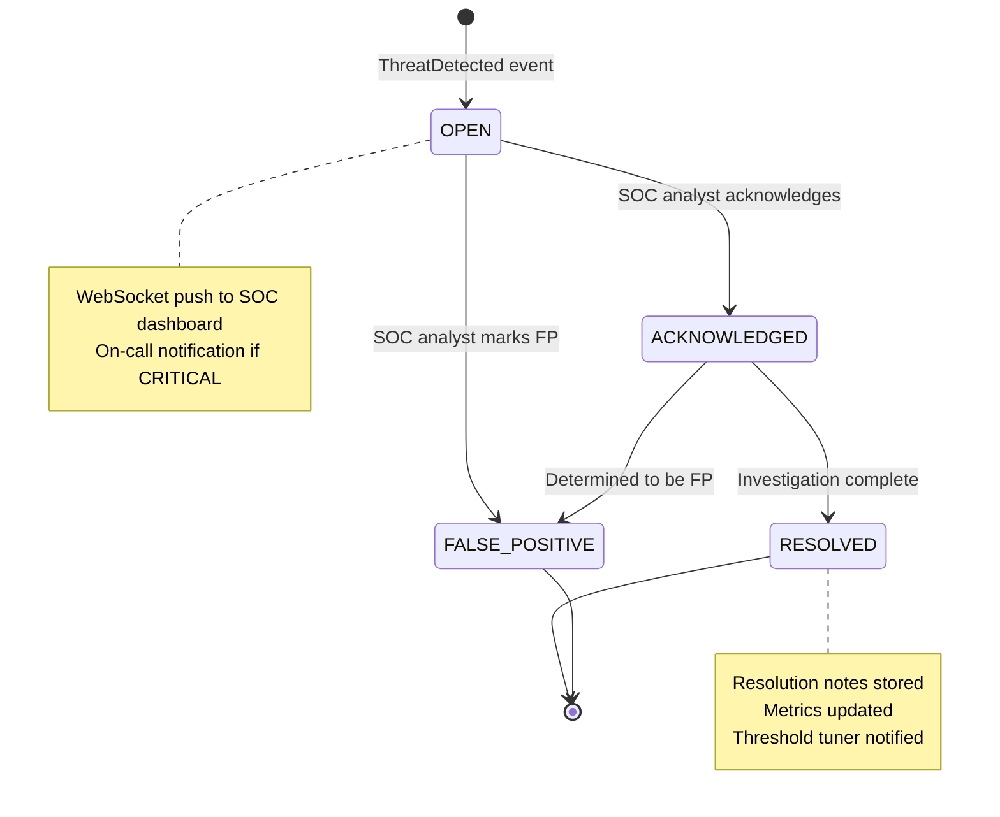

### 10.6 WebSocket Event Schema (SOC Dashboard)

```typescript
// SOC dashboard connects via WebSocket (Socket.IO)
// Authentication: JWT in handshake query param
// Room: tenant:{tenantId}:soc (tenant-scoped)

interface SocAlertCreatedEvent {
  event: 'soc:alert:created'
  data: {
    alertId: string
    tenantId: string
    userId?: string
    threatScore: number
    killChainStage: KillChainStage | null
    signals: Array<{ name: string; score: number; detail: string }>
    responseActions: string[]
    createdAt: string
  }
}

interface SocAlertUpdatedEvent {
  event: 'soc:alert:updated'
  data: {
    alertId: string
    workflow: AlertWorkflow
    updatedBy: string
    updatedAt: string
  }
}

interface SocMetricsEvent {
  event: 'soc:metrics'
  data: {
    openAlerts: number
    criticalAlerts: number
    avgThreatScore: number
    topKillChainStage: KillChainStage
    timestamp: string
  }
}
// Metrics event emitted every 30 seconds to all connected SOC dashboards
```


---

## 11. Resilience

### 11.1 Circuit Breaker State Machine

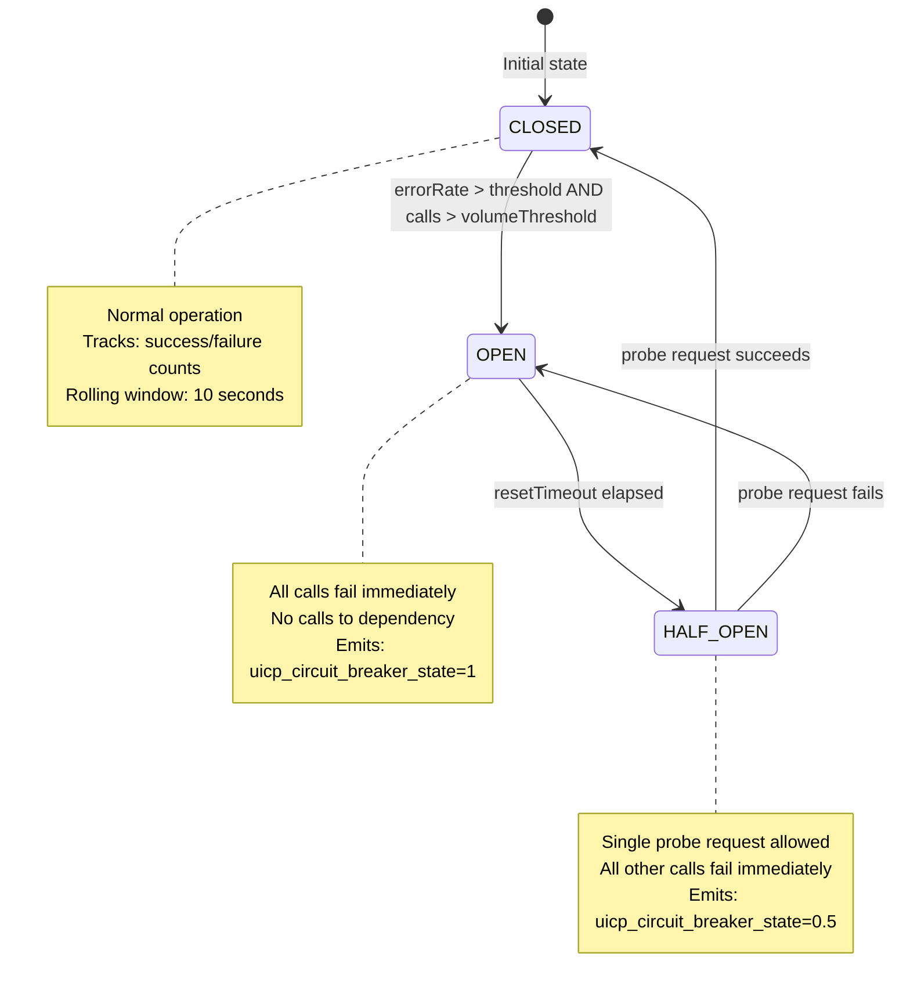

**Per-dependency configuration:**

| Dependency | Timeout | Error Threshold | Volume Threshold | Reset Timeout | Fallback |
|---|---|---|---|---|---|
| MySQL Primary | 5000ms | 50% | 10 calls | 30s | Read replica (reads only) |
| Redis | 200ms | 30% | 20 calls | 10s | DB fallback for sessions |
| Firebase OTP | 3000ms | 40% | 5 calls | 60s | SMTP fallback |
| MaxMind GeoIP | 100ms | 20% | 10 calls | 30s | Score 0.0 (skip geo) |
| External OAuth | 5000ms | 50% | 5 calls | 60s | Error to user |

### 11.2 Bulkhead Pattern

BullMQ queue concurrency limits act as bulkheads, preventing one queue from starving others:

```typescript
const QUEUE_CONCURRENCY = {
  'otp-send':      5,   // OTP delivery — low concurrency, high priority
  'audit-write':   20,  // Audit log writes — high throughput, low priority
  'soc-alert':     3,   // SOC alert processing — low concurrency
  'outbox-relay':  10,  // Outbox relay — medium concurrency
  'email-welcome': 5,   // Welcome emails — low priority
}
// Each queue runs in its own worker process (separate Node.js process)
// Worker crash does not affect other queues or HTTP server
```

### 11.3 Retry Budget

```typescript
// Total retry budget per incoming request: max 3 retries across all dependencies
// Prevents retry storms where one slow dependency causes cascading retries

interface RetryBudget {
  remaining: number      // starts at 3
  consume(): boolean     // returns false if budget exhausted
}

// Budget is stored in CLS context, shared across all operations in a request
// DB deadlock retry: consumes 1 budget unit per retry
// Redis retry: consumes 1 budget unit per retry
// If budget exhausted: fail fast with InfrastructureException
```

### 11.4 Timeout Hierarchy

```
Request timeout (NestJS):          30,000ms  (entire request must complete)
  └── DB query timeout:             5,000ms  (individual SQL query)
  └── Redis command timeout:          200ms  (individual Redis command)
  └── External OAuth call timeout:  5,000ms  (OAuth token exchange)
  └── GeoIP lookup timeout:           100ms  (local DB, should be <5ms)
  └── OTP send timeout:             3,000ms  (Firebase/SMTP)

Hierarchy enforcement:
  - Each layer sets its own timeout independently
  - Inner timeouts are always shorter than outer timeouts
  - AbortController propagated through async call chain
  - Timeout triggers InfrastructureException (retryable=true)
```

### 11.5 Backpressure Propagation

```
Queue depth → Adaptive concurrency → Rate limit multiplier chain:

1. BullMQ queue depth monitored every 10s:
   depth = await queue.getWaitingCount()

2. If depth > HIGH_WATERMARK (1000):
   → Reduce queue concurrency by 20%
   → Set backpressure flag in Redis: SET backpressure:{queue} 1 EX 60

3. HTTP rate limiter reads backpressure flag:
   IF backpressure:{queue} exists:
     → Multiply rate limit by 0.7 (tighten limits)
     → Return 429 with Retry-After: 30s for non-critical endpoints

4. When depth < LOW_WATERMARK (100):
   → Restore concurrency to normal
   → Clear backpressure flag
   → Rate limit multiplier restored to 1.0
```

### 11.6 Split-Brain Redis Handling

```typescript
// Redis Cluster network partition scenario:
// Primary shard becomes unreachable; replica promoted to primary

// Detection: ioredis throws ClusterAllFailedError or MOVED/ASK errors
// Response:
//   1. Circuit breaker trips for Redis (30% error threshold)
//   2. Session reads fall back to MySQL (slower but consistent)
//   3. Rate limiting falls back to in-memory token bucket (per-pod, not distributed)
//   4. Distributed locks fall back to DB advisory locks (SELECT GET_LOCK())
//   5. Alert: uicp_circuit_breaker_state{name="redis"} = 1

// Recovery:
//   1. Redis cluster heals (replica becomes primary)
//   2. Circuit breaker enters HALF_OPEN after resetTimeout
//   3. Probe request succeeds → CLOSED
//   4. In-memory rate limit state discarded (conservative: reset to 0)
//   5. DB advisory locks released (they have TTL via GET_LOCK timeout)
```

### 11.7 DB Connection Pool Exhaustion

```typescript
// Pool configuration:
const POOL_CONFIG = {
  min: 5,
  max: 20,
  acquireTimeoutMs: 5000,    // wait up to 5s for a connection
  idleTimeoutMs: 30000,      // release idle connections after 30s
  queueLimit: 50,            // max requests waiting for connection
}

// When all connections in use:
//   1. Request queued (up to queueLimit=50)
//   2. If queue full: throw InfrastructureException(DB_POOL_EXHAUSTED) immediately
//   3. If acquireTimeout exceeded: throw InfrastructureException(DB_UNAVAILABLE)
//   4. Metric: uicp_db_pool_waiting gauge incremented

// Adaptive pool expansion (see Section 12.4):
//   If waiting > 5: expand pool by 2 (up to max=20)
//   If idle > 2×min: shrink pool by 1 (down to min=5)
```


---

## 12. Adaptive Systems

### 12.1 Server Load Monitor

```typescript
// Samples CPU, memory, and event loop lag every 5 seconds
// Applies Exponential Moving Average (EMA) with α=0.15

interface LoadSample {
  cpuPercent: number        // 0-100
  memoryPercent: number     // 0-100
  eventLoopLagMs: number    // milliseconds
}

// EMA formula:
//   EMA_t = α · sample_t + (1 - α) · EMA_{t-1}
//   α = 0.15 (slow-moving average, resistant to spikes)
//   Initial EMA = first sample

// Composite load score:
//   load_score = 0.30 · (cpuEma / 100)
//              + 0.30 · (memoryEma / 100)
//              + 0.40 · min(1.0, eventLoopLagEma / 100)
//   Result: [0.0, 1.0]

// Event loop lag measurement:
//   setImmediate callback delay measured via hrtime()
//   Target: < 10ms; Warning: > 50ms; Critical: > 100ms
```

### 12.2 Adaptive Bcrypt

```typescript
// Hardware calibration algorithm (runs at startup + every 30 minutes):

async function calibrateBcryptRounds(): Promise<number> {
  const TARGET_MS = 200    // target P95 hash time
  const SAMPLES = 5
  const MIN_ROUNDS = 10
  const MAX_ROUNDS = 13

  const times: number[] = []
  for (let i = 0; i < SAMPLES; i++) {
    const start = process.hrtime.bigint()
    await bcrypt.hash('calibration_password_test', currentRounds)
    const elapsed = Number(process.hrtime.bigint() - start) / 1_000_000  // ms
    times.push(elapsed)
  }

  // P95 measurement (sort + take 95th percentile)
  times.sort((a, b) => a - b)
  const p95 = times[Math.ceil(SAMPLES * 0.95) - 1]

  // Adjust rounds:
  if (p95 > TARGET_MS * 1.2 && currentRounds > MIN_ROUNDS) {
    return currentRounds - 1  // too slow → reduce rounds
  } else if (p95 < TARGET_MS * 0.8 && currentRounds < MAX_ROUNDS) {
    return currentRounds + 1  // too fast → increase rounds
  }
  return currentRounds        // within 20% of target → no change
}

// Load-aware adjustment:
//   IF load_score > 0.80: use MIN_ROUNDS regardless of calibration
//   IF load_score > 0.60: cap at calibrated_rounds - 1
//   ELSE: use calibrated_rounds
```

### 12.3 Adaptive Cache TTL

```typescript
// Per-key-type hit rate tracking (sliding window of last 1000 operations):

const TTL_MULTIPLIER_TABLE = [
  { hitRateMin: 0.90, hitRateMax: 1.00, multiplier: 1.5 },  // hot data → extend TTL
  { hitRateMin: 0.70, hitRateMax: 0.90, multiplier: 1.2 },  // warm data → slight extension
  { hitRateMin: 0.50, hitRateMax: 0.70, multiplier: 1.0 },  // neutral
  { hitRateMin: 0.00, hitRateMax: 0.50, multiplier: 0.7 },  // cold data → reduce TTL
]

function getAdaptiveTtl(baseTtlSeconds: number, keyType: string): number {
  const hitRate = hitRateTracker.getHitRate(keyType)  // sliding window
  const row = TTL_MULTIPLIER_TABLE.find(r => hitRate >= r.hitRateMin && hitRate < r.hitRateMax)
  const multiplier = row?.multiplier ?? 1.0

  // Jitter ±10% to prevent thundering herd (cache stampede)
  const jitter = 1.0 + (Math.random() * 0.2 - 0.1)
  return Math.round(baseTtlSeconds * multiplier * jitter)
}
```

### 12.4 Adaptive DB Pool

```typescript
// Monitors pool metrics every 10 seconds:

async function adaptDbPool(): Promise<void> {
  const waiting = pool.getWaitingCount()
  const idle = pool.getIdleCount()
  const current = pool.getTotalCount()

  if (waiting > 5 && current < POOL_CONFIG.max) {
    await pool.expand(2)  // add 2 connections
    logger.info({ waiting, current, action: 'pool_expanded' }, 'DB pool expanded')
  } else if (idle > 2 * POOL_CONFIG.min && current > POOL_CONFIG.min) {
    await pool.shrink(1)  // remove 1 idle connection
    logger.info({ idle, current, action: 'pool_shrunk' }, 'DB pool shrunk')
  }
}
```

### 12.5 Adaptive Queue Concurrency

```typescript
// Per-queue tuning based on composite load score + queue depth:

function getAdaptiveConcurrency(queue: string): number {
  const base = QUEUE_CONCURRENCY[queue]
  const loadScore = serverLoadMonitor.getCompositeScore()
  const depth = queueDepthMonitor.getDepth(queue)

  // Load factor: reduce concurrency under high load
  const loadFactor = loadScore > 0.80 ? 0.5
                   : loadScore > 0.60 ? 0.75
                   : 1.0

  // Depth factor: increase concurrency when queue is deep
  const depthFactor = depth > 500 ? 1.5
                    : depth > 100 ? 1.2
                    : 1.0

  const adjusted = Math.round(base * loadFactor * depthFactor)
  return Math.max(1, Math.min(adjusted, base * 2))  // bounds: [1, 2×base]
}
```

### 12.6 Adaptive Rate Limit

```typescript
// Adjusts rate limit multiplier based on error rate:
// Error rate = 5xx responses / total responses (rolling 60s window)

function adaptRateLimitMultiplier(currentMultiplier: number, errorRate: number): number {
  if (errorRate > 0.10) {
    // >10% error rate → tighten limits to 70% of current
    return Math.max(0.3, currentMultiplier * 0.7)
  } else if (errorRate < 0.01) {
    // <1% error rate → gradually restore limits (+5% per cycle)
    return Math.min(1.0, currentMultiplier * 1.05)
  }
  return currentMultiplier  // 1-10% error rate → no change
}
// Cycle: every 30 seconds
// Multiplier stored in Redis: SET rate-limit-multiplier:{tenantId} {value} EX 60
```

### 12.7 Parameter Change Logging

```typescript
// All adaptive parameter changes are logged with structured context:
interface AdaptiveChangeLog {
  parameter: 'bcrypt_rounds' | 'cache_ttl_multiplier' | 'db_pool_size'
           | 'queue_concurrency' | 'rate_limit_multiplier'
  oldValue: number
  newValue: number
  reason: string           // e.g., "p95_hash_time=245ms > target=200ms"
  loadScore: number
  timestamp: string
}
// Logged at INFO level with metric: uicp_adaptive_parameter_change_total{parameter}
```


---

## 13. Observability

### 13.1 OpenTelemetry Span Hierarchy

```
HTTP Request Span (root)
  attributes: http.method, http.route, http.status_code, tenant.id, request.id
  │
  ├── Guard Span: jwt_auth_guard
  │     attributes: token.kid, token.jti, user.id
  │
  ├── Command Handler Span: login_handler
  │     attributes: command.type, tenant.id
  │     │
  │     ├── DB Span: identity_repository.find_by_hash
  │     │     attributes: db.system=mysql, db.operation=SELECT, db.table=identities
  │     │     attributes: db.rows_returned, db.duration_ms
  │     │
  │     ├── UEBA Span: ueba_engine.score
  │     │     attributes: ueba.velocity_score, ueba.geo_score, ueba.device_score
  │     │     attributes: ueba.composite_score, ueba.kill_chain_stage
  │     │     │
  │     │     ├── Redis Span: velocity_analyzer
  │     │     │     attributes: redis.command=INCR, redis.key_pattern=user:*:1m
  │     │     │
  │     │     └── GeoIP Span: geo_analyzer
  │     │           attributes: geo.country, geo.city, geo.distance_km
  │     │
  │     ├── DB Span: credential_service.verify
  │     │     attributes: credential.algorithm, credential.rounds
  │     │
  │     ├── Redis Span: session_service.create
  │     │     attributes: redis.command=HSET+ZADD, session.id
  │     │
  │     └── DB Span: outbox_repository.insert
  │           attributes: db.operation=INSERT, outbox.event_type
  │
  └── Response Interceptor Span: response_envelope
        attributes: response.size_bytes
```

### 13.2 Span Attribute Schema

```typescript
// Standard attributes on all spans:
const STANDARD_ATTRIBUTES = {
  'service.name':    'uicp',
  'service.version': process.env.APP_VERSION,
  'tenant.id':       cls.get('tenantId'),
  'request.id':      cls.get('requestId'),
  'user.id':         cls.get('userId'),      // undefined for unauthenticated
}

// DB span attributes:
const DB_ATTRIBUTES = {
  'db.system':       'mysql' | 'redis',
  'db.operation':    'SELECT' | 'INSERT' | 'UPDATE' | 'DELETE',
  'db.table':        tableName,
  'db.rows_affected': rowCount,
  'db.duration_ms':  durationMs,
  // Note: db.statement NOT included (may contain PII)
}

// Security event span attributes:
const SECURITY_ATTRIBUTES = {
  'security.event_type': 'login_failed' | 'token_reuse' | 'impossible_travel',
  'security.threat_score': score,
  'security.kill_chain_stage': stage,
  'security.ip_hash': ipHash,  // hashed, not raw IP
}
```

### 13.3 Trace Sampling Strategy

```typescript
const SAMPLING_CONFIG = {
  // 100% sampling for error traces (5xx responses)
  errorSampling: 1.0,

  // 100% sampling for security events
  securityEventSampling: 1.0,

  // 10% sampling for normal traffic
  normalTrafficSampling: 0.10,

  // 100% sampling for slow requests (> p99 threshold)
  slowRequestThresholdMs: 400,
  slowRequestSampling: 1.0,
}

// Implementation: custom OTel sampler
class UicpSampler implements Sampler {
  shouldSample(context: Context, traceId: string, spanName: string, spanKind: SpanKind, attributes: Attributes): SamplingResult {
    if (attributes['security.event_type']) return RECORD_AND_SAMPLED
    if (attributes['http.status_code'] >= 500) return RECORD_AND_SAMPLED
    if (Math.random() < 0.10) return RECORD_AND_SAMPLED
    return NOT_RECORD
  }
}
```

### 13.4 Complete Prometheus Metric Catalog

```typescript
// ── Counters ──────────────────────────────────────────────────────────────
uicp_auth_attempts_total{tenant_id, result}          // result: success|failed|mfa_required
uicp_signup_total{tenant_id, result}                 // result: success|conflict|error
uicp_otp_sent_total{tenant_id, channel, purpose}     // channel: email|sms
uicp_otp_verified_total{tenant_id, result}           // result: success|invalid|expired|reuse
uicp_token_minted_total{tenant_id, type}             // type: access|refresh
uicp_token_refreshed_total{tenant_id, result}        // result: success|reuse_attack|expired
uicp_errors_total{error_code, category, http_status} // all UicpError subclasses
uicp_soc_alerts_total{tenant_id, kill_chain_stage, threat_level}
uicp_circuit_breaker_fire_total{name}
uicp_circuit_breaker_success_total{name}
uicp_circuit_breaker_failure_total{name}
uicp_outbox_published_total{event_type}
uicp_outbox_dlq_total{event_type}
uicp_adaptive_parameter_change_total{parameter}

// ── Gauges ────────────────────────────────────────────────────────────────
uicp_active_sessions{tenant_id}                      // current active session count
uicp_threat_score{tenant_id, user_id}                // latest UEBA score per user
uicp_circuit_breaker_state{name}                     // 0=closed, 0.5=half-open, 1=open
uicp_db_pool_size{pool}                              // current pool size
uicp_db_pool_waiting{pool}                           // requests waiting for connection
uicp_queue_depth{queue_name}                         // BullMQ waiting job count
uicp_bcrypt_rounds                                   // current adaptive bcrypt rounds
uicp_rate_limit_multiplier{tenant_id}                // current rate limit multiplier
uicp_load_score                                      // composite server load score

// ── Histograms ────────────────────────────────────────────────────────────
uicp_request_duration_ms{method, route, status}      // buckets: 5,10,25,50,100,250,500,1000,2500
uicp_db_query_duration_ms{operation, table}          // buckets: 1,5,10,25,50,100,250,500
uicp_redis_command_duration_ms{command}              // buckets: 0.5,1,2,5,10,25,50
uicp_bcrypt_hash_duration_ms                         // buckets: 50,100,150,200,250,300,500
uicp_ueba_score_duration_ms                          // buckets: 1,5,10,25,50,100
uicp_token_validation_duration_ms                    // buckets: 0.5,1,2,5,10,25
```

### 13.5 Prometheus Alert Rules

```yaml
# Critical: Circuit breaker open
- alert: UicpCircuitBreakerOpen
  expr: uicp_circuit_breaker_state{name=~"mysql|redis"} == 1
  for: 1m
  labels: { severity: critical }
  annotations:
    summary: "Circuit breaker {{ $labels.name }} is OPEN"

# Critical: High error rate
- alert: UicpHighErrorRate
  expr: rate(uicp_errors_total{http_status=~"5.."}[5m]) > 10
  for: 2m
  labels: { severity: critical }
  annotations:
    summary: "Error rate > 10/s for 2 minutes"

# Warning: Threat score spike
- alert: UicpThreatScoreSpike
  expr: uicp_soc_alerts_total{kill_chain_stage="ACCOUNT_TAKEOVER"} > 5
  for: 5m
  labels: { severity: warning }
  annotations:
    summary: "Multiple ACCOUNT_TAKEOVER alerts in 5 minutes"

# Warning: Outbox DLQ growing
- alert: UicpOutboxDlqGrowing
  expr: increase(uicp_outbox_dlq_total[10m]) > 10
  for: 5m
  labels: { severity: warning }
  annotations:
    summary: "Outbox DLQ receiving > 10 events in 10 minutes"

# Warning: DB pool exhaustion
- alert: UicpDbPoolExhausted
  expr: uicp_db_pool_waiting > 20
  for: 1m
  labels: { severity: warning }
  annotations:
    summary: "DB connection pool has > 20 waiting requests"
```

### 13.6 Log Correlation

```typescript
// Every log line includes traceId from CLS context:
// traceId links: Pino logs → OTel traces → Prometheus metrics

// Pino log schema (NDJSON):
interface PinoLogLine {
  level: 'trace' | 'debug' | 'info' | 'warn' | 'error' | 'fatal'
  time: number              // Unix timestamp ms
  pid: number
  hostname: string
  msg: string
  // CLS context (auto-injected):
  requestId: string
  traceId: string           // OTel trace ID (links to Jaeger/Zipkin)
  tenantId: string
  userId?: string
  sessionId?: string
  // Operation context:
  operation?: string        // e.g., "login", "refresh_token"
  durationMs?: number       // for measure() wrapped operations
  // Error context (on error level):
  errorCode?: string
  errorCategory?: string
  httpStatus?: number
  // Security context (PII-free):
  ipHash?: string
  threatScore?: number
}

// PII redaction (pino-redact):
// Paths redacted: ['email', 'password', 'phone', 'ip', '*.email', '*.phone']
// Replaced with: '[REDACTED]'
```


---

## 14. Testing Strategy

### 14.1 Property-Based Test Arbitraries

```typescript
import * as fc from 'fast-check'

// Custom arbitraries for domain types:

const validEmail = () =>
  fc.tuple(
    fc.stringOf(fc.constantFrom(...'abcdefghijklmnopqrstuvwxyz0123456789'.split('')), { minLength: 1, maxLength: 30 }),
    fc.constantFrom('gmail.com', 'yahoo.com', 'outlook.com', 'company.org')
  ).map(([local, domain]) => `${local}@${domain}`)

const validPassword = () =>
  fc.tuple(
    fc.stringOf(fc.constantFrom(...'ABCDEFGHIJKLMNOPQRSTUVWXYZ'.split('')), { minLength: 1, maxLength: 5 }),
    fc.stringOf(fc.constantFrom(...'abcdefghijklmnopqrstuvwxyz'.split('')), { minLength: 1, maxLength: 5 }),
    fc.stringOf(fc.constantFrom(...'0123456789'.split('')), { minLength: 1, maxLength: 3 }),
    fc.stringOf(fc.constantFrom(...'!@#$%^&*'.split('')), { minLength: 1, maxLength: 3 })
  ).map(parts => parts.join('').split('').sort(() => Math.random() - 0.5).join(''))
   .filter(p => p.length >= 10)

const validTenantId = () => fc.uuid()
const validUserId = () => fc.uuid()
const validSessionId = () => fc.uuid()

const validThreatScore = () => fc.float({ min: 0.0, max: 1.0, noNaN: true })

const validIdentityType = () =>
  fc.constantFrom('email', 'phone', 'google', 'github', 'apple', 'microsoft')

const validUserStatus = () =>
  fc.constantFrom('pending', 'active', 'suspended', 'deleted')
```

### 14.2 Integration Test Matrix

| Scenario | Real DB | Real Redis | Mock | Notes |
|---|---|---|---|---|
| Signup race condition | ✅ | ✅ | — | Requires real UNIQUE constraint |
| Optimistic lock conflict | ✅ | — | — | Requires real concurrent transactions |
| Session TTL expiry | — | ✅ | — | Requires real Redis TTL |
| OTP single-use (GETDEL) | — | ✅ | — | Requires real atomic GETDEL |
| Outbox SKIP LOCKED | ✅ | — | — | Requires real FOR UPDATE SKIP LOCKED |
| Circuit breaker fallback | — | — | ✅ | Inject artificial failures |
| Token family revocation | ✅ | ✅ | — | Requires both for full flow |
| ABAC policy evaluation | — | — | ✅ | Pure domain logic |
| Bcrypt calibration | — | — | ✅ | Mock CPU timing |
| Audit log immutability | ✅ | — | — | Verify UPDATE returns 0 rows |

### 14.3 Load Test Scenarios (k6)

```javascript
// Scenario 1: Sustained 500 RPS login flow
export const options = {
  scenarios: {
    sustained_load: {
      executor: 'constant-arrival-rate',
      rate: 500,
      timeUnit: '1s',
      duration: '10m',
      preAllocatedVUs: 100,
    }
  },
  thresholds: {
    'http_req_duration{route:login}': ['p95<200', 'p99<400'],
    'http_req_failed': ['rate<0.01'],
  }
}

// Scenario 2: Spike test (0 → 2000 RPS in 30s)
export const spikeOptions = {
  scenarios: {
    spike: {
      executor: 'ramping-arrival-rate',
      stages: [
        { duration: '30s', target: 2000 },
        { duration: '1m', target: 2000 },
        { duration: '30s', target: 0 },
      ]
    }
  }
}

// Scenario 3: Soak test (200 RPS for 2 hours)
// Validates: no memory leaks, no connection pool exhaustion, stable p99
```

### 14.4 Chaos Engineering Scenarios

| Scenario | Injection Method | Expected Behavior | Recovery |
|---|---|---|---|
| Redis failure | Kill Redis primary | Session reads fall back to DB; rate limiting uses in-memory | Circuit breaker closes when Redis recovers |
| DB primary failover | Kill MySQL primary | Writes fail with 503; reads continue on replica | Reconnect to new primary within 30s |
| Network partition | iptables DROP between pods and Redis | Split-brain handling; conservative rate limits | Automatic recovery when partition heals |
| OOM | `--max-old-space-size=256` | Graceful shutdown triggered; pod restarted by K8s | New pod starts within 10s |
| Slow DB | Add 2s artificial delay | Circuit breaker trips after volumeThreshold; 503 returned | Circuit closes when delay removed |
| Outbox relay crash | Kill relay worker process | Events accumulate in outbox; no data loss | Relay restarts, processes backlog |

### 14.5 Security Test Scenarios

```typescript
// SQL Injection: all queries use parameterized statements
// Test: inject ' OR 1=1 -- into all string inputs
// Expected: Zod validation rejects or parameterized query treats as literal string

// JWT Tampering: modify payload without re-signing
// Test: base64-decode payload, change userId, re-encode without signing
// Expected: RS256 signature verification fails → 401

// Timing Attack on OTP: measure response time for valid vs invalid codes
// Test: 1000 requests with invalid codes, measure variance
// Expected: timingSafeEqual ensures constant-time comparison; variance < 1ms

// Replay Attack on OTP: use same OTP code twice
// Test: verify OTP → 200; verify same OTP again → 400 ALREADY_USED
// Expected: Redis GETDEL ensures single-use

// Refresh Token Reuse: use rotated-away refresh token
// Test: rotate token → get new token; use old token → 401 REFRESH_TOKEN_REUSE
// Expected: entire family revoked; user must re-authenticate

// Cross-Tenant Data Access: use valid JWT from tenant A to access tenant B data
// Test: JWT with tenantId=A, request with X-Tenant-ID=B
// Expected: TenantGuard rejects (tenantId mismatch) → 403
```


---

## 15. Correctness Properties

The following 20 properties must hold at all times and are verified via property-based tests using `fast-check`.

### Property 1: Identity Uniqueness

**Formal statement:**
```
∀ tenant T, identity type τ, identity value v:
count({ i ∈ identities | i.tenantId = T ∧ i.type = τ ∧ i.valueHash = hmac(v) ∧ i.verified = true }) ≤ 1
```

**fast-check implementation:**
```typescript
it('identity uniqueness', async () => {
  await fc.assert(fc.asyncProperty(
    validEmail(), validTenantId(),
    async (email, tenantId) => {
      await signupEmail(email, tenantId)
      const result = await signupEmail(email, tenantId)  // duplicate
      expect(result.errorCode).toBe('IDENTITY_ALREADY_EXISTS')
    }
  ), { numRuns: 100 })
})
```

**Enforcement layers:** DB UNIQUE KEY `uq_tenant_type_hash` + distributed lock + application-level check.

---

### Property 2: User Status Invariant

**Formal statement:**
```
∀ user U: U.status = ACTIVE ⟹ ∃ i ∈ U.identities: i.verified = true
```

**fast-check implementation:**
```typescript
it('active user has verified identity', async () => {
  await fc.assert(fc.asyncProperty(
    validUserId(), validTenantId(),
    async (userId, tenantId) => {
      const user = await userRepository.findById(userId, tenantId)
      if (user?.getStatus() === UserStatus.ACTIVE) {
        expect(user.getVerifiedIdentities().length).toBeGreaterThan(0)
      }
    }
  ), { numRuns: 500 })
})
```

**Failure looks like:** User with status=ACTIVE but no verified identities — would allow login without identity verification.

---

### Property 3: Token Family Integrity

**Formal statement:**
```
∀ refresh token R, family F:
R.familyId = F ∧ reuseDetected(R) ⟹ ∀ R' ∈ family(F): R'.revoked = true
```

**fast-check implementation:**
```typescript
it('token reuse revokes entire family', async () => {
  await fc.assert(fc.asyncProperty(
    validUserId(), validTenantId(),
    async (userId, tenantId) => {
      const { refreshToken: rt1 } = await login(userId, tenantId)
      const { refreshToken: rt2 } = await refresh(rt1)  // rotate
      await refresh(rt1)  // reuse attack — use old token
      const family = await tokenRepository.findFamily(rt1.familyId)
      expect(family.every(t => t.revoked)).toBe(true)
    }
  ), { numRuns: 50 })
})
```

---

### Property 4: Optimistic Lock Consistency

**Formal statement:**
```
∀ concurrent updates {u₁, u₂} on same user aggregate:
exactly one succeeds ∧ rest throw ConflictException(VERSION_CONFLICT)
```

**fast-check implementation:**
```typescript
it('concurrent updates: exactly one succeeds', async () => {
  await fc.assert(fc.asyncProperty(
    validUserId(), validTenantId(),
    async (userId, tenantId) => {
      const results = await Promise.allSettled([
        updateUser(userId, tenantId, { version: 0 }),
        updateUser(userId, tenantId, { version: 0 }),
      ])
      const successes = results.filter(r => r.status === 'fulfilled')
      const conflicts = results.filter(r => r.status === 'rejected' && r.reason.errorCode === 'VERSION_CONFLICT')
      expect(successes.length).toBe(1)
      expect(conflicts.length).toBe(1)
    }
  ), { numRuns: 100 })
})
```

---

### Property 5: OTP Single-Use

**Formal statement:**
```
∀ OTP code C: verify(C) succeeds ⟹ verify(C) on subsequent call throws OtpException(ALREADY_USED)
```

**Enforcement:** Redis `GETDEL` — atomic get-and-delete in single round trip.

---

### Property 6: Rate Limit Monotonicity

**Formal statement:**
```
∀ token bucket B: B.remaining ∈ [0, B.capacity] at all times
```

**fast-check implementation:**
```typescript
it('rate limit remaining never negative or exceeds capacity', async () => {
  await fc.assert(fc.asyncProperty(
    fc.integer({ min: 1, max: 100 }), fc.integer({ min: 1, max: 1000 }),
    async (capacity, requests) => {
      const results = await Promise.all(
        Array.from({ length: requests }, () => checkRateLimit('test-key', capacity))
      )
      results.forEach(r => {
        expect(r.remaining).toBeGreaterThanOrEqual(0)
        expect(r.remaining).toBeLessThanOrEqual(capacity)
      })
    }
  ), { numRuns: 50 })
})
```

---

### Property 7: Encryption Roundtrip

**Formal statement:**
```
∀ plaintext p, context ctx: decrypt(encrypt(p, ctx), ctx) = p
```

**fast-check implementation:**
```typescript
it('encryption roundtrip', async () => {
  await fc.assert(fc.asyncProperty(
    fc.string({ minLength: 1, maxLength: 1000 }),
    fc.constantFrom(...Object.values(EncryptionContext)),
    async (plaintext, context) => {
      const encrypted = await encryptionService.encrypt(plaintext, context)
      const decrypted = await encryptionService.decrypt(encrypted, context)
      expect(decrypted).toBe(plaintext)
    }
  ), { numRuns: 1000 })
})
```

---

### Property 8: HMAC Determinism

**Formal statement:**
```
∀ value v, context ctx: hmac(v, ctx) = hmac(v, ctx)
```

**fast-check implementation:**
```typescript
it('HMAC is deterministic', async () => {
  await fc.assert(fc.property(
    fc.string(), fc.constantFrom(...Object.values(EncryptionContext)),
    (value, context) => {
      const h1 = encryptionService.hmac(value, context)
      const h2 = encryptionService.hmac(value, context)
      expect(h1).toBe(h2)
    }
  ), { numRuns: 1000 })
})
```

---

### Property 9: Session Expiry

**Formal statement:**
```
∀ session S, time t: t > S.expiresAt ⟹ findById(S.id) = null
```

**Enforcement:** Redis TTL auto-expires session keys. Session reads check `expiresAt` field as secondary guard.

---

### Property 10: Audit Immutability

**Formal statement:**
```
∀ audit log entry A: UPDATE audit_logs ... WHERE id = A.id → 0 rows affected
```

**Enforcement:** DB-level: revoke UPDATE/DELETE grants on `audit_logs` table for application DB user. Application-level: `IAlertRepository.save()` is INSERT-only.

---

### Property 11: ABAC Deny Override

**Formal statement:**
```
∀ policy set P, subject S, resource R, action A:
∃ p ∈ P: p.effect = DENY ∧ matches(p, S, R, A) ⟹ decision = DENY
(regardless of any ALLOW policies or priority values)
```

**fast-check implementation:**
```typescript
it('DENY policy overrides any ALLOW policy', async () => {
  await fc.assert(fc.asyncProperty(
    fc.record({ subject: fc.record({ role: fc.string() }), resource: fc.record({ type: fc.string() }) }),
    async (context) => {
      const policies = [
        { effect: 'ALLOW', priority: 100, condition: 'true' },
        { effect: 'DENY', priority: 1, condition: 'true' },
      ]
      const decision = abacEngine.evaluate(policies, context)
      expect(decision).toBe('DENY')
    }
  ), { numRuns: 500 })
})
```

---

### Property 12: Threat Score Bounds

**Formal statement:**
```
∀ UEBA evaluation E: E.threatScore ∈ [0.0, 1.0]
```

**fast-check implementation:**
```typescript
it('threat score always in [0, 1]', async () => {
  await fc.assert(fc.asyncProperty(
    validThreatScore(), validThreatScore(), validThreatScore(), validThreatScore(),
    async (v, g, d, cs) => {
      const score = uebaEngine.computeComposite({ velocity: v, geo: g, device: d, credentialStuffing: cs, tor: 0 })
      expect(score).toBeGreaterThanOrEqual(0.0)
      expect(score).toBeLessThanOrEqual(1.0)
    }
  ), { numRuns: 10000 })
})
```

---

### Property 13: Bcrypt Rounds Floor

**Formal statement:**
```
∀ adaptive calibration cycle: getBcryptRounds() ≥ 10
```

**fast-check implementation:**
```typescript
it('bcrypt rounds never below 10', async () => {
  await fc.assert(fc.asyncProperty(
    fc.float({ min: 0.0, max: 1.0 }),  // any load score
    async (loadScore) => {
      serverLoadMonitor.mockScore(loadScore)
      const rounds = adaptiveTuningEngine.getBcryptRounds()
      expect(rounds).toBeGreaterThanOrEqual(10)
    }
  ), { numRuns: 1000 })
})
```

---

### Property 14: Idempotency Consistency

**Formal statement:**
```
∀ requests R₁, R₂ with same idempotency key K:
R₁.idempotencyKey = R₂.idempotencyKey ⟹ response(R₁) = response(R₂)
```

**fast-check implementation:**
```typescript
it('same idempotency key returns same response', async () => {
  await fc.assert(fc.asyncProperty(
    fc.uuid(), validEmail(), validPassword(),
    async (idempotencyKey, email, password) => {
      const r1 = await signup({ email, password, idempotencyKey })
      const r2 = await signup({ email, password, idempotencyKey })
      expect(r2.headers['x-idempotency-replayed']).toBe('true')
      expect(r2.body).toEqual(r1.body)
    }
  ), { numRuns: 100 })
})
```

---

### Property 15: Distributed Lock Exclusivity

**Formal statement:**
```
∀ lock key K, time t: |{ processes P | P holds lock K at time t }| ≤ 1
```

**fast-check implementation:**
```typescript
it('at most one holder per lock key', async () => {
  await fc.assert(fc.asyncProperty(
    fc.uuid(),
    async (lockKey) => {
      const results = await Promise.allSettled(
        Array.from({ length: 10 }, () => lockPort.acquire(lockKey, 5000))
      )
      const acquired = results.filter(r => r.status === 'fulfilled')
      expect(acquired.length).toBe(1)  // exactly one acquires
    }
  ), { numRuns: 50 })
})
```

---

### Property 16: Tenant Isolation

**Formal statement:**
```
∀ tenants A, B where A ≠ B, ∀ query Q with tenantId=A:
∀ row r ∈ result(Q): r.tenantId = A
```

**fast-check implementation:**
```typescript
it('no query returns data from different tenant', async () => {
  await fc.assert(fc.asyncProperty(
    validTenantId(), validTenantId(),
    async (tenantA, tenantB) => {
      fc.pre(tenantA !== tenantB)
      const userInA = await createUser(tenantA)
      const result = await userRepository.findById(userInA.id, tenantB)
      expect(result).toBeNull()  // user from tenant A not visible in tenant B
    }
  ), { numRuns: 200 })
})
```

**Enforcement:** Every repository method includes `WHERE tenant_id = ?`. Integration tests verify cross-tenant isolation.

---

### Property 17: Credential Pepper Consistency

**Formal statement:**
```
∀ password p, pepper π: verify(p, hash(p, π), π) = true
∀ password p, pepper π, wrong_pepper π': verify(p, hash(p, π), π') = false
```

**fast-check implementation:**
```typescript
it('same password + same pepper always verifiable', async () => {
  await fc.assert(fc.asyncProperty(
    validPassword(),
    async (password) => {
      const raw = RawPassword.create(password)
      const { hash } = await credentialService.hash(raw)
      const { valid } = await credentialService.verify(password, { hash, algorithm: 'bcrypt_v1', rounds: 10 })
      expect(valid).toBe(true)
    }
  ), { numRuns: 20 })  // bcrypt is slow — fewer runs
})
```

---

### Property 18: Event Store Ordering

**Formal statement:**
```
∀ aggregate A, events E = loadEvents(A.id):
∀ i < j: E[i].aggregateSeq < E[j].aggregateSeq
```

**fast-check implementation:**
```typescript
it('events always replayed in aggregate_seq order', async () => {
  await fc.assert(fc.asyncProperty(
    validUserId(),
    async (aggregateId) => {
      const events = await eventStore.loadEvents(aggregateId)
      for (let i = 1; i < events.length; i++) {
        expect(events[i].aggregateSeq).toBeGreaterThan(events[i-1].aggregateSeq)
      }
    }
  ), { numRuns: 100 })
})
```

**Enforcement:** DB `ORDER BY aggregate_seq ASC` in `loadEvents` query. `UNIQUE KEY uq_aggregate_seq` prevents gaps or duplicates.

---

### Property 19: Outbox At-Least-Once

**Formal statement:**
```
∀ domain event E inserted into outbox:
∃ t > insertTime(E): E.status = 'PUBLISHED' ∨ E.status = 'DLQ'
(no event remains PENDING indefinitely)
```

**Enforcement:** Outbox relay polls every 500ms. Failed events retried up to 5 times with exponential backoff. After 5 failures: moved to DLQ + SOC alert. DLQ events trigger manual intervention alert.

---

### Property 20: ABAC JIT Determinism

**Formal statement:**
```
∀ policy P, context C:
compiledFn(P)(C) = interpretDsl(P.condition)(C)
```

**fast-check implementation:**
```typescript
it('JIT compiled policy matches DSL interpreter', async () => {
  await fc.assert(fc.asyncProperty(
    fc.record({
      subject: fc.record({ role: fc.constantFrom('admin', 'editor', 'viewer'), tenantId: validTenantId() }),
      resource: fc.record({ type: fc.constantFrom('user', 'billing', 'report'), tenantId: validTenantId() }),
      action: fc.constantFrom('read', 'write', 'delete'),
    }),
    async (context) => {
      const policy = { condition: 'subject.role IN ["admin", "editor"] AND subject.tenantId == resource.tenantId' }
      const interpretedResult = abacDslInterpreter.evaluate(policy.condition, context)
      const compiledFn = abacCompiler.compile(policy.condition)
      const compiledResult = compiledFn(context)
      expect(compiledResult).toBe(interpretedResult)
    }
  ), { numRuns: 1000 })
})
```


---

## 16. Module Architecture

### 16.1 Full NestJS Module Map

```typescript
// AppModule — root module
@Module({
  imports: [
    ConfigModule.forRoot({ isGlobal: true }),   // global
    ClsModule.forRoot({ global: true }),         // global
    InfraModule,
    ApplicationModule,
    InterfaceModule,
  ],
})
export class AppModule {}

// InfraModule — infrastructure adapters
@Module({
  imports: [
    DbModule.forRoot(),          // dynamic: selects MySQL or Postgres adapter
    CacheModule,
    QueueModule,
    EncryptionModule,
    MetricsModule,
    TracingModule,
    LockModule,
  ],
  exports: [
    DbModule, CacheModule, QueueModule, EncryptionModule,
    MetricsModule, TracingModule, LockModule,
  ],
})
export class InfraModule {}

// DbModule — dynamic module for DB adapter selection
@Module({})
export class DbModule {
  static forRoot(): DynamicModule {
    const adapter = process.env.DB_ADAPTER ?? 'mysql'
    const providers = adapter === 'postgres'
      ? postgresProviders
      : mysqlProviders  // default

    return {
      module: DbModule,
      providers: [
        ...providers,
        // Bind all repository injection tokens to concrete implementations
        { provide: INJECTION_TOKENS.USER_REPOSITORY, useClass: providers.UserRepository },
        { provide: INJECTION_TOKENS.IDENTITY_REPOSITORY, useClass: providers.IdentityRepository },
        { provide: INJECTION_TOKENS.SESSION_STORE, useClass: RedisSessionStore },
        { provide: INJECTION_TOKENS.TOKEN_REPOSITORY, useClass: providers.TokenRepository },
        { provide: INJECTION_TOKENS.EVENT_STORE, useClass: providers.EventStoreRepository },
        { provide: INJECTION_TOKENS.OUTBOX_REPOSITORY, useClass: providers.OutboxRepository },
        { provide: INJECTION_TOKENS.ABAC_POLICY_REPOSITORY, useClass: providers.AbacPolicyRepository },
        { provide: INJECTION_TOKENS.ALERT_REPOSITORY, useClass: providers.AlertRepository },
      ],
      exports: [
        INJECTION_TOKENS.USER_REPOSITORY,
        INJECTION_TOKENS.IDENTITY_REPOSITORY,
        INJECTION_TOKENS.SESSION_STORE,
        INJECTION_TOKENS.TOKEN_REPOSITORY,
        INJECTION_TOKENS.EVENT_STORE,
        INJECTION_TOKENS.OUTBOX_REPOSITORY,
        INJECTION_TOKENS.ABAC_POLICY_REPOSITORY,
        INJECTION_TOKENS.ALERT_REPOSITORY,
      ],
    }
  }
}

// ApplicationModule — use cases
@Module({
  imports: [InfraModule],
  providers: [
    // Command handlers
    SignupEmailHandler,
    LoginHandler,
    RefreshTokenHandler,
    VerifyOtpHandler,
    LogoutHandler,
    LogoutAllHandler,
    OAuthCallbackHandler,
    ChangePasswordHandler,
    RotateKeysHandler,
    // Query handlers
    GetUserHandler,
    GetUserSessionsHandler,
    ListAuditLogsHandler,
    GetThreatHistoryHandler,
    GetJwksHandler,
    ValidateTokenHandler,
    // Application services
    CredentialService,
    TokenService,
    SessionService,
    OtpService,
    DistributedLockService,
    IdempotencyService,
    UebaEngine,
    AbacPolicyEngine,
    // Sagas
    IdentityVerificationSaga,
  ],
  exports: [
    SignupEmailHandler, LoginHandler, RefreshTokenHandler,
    VerifyOtpHandler, LogoutHandler, LogoutAllHandler,
    OAuthCallbackHandler, ValidateTokenHandler, GetJwksHandler,
    GetUserHandler, GetUserSessionsHandler,
  ],
})
export class ApplicationModule {}

// InterfaceModule — driving adapters
@Module({
  imports: [ApplicationModule],
  providers: [
    // HTTP
    AuthController,
    SessionController,
    UserController,
    AdminController,
    JwksController,
    // Guards
    JwtAuthGuard,
    TenantGuard,
    // Interceptors
    IdempotencyInterceptor,
    ClsContextInterceptor,
    ResponseEnvelopeInterceptor,
    // Filters
    GlobalExceptionFilter,
    // gRPC
    AuthGrpcHandler,
    TokenValidateGrpcHandler,
    // WebSocket
    SocDashboardGateway,
  ],
})
export class InterfaceModule {}
```

### 16.2 Global vs Scoped Providers

| Provider | Scope | Reason |
|---|---|---|
| `ConfigModule` | Global | Config values needed everywhere |
| `ClsModule` | Global | CLS context needed in all layers |
| `MetricsModule` | Global | Metrics emitted from all layers |
| `TracingModule` | Global | Spans created in all layers |
| `EncryptionModule` | Global | Encryption used in repositories |
| `LockModule` | Global | Locks used in multiple handlers |
| `CacheModule` | Global | Cache used in multiple services |
| All command/query handlers | Default (singleton) | Stateless — safe to share |
| `CredentialService` | Default (singleton) | Stateless |
| `UebaEngine` | Default (singleton) | Stateless (reads from Redis) |
| `AbacPolicyEngine` | Default (singleton) | LRU cache is instance-level |
| `IdentityVerificationSaga` | Default (singleton) | Stateless orchestrator |

### 16.3 CLS Module Configuration

```typescript
ClsModule.forRoot({
  global: true,
  middleware: {
    mount: true,
    generateId: true,
    idGenerator: () => randomUUID(),
  },
  guard: { mount: false },    // use interceptor instead for more control
  interceptor: { mount: false }, // manually mounted in InterfaceModule
})
```

### 16.4 BullMQ Module Configuration

```typescript
BullModule.forRoot({
  connection: {
    host: process.env.REDIS_HOST,
    port: parseInt(process.env.REDIS_PORT),
    password: process.env.REDIS_PASSWORD,
    tls: process.env.REDIS_TLS === 'true' ? {} : undefined,
  },
  defaultJobOptions: {
    removeOnComplete: { count: 1000 },
    removeOnFail: { count: 5000 },
    attempts: 5,
    backoff: { type: 'exponential', delay: 1000 },
  },
})

// Per-queue configuration:
BullModule.registerQueue(
  { name: 'otp-send',      defaultJobOptions: { priority: 1, attempts: 3 } },
  { name: 'audit-write',   defaultJobOptions: { priority: 10, attempts: 5 } },
  { name: 'soc-alert',     defaultJobOptions: { priority: 2, attempts: 3 } },
  { name: 'outbox-relay',  defaultJobOptions: { priority: 5, attempts: 5 } },
  { name: 'email-welcome', defaultJobOptions: { priority: 8, attempts: 3 } },
)
```


---

## 17. API Surface

The UICP exposes **6 main API groups**. Each group is a self-contained surface with its own auth tier, rate limit policy, and built-in advanced rules. Clients integrate with the group that matches their actor type — the rules inside each group handle the rest automatically.

```
API Groups:
  /auth          → Authentication API (all clients — public surface)
  /users         → User Self-Service API (authenticated end-users)
  /iam           → IAM Management API (tenant admins — roles, permissions, policies)
  /admin         → Tenant Administration API (tenant admins — user management, audit)
  /soc           → Security Operations API (SOC analysts — alerts, threat intel)
  /platform      → Platform API (super-admins — tenant provisioning, key ops)
```

### 17.1 API Group 1: Authentication API (`/auth`)

**Actor**: Any client (public surface). No auth required except where noted.
**Built-in rules**: UEBA scoring on every login attempt, adaptive rate limiting, idempotency on signup, OTP single-use enforcement, refresh token family revocation, MFA challenge injection, device trust tracking.

| Method | Path | Auth | Rate Limit | Idempotency | Built-in Rules |
|---|---|---|---|---|---|
| `POST` | `/auth/signup` | None | 10/min/IP | ✅ Required | Distributed lock, duplicate identity check, OTP dispatch |
| `POST` | `/auth/login` | None | 20/min/IP | ❌ | UEBA scoring, AuthPolicy eval, MFA injection, session LRU |
| `POST` | `/auth/refresh` | Refresh JWT | 60/min/user | ❌ | Pessimistic lock, reuse detection, family revocation |
| `POST` | `/auth/logout` | Access JWT | 100/min/user | ❌ | Session invalidation, JWT blocklist |
| `POST` | `/auth/logout-all` | Access JWT | 10/min/user | ❌ | All sessions + all families revoked |
| `POST` | `/auth/otp/send` | None | 5/min/user | ✅ Optional | Rate limit per purpose, channel fallback |
| `POST` | `/auth/otp/verify` | None | 10/min/user | ❌ | Atomic GETDEL, timing-safe compare, saga trigger |
| `POST` | `/auth/password/change` | Access JWT | 5/min/user | ✅ Optional | Old password verify, rehash, session invalidation |
| `POST` | `/auth/password/reset/request` | None | 3/min/IP | ✅ Optional | Timing-safe (same response whether user exists or not) |
| `POST` | `/auth/password/reset/confirm` | None | 5/min/IP | ✅ Optional | Token consume, credential update, all sessions revoked |
| `GET` | `/auth/oauth/{provider}` | None | 20/min/IP | ❌ | CSRF state generation, redirect URI validation |
| `GET` | `/auth/oauth/{provider}/callback` | None | 20/min/IP | ❌ | State verify, token exchange, identity upsert |
| `GET` | `/.well-known/jwks.json` | None | 1000/min/IP | ❌ | Cache-Control: public, max-age=3600 |
| `GET` | `/.well-known/openid-configuration` | None | 1000/min/IP | ❌ | OIDC discovery document |

**Request/Response DX conventions for `/auth`:**

```typescript
// All auth responses follow this envelope:
interface AuthResponse<T> {
  data: T
  meta: {
    requestId: string
    timestamp: string
  }
}

// POST /auth/login — request
interface LoginRequest {
  identity: string          // email or phone (E.164)
  password: string
  deviceFingerprint?: string
  // X-Tenant-ID: header (required)
  // X-Idempotency-Key: header (optional)
}

// POST /auth/login — success response
interface LoginResponse {
  accessToken: string       // JWT, 15min TTL
  refreshToken: string      // JWT, 7-day TTL
  sessionId: string
  expiresIn: 900            // seconds
  tokenType: 'Bearer'
  mfaRequired?: boolean     // if true: use challengeToken to verify OTP
  challengeToken?: string   // short-lived token for MFA flow
  user: {
    id: string
    status: string
    roles: string[]
  }
}

// POST /auth/login — MFA required response (HTTP 202)
interface MfaRequiredResponse {
  mfaRequired: true
  challengeToken: string    // 5-min TTL, used in /auth/otp/verify
  sessionId: string
  otpChannel: 'email' | 'sms'
  maskedDestination: string // "j***@gmail.com" or "+1***1234"
}

// Error response (all groups)
interface ErrorResponse {
  error: {
    code: string            // e.g., "INVALID_CREDENTIALS"
    message: string         // human-readable
    retryAfter?: number     // seconds (for 429)
    remaining?: number      // rate limit remaining
    field?: string          // for validation errors
  }
  meta: { requestId: string; timestamp: string }
}
```

### 17.2 API Group 2: User Self-Service API (`/users`)

**Actor**: Authenticated end-users managing their own account.
**Built-in rules**: All endpoints automatically scope to `req.user.id` — users cannot access other users' data. ABAC policy evaluated on every request. Audit log written for every mutation.

| Method | Path | Auth | Rate Limit | Idempotency | Built-in Rules |
|---|---|---|---|---|---|
| `GET` | `/users/me` | Access JWT | 100/min | ❌ | Decrypt PII, strip internal fields |
| `PATCH` | `/users/me` | Access JWT | 10/min | ✅ Optional | Optimistic lock, re-encrypt PII |
| `DELETE` | `/users/me` | Access JWT | 3/min | ✅ Required | Soft delete, all sessions revoked, GDPR erasure queued |
| `GET` | `/users/me/sessions` | Access JWT | 30/min | ❌ | Redis + DB merge, device info enrichment |
| `DELETE` | `/users/me/sessions/{id}` | Access JWT | 10/min | ❌ | Session invalidate + JWT blocklist |
| `GET` | `/users/me/devices` | Access JWT | 30/min | ❌ | Trusted device list with last-seen |
| `DELETE` | `/users/me/devices/{id}` | Access JWT | 10/min | ❌ | Remove from trusted set |
| `GET` | `/users/me/identities` | Access JWT | 30/min | ❌ | Decrypt + return all linked identities |
| `POST` | `/users/me/identities` | Access JWT | 5/min | ✅ Required | Link new identity, dispatch OTP verification |
| `DELETE` | `/users/me/identities/{id}` | Access JWT | 5/min | ✅ Required | Unlink identity (min 1 verified must remain) |
| `GET` | `/users/me/audit-logs` | Access JWT | 10/min | ❌ | User's own audit trail (last 90 days) |
| `GET` | `/users/me/permissions` | Access JWT | 30/min | ❌ | Effective permissions (roles expanded) |

**DX: Self-service user profile response:**

```typescript
// GET /users/me
interface UserProfileResponse {
  id: string
  status: 'pending' | 'active' | 'suspended'
  displayName?: string
  identities: Array<{
    id: string
    type: 'email' | 'phone' | 'google' | 'github' | 'apple' | 'microsoft'
    maskedValue: string     // "j***@gmail.com" — never returns plaintext
    verified: boolean
    verifiedAt?: string
    isPrimary: boolean
  }>
  roles: string[]
  permissions: string[]     // effective permissions (all roles expanded)
  mfaEnabled: boolean
  trustedDeviceCount: number
  activeSessionCount: number
  createdAt: string
  lastLoginAt?: string
}
```

### 17.3 API Group 3: IAM Management API (`/iam`)

**Actor**: Tenant administrators managing identity and access policies.
**Built-in rules**: All mutations require `iam:write` permission. All reads require `iam:read`. ABAC policy changes invalidate the LRU cache immediately. Role assignments emit `RoleAssignedEvent` to outbox. Every mutation is audit-logged with full diff.

| Method | Path | Auth | Rate Limit | Idempotency | Built-in Rules |
|---|---|---|---|---|---|
| `GET` | `/iam/roles` | Admin JWT + `iam:read` | 100/min | ❌ | Paginated, tenant-scoped |
| `POST` | `/iam/roles` | Admin JWT + `iam:write` | 20/min | ✅ Required | Name uniqueness check, audit log |
| `GET` | `/iam/roles/{id}` | Admin JWT + `iam:read` | 100/min | ❌ | With expanded permissions |
| `PUT` | `/iam/roles/{id}` | Admin JWT + `iam:write` | 20/min | ✅ Required | Optimistic lock, audit diff |
| `DELETE` | `/iam/roles/{id}` | Admin JWT + `iam:write` | 10/min | ✅ Required | Blocks if role assigned to users |
| `GET` | `/iam/roles/{id}/users` | Admin JWT + `iam:read` | 50/min | ❌ | Users with this role |
| `POST` | `/iam/roles/{id}/permissions` | Admin JWT + `iam:write` | 20/min | ✅ Required | Bulk assign permissions to role |
| `DELETE` | `/iam/roles/{id}/permissions/{permId}` | Admin JWT + `iam:write` | 20/min | ❌ | Remove permission from role |
| `GET` | `/iam/permissions` | Admin JWT + `iam:read` | 100/min | ❌ | All permissions for tenant |
| `POST` | `/iam/permissions` | Admin JWT + `iam:write` | 20/min | ✅ Required | Create permission (resource:action) |
| `DELETE` | `/iam/permissions/{id}` | Admin JWT + `iam:write` | 10/min | ✅ Required | Blocks if assigned to roles |
| `GET` | `/iam/users/{userId}/roles` | Admin JWT + `iam:read` | 100/min | ❌ | User's assigned roles |
| `POST` | `/iam/users/{userId}/roles` | Admin JWT + `iam:write` | 20/min | ✅ Required | Assign role to user, JWT invalidated |
| `DELETE` | `/iam/users/{userId}/roles/{roleId}` | Admin JWT + `iam:write` | 20/min | ❌ | Revoke role, JWT invalidated |
| `GET` | `/iam/users/{userId}/permissions` | Admin JWT + `iam:read` | 100/min | ❌ | Effective permissions (all roles) |
| `GET` | `/iam/policies` | Admin JWT + `iam:read` | 100/min | ❌ | ABAC policies, sorted by priority |
| `POST` | `/iam/policies` | Admin JWT + `iam:write` | 10/min | ✅ Required | Create ABAC policy, DSL validated |
| `GET` | `/iam/policies/{id}` | Admin JWT + `iam:read` | 100/min | ❌ | Policy with compiled DSL preview |
| `PUT` | `/iam/policies/{id}` | Admin JWT + `iam:write` | 10/min | ✅ Required | Update policy, cache invalidated |
| `DELETE` | `/iam/policies/{id}` | Admin JWT + `iam:write` | 10/min | ✅ Required | Soft delete, cache invalidated |
| `POST` | `/iam/policies/evaluate` | Admin JWT + `iam:read` | 20/min | ❌ | Dry-run policy evaluation (DX tool) |
| `GET` | `/iam/policies/simulate` | Admin JWT + `iam:read` | 20/min | ❌ | Simulate all policies for a context |

**DX: Policy evaluation dry-run (developer experience):**

```typescript
// POST /iam/policies/evaluate — test a policy before deploying it
interface PolicyEvaluateRequest {
  condition: string         // DSL condition string
  context: {
    subject: Record<string, unknown>
    resource: Record<string, unknown>
    action: string
    env?: Record<string, unknown>
  }
}

interface PolicyEvaluateResponse {
  result: boolean
  matchedNodes: string[]    // which DSL nodes evaluated to true
  executionTimeMs: number
  warnings: string[]        // e.g., "attribute 'subject.clearance' not found in context"
}

// POST /iam/policies/simulate — see which policies fire for a given context
interface PolicySimulateResponse {
  decision: 'ALLOW' | 'DENY' | 'NO_MATCH'
  matchedPolicies: Array<{
    policyId: string
    name: string
    effect: 'allow' | 'deny'
    priority: number
    matched: boolean
  }>
  effectivePolicies: number
  evaluationTimeMs: number
}
```

### 17.4 API Group 4: Tenant Administration API (`/admin`)

**Actor**: Tenant administrators managing users, audit logs, and tenant configuration.
**Built-in rules**: All endpoints require `admin:*` permission. User mutations emit domain events. Audit log queries enforce tenant isolation. Tenant config changes are versioned and audit-logged.

| Method | Path | Auth | Rate Limit | Idempotency | Built-in Rules |
|---|---|---|---|---|---|
| `GET` | `/admin/users` | Admin JWT + `admin:users:read` | 100/min | ❌ | Paginated, filterable by status/role/date |
| `GET` | `/admin/users/{id}` | Admin JWT + `admin:users:read` | 100/min | ❌ | Full profile with decrypted PII |
| `POST` | `/admin/users` | Admin JWT + `admin:users:write` | 20/min | ✅ Required | Admin-created user, OTP dispatched |
| `PATCH` | `/admin/users/{id}` | Admin JWT + `admin:users:write` | 20/min | ✅ Optional | Optimistic lock, audit diff |
| `POST` | `/admin/users/{id}/suspend` | Admin JWT + `admin:users:write` | 10/min | ✅ Required | Suspend + revoke sessions + audit |
| `POST` | `/admin/users/{id}/unsuspend` | Admin JWT + `admin:users:write` | 10/min | ✅ Required | Unsuspend + audit |
| `DELETE` | `/admin/users/{id}` | Admin JWT + `admin:users:delete` | 5/min | ✅ Required | Soft delete + GDPR erasure queue |
| `GET` | `/admin/users/{id}/sessions` | Admin JWT + `admin:users:read` | 50/min | ❌ | All sessions with device info |
| `DELETE` | `/admin/users/{id}/sessions` | Admin JWT + `admin:users:write` | 10/min | ✅ Required | Revoke all user sessions |
| `GET` | `/admin/users/{id}/audit-logs` | Admin JWT + `admin:audit:read` | 50/min | ❌ | User's full audit trail |
| `GET` | `/admin/audit-logs` | Admin JWT + `admin:audit:read` | 50/min | ❌ | Tenant-wide audit log, cursor pagination |
| `GET` | `/admin/audit-logs/export` | Admin JWT + `admin:audit:export` | 2/min | ❌ | CSV/JSON export, async job |
| `GET` | `/admin/tenant` | Admin JWT + `admin:tenant:read` | 30/min | ❌ | Tenant config (decrypted settings) |
| `PATCH` | `/admin/tenant` | Admin JWT + `admin:tenant:write` | 5/min | ✅ Required | Update MFA policy, session TTL, etc. |
| `GET` | `/admin/tenant/stats` | Admin JWT + `admin:tenant:read` | 30/min | ❌ | User counts, session counts, alert counts |
| `GET` | `/admin/client-apps` | Admin JWT + `admin:apps:read` | 50/min | ❌ | OAuth client apps |
| `POST` | `/admin/client-apps` | Admin JWT + `admin:apps:write` | 10/min | ✅ Required | Register OAuth client |
| `PUT` | `/admin/client-apps/{id}` | Admin JWT + `admin:apps:write` | 10/min | ✅ Required | Update client app |
| `DELETE` | `/admin/client-apps/{id}` | Admin JWT + `admin:apps:write` | 5/min | ✅ Required | Revoke client app |
| `POST` | `/admin/client-apps/{id}/rotate-secret` | Admin JWT + `admin:apps:write` | 3/min | ✅ Required | Rotate client secret |

### 17.5 API Group 5: Security Operations API (`/soc`)

**Actor**: SOC analysts and security engineers monitoring threats.
**Built-in rules**: All endpoints require `soc:*` permission. Alert mutations emit `AlertWorkflowUpdatedEvent`. Threshold changes are logged and trigger adaptive tuner. WebSocket feed auto-joins tenant room on connect.

| Method | Path | Auth | Rate Limit | Idempotency | Built-in Rules |
|---|---|---|---|---|---|
| `GET` | `/soc/alerts` | SOC JWT + `soc:alerts:read` | 100/min | ❌ | Filterable by workflow/score/stage/date |
| `GET` | `/soc/alerts/{id}` | SOC JWT + `soc:alerts:read` | 100/min | ❌ | Full alert with signal breakdown |
| `PATCH` | `/soc/alerts/{id}/acknowledge` | SOC JWT + `soc:alerts:write` | 50/min | ❌ | Workflow: OPEN → ACKNOWLEDGED |
| `PATCH` | `/soc/alerts/{id}/resolve` | SOC JWT + `soc:alerts:write` | 50/min | ❌ | Workflow: ACKNOWLEDGED → RESOLVED |
| `PATCH` | `/soc/alerts/{id}/false-positive` | SOC JWT + `soc:alerts:write` | 50/min | ❌ | Workflow: any → FALSE_POSITIVE, tuner notified |
| `GET` | `/soc/users/{userId}/threat-history` | SOC JWT + `soc:users:read` | 50/min | ❌ | User's threat score history (30 days) |
| `GET` | `/soc/users/{userId}/sessions` | SOC JWT + `soc:users:read` | 50/min | ❌ | All sessions with geo + device info |
| `POST` | `/soc/users/{userId}/lock` | SOC JWT + `soc:actions:write` | 10/min | ✅ Required | Manual account lock (Redis, custom TTL) |
| `POST` | `/soc/users/{userId}/revoke-sessions` | SOC JWT + `soc:actions:write` | 10/min | ✅ Required | Force revoke all sessions |
| `GET` | `/soc/metrics` | SOC JWT + `soc:metrics:read` | 60/min | ❌ | Real-time threat metrics |
| `GET` | `/soc/thresholds` | SOC JWT + `soc:config:read` | 30/min | ❌ | Current UEBA thresholds |
| `PATCH` | `/soc/thresholds` | SOC JWT + `soc:config:write` | 5/min | ✅ Required | Adjust thresholds, audit-logged |
| `GET` | `/soc/ip/{ipHash}/history` | SOC JWT + `soc:intel:read` | 30/min | ❌ | IP threat history across tenant |
| `WS` | `/soc/feed` | SOC JWT (handshake) | — | — | Real-time alert + metrics stream |

**DX: Alert detail response:**

```typescript
// GET /soc/alerts/{id}
interface SocAlertDetailResponse {
  id: string
  tenantId: string
  userId?: string
  threatScore: number       // [0.000, 1.000]
  killChainStage: string | null
  workflow: 'open' | 'acknowledged' | 'resolved' | 'false_positive'
  signals: Array<{
    name: string            // "velocity" | "geo" | "device" | "credential_stuffing" | "tor"
    score: number
    weight: number
    contribution: number    // score × weight
    detail: string          // human-readable explanation
    rawData?: Record<string, unknown>  // e.g., { distance_km: 8500, speed_kmh: 4250 }
  }>
  responseActions: string[] // actions taken automatically
  createdAt: string
  acknowledgedBy?: string
  resolvedBy?: string
  notes?: string
}
```

### 17.6 API Group 6: Platform API (`/platform`)

**Actor**: Super-admins managing the UICP platform itself (tenant provisioning, key operations, system health).
**Built-in rules**: Requires `platform:*` permission + IP allowlist enforcement. All mutations are double-audit-logged (platform audit + tenant audit). Key rotation operations are idempotent and resumable.

| Method | Path | Auth | Rate Limit | Idempotency | Built-in Rules |
|---|---|---|---|---|---|
| `GET` | `/platform/tenants` | Platform JWT + `platform:tenants:read` | 50/min | ❌ | All tenants with plan/status |
| `POST` | `/platform/tenants` | Platform JWT + `platform:tenants:write` | 5/min | ✅ Required | Provision tenant, seed default roles |
| `GET` | `/platform/tenants/{id}` | Platform JWT + `platform:tenants:read` | 50/min | ❌ | Full tenant config |
| `PATCH` | `/platform/tenants/{id}` | Platform JWT + `platform:tenants:write` | 10/min | ✅ Required | Update plan/limits/status |
| `POST` | `/platform/tenants/{id}/suspend` | Platform JWT + `platform:tenants:write` | 5/min | ✅ Required | Suspend tenant + all users |
| `GET` | `/platform/keys` | Platform JWT + `platform:keys:read` | 20/min | ❌ | All encryption + JWT key metadata |
| `POST` | `/platform/keys/rotate-encryption` | Platform JWT + `platform:keys:write` | 1/min | ✅ Required | Trigger encryption key rotation job |
| `POST` | `/platform/keys/rotate-jwt` | Platform JWT + `platform:keys:write` | 1/min | ✅ Required | Generate new JWT signing key |
| `GET` | `/platform/keys/rotation-status` | Platform JWT + `platform:keys:read` | 20/min | ❌ | Re-encryption job progress |
| `GET` | `/platform/health` | Platform JWT | 60/min | ❌ | Full system health (all tenants) |
| `GET` | `/platform/metrics/summary` | Platform JWT + `platform:metrics:read` | 30/min | ❌ | Cross-tenant aggregate metrics |
| `GET` | `/platform/schema/versions` | Platform JWT + `platform:ops:read` | 20/min | ❌ | DB migration history |
| `POST` | `/platform/schema/migrate` | Platform JWT + `platform:ops:write` | 1/min | ✅ Required | Run pending migrations |

### 17.7 gRPC Service (Internal Service-to-Service)

```protobuf
// Used by downstream microservices to validate tokens and check permissions
// without making HTTP calls — lower latency, binary protocol

service AuthService {
  rpc ValidateToken(ValidateTokenRequest) returns (ValidateTokenResponse);
  rpc CheckPermission(CheckPermissionRequest) returns (CheckPermissionResponse);
  rpc GetUserClaims(GetUserClaimsRequest) returns (GetUserClaimsResponse);
}

message ValidateTokenRequest {
  string token = 1;
  repeated string required_scopes = 2;
}

message ValidateTokenResponse {
  bool valid = 1;
  string user_id = 2;
  string tenant_id = 3;
  string session_id = 4;
  repeated string roles = 5;
  repeated string permissions = 6;
  bool mfa_verified = 7;
  string error_code = 8;
}

message CheckPermissionRequest {
  string user_id = 1;
  string tenant_id = 2;
  string resource_type = 3;
  string resource_id = 4;
  string action = 5;
  map<string, string> context = 6;
}

message CheckPermissionResponse {
  bool allowed = 1;
  string matched_policy_id = 2;
  string decision_reason = 3;  // "role:admin" | "abac:policy-uuid" | "implicit_deny"
}
```

### 17.8 WebSocket Events (SOC Dashboard)

```typescript
// Connection: ws://uicp-host/soc?token={accessToken}
// Namespace: /soc
// Room: tenant:{tenantId}:soc (auto-joined on connect)

// Server → Client events:
'soc:alert:created'      // new threat alert (full SocAlertDetailResponse)
'soc:alert:updated'      // alert workflow state change
'soc:metrics'            // periodic metrics update (every 30s)
'soc:session:revoked'    // session revoked by SOC action

// Client → Server events:
'soc:alert:acknowledge'  // { alertId: string }
'soc:alert:resolve'      // { alertId: string, notes: string }
'soc:alert:false-positive' // { alertId: string, reason: string }
```

### 17.9 DX Conventions (All Groups)

```typescript
// Standard response envelope (all successful responses):
interface ApiResponse<T> {
  data: T
  meta: {
    requestId: string       // X-Request-ID echo
    timestamp: string       // ISO 8601
    pagination?: {
      cursor: string        // opaque cursor for next page
      hasMore: boolean
      total?: number        // only when count is cheap
    }
  }
}

// Standard error envelope (all error responses):
interface ApiError {
  error: {
    code: string            // machine-readable error code
    message: string         // human-readable message
    field?: string          // for validation errors (dot-notation path)
    retryAfter?: number     // seconds (for 429)
    remaining?: number      // rate limit remaining (for 429)
    requestId: string
  }
}

// Idempotency headers:
// Request:  X-Idempotency-Key: {uuid}
// Response: X-Idempotency-Replayed: true (if replayed from cache)

// Tenant header (required on all requests):
// X-Tenant-ID: {tenantId}

// Pagination (cursor-based, all list endpoints):
// Request:  GET /admin/users?cursor={cursor}&limit=50
// Response: meta.pagination.cursor + meta.pagination.hasMore

// Versioning: URL-based (/v1/auth/login) — v1 is current, no breaking changes without version bump
```

### 17.10 Health Endpoints

```typescript
// GET /health/live — always 200 if process is running
{ status: 'ok' }

// GET /health/ready — 200 if ready to serve traffic, 503 if not
{
  status: 'ok' | 'degraded' | 'down',
  checks: {
    db: { status: 'ok' | 'error', latencyMs: number },
    redis: { status: 'ok' | 'error', latencyMs: number },
  }
}

// GET /health/deep — full check (internal only)
{
  status: 'ok' | 'degraded' | 'down',
  checks: {
    db_primary: { status: string, latencyMs: number, version: string },
    db_replica: { status: string, latencyMs: number, replicationLagMs: number },
    redis: { status: string, latencyMs: number, connectedClients: number },
    queues: {
      'otp-send': { status: string, depth: number, processingRate: number },
      'audit-write': { status: string, depth: number, processingRate: number },
    },
    encryption: { status: string, activeKid: string, roundtripMs: number },
    geoip: { status: string, dbVersion: string, lastUpdated: string },
  }
}
```

---

## 18. Deployment & Operations

### 18.1 Local Development Setup

The UICP assumes MySQL 8.0 and Redis 7 are already running locally (installed natively or via your preferred method). No Docker is required for local development.

**Required local services:**

| Service | Default Port | Config Env Var |
|---|---|---|
| MySQL 8.0 | 3306 | `DB_HOST=localhost` |
| Redis 7 | 6379 | `REDIS_HOST=localhost` |
| SMTP (MailHog or local) | 1025 | `SMTP_HOST=localhost` |

**Local `.env` quickstart:**

```bash
NODE_ENV=development
PORT=3000
GRPC_PORT=5000

# Database (local MySQL)
DB_ADAPTER=mysql
DB_HOST=localhost
DB_PORT=3306
DB_NAME=uicp_dev
DB_USER=uicp
DB_PASSWORD=uicppassword

# Redis (local)
REDIS_HOST=localhost
REDIS_PORT=6379

# Encryption (generate with: openssl rand -hex 32)
ENCRYPT_ACTIVE_KID=dev-key-1
ENCRYPT_KEY_dev-key-1=<hex-32-bytes>

# Credential pepper (generate with: openssl rand -hex 32)
CREDENTIAL_PEPPER=<hex-32-bytes>

# SMTP (local MailHog)
SMTP_HOST=localhost
SMTP_PORT=1025
SMTP_FROM=noreply@uicp.local

# Logging
LOG_LEVEL=debug
```

**Bootstrap local DB:**

```bash
# Create database and user
mysql -u root -p -e "
  CREATE DATABASE IF NOT EXISTS uicp_dev;
  CREATE USER IF NOT EXISTS 'uicp'@'localhost' IDENTIFIED BY 'uicppassword';
  GRANT SELECT, INSERT, UPDATE, DELETE, CREATE, DROP, INDEX, ALTER ON uicp_dev.* TO 'uicp'@'localhost';
  FLUSH PRIVILEGES;
"

# Run migrations
npm run migrate:up

# Start development server
npm run start:dev
```

### 18.2 Kubernetes Deployment

```yaml
# Deployment
apiVersion: apps/v1
kind: Deployment
metadata:
  name: uicp
  namespace: identity
spec:
  replicas: 2
  selector:
    matchLabels: { app: uicp }
  template:
    metadata:
      labels: { app: uicp }
      annotations:
        prometheus.io/scrape: "true"
        prometheus.io/port: "3000"
        prometheus.io/path: "/metrics"
    spec:
      terminationGracePeriodSeconds: 35  # > 25s drain window
      containers:
        - name: uicp
          image: uicp:latest
          ports:
            - containerPort: 3000  # HTTP
            - containerPort: 5000  # gRPC
          envFrom:
            - configMapRef: { name: uicp-config }
            - secretRef: { name: uicp-secrets }
          resources:
            requests: { cpu: "500m", memory: "512Mi" }
            limits: { cpu: "2000m", memory: "1Gi" }
          livenessProbe:
            httpGet: { path: /health/live, port: 3000 }
            initialDelaySeconds: 10
            periodSeconds: 10
          readinessProbe:
            httpGet: { path: /health/ready, port: 3000 }
            initialDelaySeconds: 5
            periodSeconds: 5
            failureThreshold: 3
          lifecycle:
            preStop:
              exec:
                command: ["/bin/sh", "-c", "sleep 5"]  # allow LB to drain

---
# HorizontalPodAutoscaler
apiVersion: autoscaling/v2
kind: HorizontalPodAutoscaler
metadata:
  name: uicp-hpa
  namespace: identity
spec:
  scaleTargetRef:
    apiVersion: apps/v1
    kind: Deployment
    name: uicp
  minReplicas: 2
  maxReplicas: 20
  metrics:
    - type: Resource
      resource:
        name: cpu
        target: { type: Utilization, averageUtilization: 70 }
    - type: Pods
      pods:
        metric: { name: uicp_request_queue_depth }
        target: { type: AverageValue, averageValue: "100" }

---
# PodDisruptionBudget
apiVersion: policy/v1
kind: PodDisruptionBudget
metadata:
  name: uicp-pdb
  namespace: identity
spec:
  minAvailable: 1
  selector:
    matchLabels: { app: uicp }
```

### 18.3 Environment Variable Catalog

| Variable | Required | Default | Description |
|---|---|---|---|
| `NODE_ENV` | ✅ | — | `production` \| `development` \| `test` |
| `PORT` | ❌ | `3000` | HTTP server port |
| `GRPC_PORT` | ❌ | `5000` | gRPC server port |
| `DB_ADAPTER` | ❌ | `mysql` | `mysql` \| `postgres` |
| `DB_HOST` | ✅ | — | Database primary host |
| `DB_PORT` | ❌ | `3306` | Database port |
| `DB_NAME` | ✅ | — | Database name |
| `DB_USER` | ✅ | — | Database username |
| `DB_PASSWORD` | ✅ | — | Database password |
| `DB_REPLICA_HOST` | ❌ | — | Read replica host (falls back to primary) |
| `DB_POOL_MIN` | ❌ | `5` | Min DB connections |
| `DB_POOL_MAX` | ❌ | `20` | Max DB connections |
| `REDIS_HOST` | ✅ | — | Redis host |
| `REDIS_PORT` | ❌ | `6379` | Redis port |
| `REDIS_PASSWORD` | ❌ | — | Redis password |
| `REDIS_TLS` | ❌ | `false` | Enable Redis TLS |
| `ENCRYPT_ACTIVE_KID` | ✅ | — | Active encryption key ID |
| `ENCRYPT_KEY_{kid}` | ✅ | — | Hex-encoded 32-byte encryption key |
| `ENCRYPT_DEPRECATED_KIDS` | ❌ | — | Comma-separated deprecated key IDs |
| `JWT_ACTIVE_KID` | ✅ | — | Active JWT signing key ID |
| `CREDENTIAL_PEPPER` | ✅ | — | Hex-encoded 32-byte credential pepper |
| `FIREBASE_PROJECT_ID` | ❌ | — | Firebase project (OTP via Firebase) |
| `FIREBASE_PRIVATE_KEY` | ❌ | — | Firebase service account key |
| `SMTP_HOST` | ❌ | — | SMTP host (OTP fallback) |
| `SMTP_PORT` | ❌ | `587` | SMTP port |
| `SMTP_USER` | ❌ | — | SMTP username |
| `SMTP_PASSWORD` | ❌ | — | SMTP password |
| `SMTP_FROM` | ❌ | — | From address for OTP emails |
| `MAXMIND_DB_PATH` | ❌ | `/data/GeoLite2-City.mmdb` | MaxMind DB file path |
| `OTEL_EXPORTER_OTLP_ENDPOINT` | ❌ | — | OpenTelemetry collector endpoint |
| `LOG_LEVEL` | ❌ | `info` | Pino log level |
| `OAUTH_GOOGLE_CLIENT_ID` | ❌ | — | Google OAuth client ID |
| `OAUTH_GOOGLE_CLIENT_SECRET` | ❌ | — | Google OAuth client secret |
| `OAUTH_GITHUB_CLIENT_ID` | ❌ | — | GitHub OAuth client ID |
| `OAUTH_GITHUB_CLIENT_SECRET` | ❌ | — | GitHub OAuth client secret |
| `APP_VERSION` | ❌ | `unknown` | Application version (for OTel) |

### 18.4 Zero-Downtime Migration Procedure

```bash
# Step 1: Run migration against primary (non-blocking DDL in MySQL 8.0)
# MySQL 8.0 uses ALGORITHM=INPLACE for most DDL operations (no table lock)
mysql -h $DB_HOST -u $DB_USER -p$DB_PASSWORD $DB_NAME < migrations/V{N}__{description}.sql

# Step 2: Verify migration applied
mysql -e "SELECT version, description, applied_at FROM schema_versions ORDER BY version DESC LIMIT 5"

# Step 3: Verify checksum matches
# (automated by startup validation — pods will refuse to start if checksum mismatch)

# Step 4: Deploy new pods (rolling update)
kubectl rollout restart deployment/uicp -n identity

# Step 5: Monitor rollout
kubectl rollout status deployment/uicp -n identity

# Rollback procedure (if migration causes issues):
# 1. Deploy previous pod version (kubectl rollout undo)
# 2. Run rollback SQL: migrations/V{N}__rollback.sql
# 3. Remove schema_versions entry for version N
```

### 18.5 Key Rotation Runbook

```bash
# Step 1: Generate new encryption key
NEW_KID=$(uuidgen)
NEW_KEY=$(openssl rand -hex 32)
echo "New KID: $NEW_KID"

# Step 2: Add to secrets (Kubernetes)
kubectl patch secret uicp-secrets -n identity \
  --type='json' \
  -p="[{\"op\":\"add\",\"path\":\"/data/ENCRYPT_KEY_${NEW_KID}\",\"value\":\"$(echo -n $NEW_KEY | base64)\"}]"

# Step 3: Update active KID
kubectl patch secret uicp-secrets -n identity \
  --type='json' \
  -p="[{\"op\":\"replace\",\"path\":\"/data/ENCRYPT_ACTIVE_KID\",\"value\":\"$(echo -n $NEW_KID | base64)\"}]"

# Step 4: Rolling restart (new pods use new KID for encryption)
kubectl rollout restart deployment/uicp -n identity
kubectl rollout status deployment/uicp -n identity

# Step 5: Run re-encryption job
kubectl create job --from=cronjob/uicp-reencrypt uicp-reencrypt-$(date +%s) -n identity

# Step 6: Monitor re-encryption progress
kubectl logs -f job/uicp-reencrypt-* -n identity

# Step 7: Verify no old KID references
kubectl exec -it deployment/uicp -n identity -- \
  node -e "require('./dist/scripts/verify-encryption-migration').run('$OLD_KID')"

# Step 8: Deprecate old KID
kubectl patch secret uicp-secrets -n identity \
  --type='json' \
  -p="[{\"op\":\"add\",\"path\":\"/data/ENCRYPT_DEPRECATED_KIDS\",\"value\":\"$(echo -n $OLD_KID | base64)\"}]"

# Step 9: After 7 days (max token TTL), revoke old KID
kubectl patch secret uicp-secrets -n identity \
  --type='json' \
  -p="[{\"op\":\"remove\",\"path\":\"/data/ENCRYPT_KEY_${OLD_KID}\"}]"
```

### 18.6 Incident Response Playbook

#### Alert: UicpCircuitBreakerOpen (MySQL or Redis)

```
1. Check circuit breaker state:
   kubectl exec -it deployment/uicp -- curl localhost:3000/health/deep

2. Check DB/Redis connectivity:
   kubectl exec -it deployment/uicp -- nc -zv $DB_HOST 3306
   kubectl exec -it deployment/uicp -- redis-cli -h $REDIS_HOST ping

3. If DB primary down:
   - Verify replica is healthy
   - Trigger manual failover: kubectl exec mysql-primary -- mysqladmin failover
   - Circuit breaker will close automatically when primary recovers

4. If Redis down:
   - Check Redis Sentinel status
   - Verify replica promotion
   - Session reads falling back to DB (check uicp_db_query_duration_ms spike)

5. Escalate if not resolved in 5 minutes
```

#### Alert: UicpHighErrorRate (>10 5xx/s)

```
1. Check error breakdown:
   kubectl logs -l app=uicp --since=5m | grep '"level":50' | jq '.errorCode' | sort | uniq -c

2. Check recent deployments:
   kubectl rollout history deployment/uicp -n identity

3. If deployment-related: rollback
   kubectl rollout undo deployment/uicp -n identity

4. If DB-related: check slow query log
5. If Redis-related: check circuit breaker state
6. If OOM: check pod memory usage, consider scaling up
```

#### Alert: UicpThreatScoreSpike (ACCOUNT_TAKEOVER alerts)

```
1. Check SOC dashboard for affected tenants
2. Review signals_json for common patterns (same IP? same device?)
3. If credential stuffing: block IP range at WAF level
4. If impossible travel: verify with affected users
5. If legitimate attack: escalate to security team
6. Consider: temporarily lower ACCOUNT_LOCKED threshold for affected tenant
```

#### Alert: UicpOutboxDlqGrowing

```
1. Check DLQ contents:
   SELECT * FROM outbox_events WHERE status='DLQ' ORDER BY created_at DESC LIMIT 20;

2. Check last_error column for failure reason
3. If transient (network/DB): manually reset to PENDING
   UPDATE outbox_events SET status='PENDING', attempts=0 WHERE status='DLQ';

4. If persistent: investigate root cause before resetting
5. Check BullMQ worker logs for processing errors
```

#### Alert: UicpDbPoolExhausted

```
1. Check current pool state:
   curl localhost:3000/health/deep | jq '.checks.db_primary'

2. Check slow queries:
   SELECT * FROM information_schema.processlist WHERE time > 5 ORDER BY time DESC;

3. Kill long-running queries if safe:
   KILL QUERY {process_id};

4. If sustained: scale up pods (more pods = more pool connections)
   kubectl scale deployment/uicp --replicas=+2 -n identity

5. Consider: reduce DB_POOL_MAX per pod if total connections exceed MySQL max_connections
```

---

## Error Handling

### Error Taxonomy

```typescript
abstract class UicpError extends Error {
  abstract readonly errorCode: string
  abstract readonly httpStatus: number
  abstract readonly retryable: boolean
  abstract readonly category: ErrorCategory
  readonly context: Record<string, unknown>
  toJSON(): object
}

class DomainException extends UicpError         // 422, not retryable
class ValidationException extends UicpError     // 400, not retryable
class SchemaValidationException extends UicpError // 400, not retryable
class AuthenticationException extends UicpError  // 401, not retryable
class ConflictException extends UicpError        // 409, not retryable
class RateLimitException extends UicpError       // 429, retryable
class SecurityException extends UicpError        // 403, not retryable
class OtpException extends UicpError             // 400/423, conditionally retryable
class InfrastructureException extends UicpError  // 503, retryable
```

### Error Scenario: Signup Race Condition

**Condition**: Two concurrent requests attempt to create the same email identity.
**Response**: Tri-layer defense: (1) Redis NX distributed lock, (2) DB UNIQUE KEY constraint, (3) optimistic version check.
**Recovery**: Second request receives `ConflictException(IDENTITY_ALREADY_EXISTS)` with 409.

### Error Scenario: OTP Replay Attack

**Condition**: Attacker intercepts and replays a valid OTP code.
**Response**: Atomic Redis `GETDEL` — code consumed on first use. `timingSafeEqual` prevents timing attacks.
**Recovery**: `OtpException(ALREADY_USED)` with 400.

### Error Scenario: Refresh Token Reuse Attack

**Condition**: Stolen refresh token used after legitimate rotation.
**Response**: Pessimistic write lock on rotation. Reuse detected → entire token family revoked.
**Recovery**: `AuthenticationException(REFRESH_TOKEN_REUSE)` with 401. User must re-authenticate.

### Error Scenario: DB Deadlock

**Condition**: Concurrent transactions deadlock on user/credential tables.
**Response**: `@WithDeadlockRetry` catches `ER_LOCK_DEADLOCK`, retries with exponential backoff + jitter (max 3 attempts).
**Recovery**: Succeeds on retry or throws `InfrastructureException(DB_UNAVAILABLE)`.

### Error Scenario: Redis Circuit Open

**Condition**: Redis latency exceeds threshold, circuit breaker trips.
**Response**: Session store falls back to DB reads. OTP delivery falls back from Firebase to SMTP.
**Recovery**: Circuit enters half-open after `resetTimeout`, probes with single request, closes on success.

---

## Production Anti-Patterns (Avoided)

| Anti-Pattern | Why Avoided | Solution Used |
|---|---|---|
| `@Res()` decorator | Breaks interceptors/filters | Return values from handlers |
| REQUEST-scoped providers | Performance overhead | AsyncLocalStorage (CLS) |
| `forwardRef` | Circular dependency smell | Module redesign |
| `@InjectRepository` in domain | Couples domain to infra | Port interface injection |
| Global modules for everything | Tight coupling | Only infra primitives are global |
| Swallowing errors | Silent failures | Full error taxonomy + logging |
| `class-validator` in domain | Anemic domain model | Value Objects with invariants |
| Async constructors | Race conditions at startup | Factory providers with fail-fast |
| `EventEmitter2` for domain events | No delivery guarantee | Transactional Outbox Pattern |
| Stateful services | Multi-replica issues | Stateless services + Redis state |
| Plaintext PII in logs | Privacy violation | Pino redact + HMAC masking |
| Synchronous bcrypt | Blocks event loop | `bcrypt.hash()` async always |
| Missing idempotency | Duplicate operations on retry | Idempotency interceptor + Redis cache |
| Hardcoded bcrypt rounds | Suboptimal under load | Adaptive calibration |
| FK constraints on partitioned tables | MySQL limitation | Application-level integrity |

