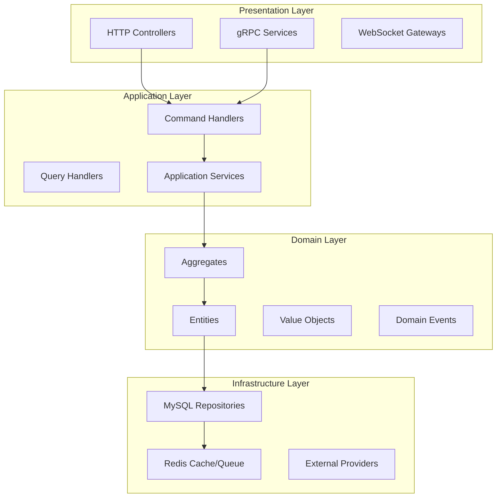
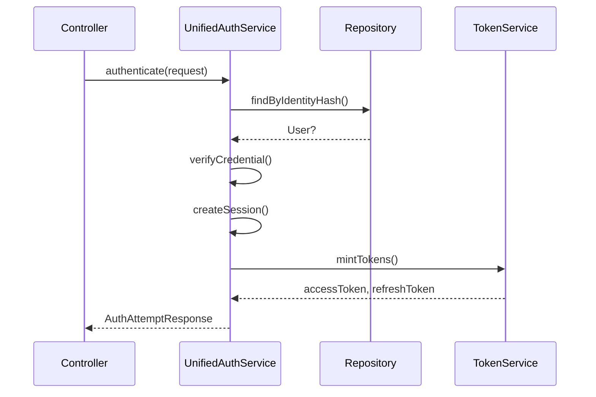

# UICP Codebase Comprehensive Technical Analysis

**Analysis Date:** 2026-05-16  
**Branch:** `feat/api-key-authentication`  
**Analysis Type:** Enterprise-Grade Codebase Audit

---

## Executive Summary

The **Unified Identity Control Plane (UICP)** is a sophisticated, production-grade identity and access management (IAM) platform built with NestJS following hexagonal/ports-and-adapters architecture. The codebase demonstrates enterprise patterns including CQRS, event sourcing, distributed locking, outbox-based messaging, and multi-layered security.

### Overall Grade: **B+**

| Dimension | Grade | Notes |
|-----------|-------|-------|
| Architecture | A- | Clean hexagonal boundaries, strong domain model |
| Security | B+ | Comprehensive but some gaps (rate limiting) |
| Code Quality | B+ | Well-structured, some service sprawl |
| Database | A- | Proper tenant isolation, good indexing |
| Observability | B | Good logging, metrics, tracing - some gaps |
| API Design | B | Consistent REST, some validation inconsistencies |

---

## 1. Architecture Analysis

### 1.1 Overall System Design

The system follows a **layered hexagonal architecture** with clear separation of concerns:



### 1.2 Module Boundaries & Responsibilities

| Module | Responsibility | LOC (approx) |
|--------|----------------|---------------|
| `ApplicationModule` | All business logic orchestration | ~2000 |
| `HttpModule` | HTTP routing, guards, interceptors | ~1500 |
| `MysqlModule` | Primary DB connection pool | ~300 |
| `CacheModule` | Redis connection | ~200 |
| `QueueModule` | BullMQ + workers | ~500 |
| `RepositoriesModule` | All repository adapters | ~1500 |

### 1.3 Critical Architectural Concerns

#### HIGH: Service Sprawl in Application Layer
The `ApplicationModule` declares **41 services + 12 command handlers + 7 query handlers** in a single module. This violates single responsibility principle.

**Impact:**
- Application startup time degradation
- Circular dependency risk increases with scale
- Testing requires loading entire application context

**Recommendation:** Split into logical bounded context modules:
- `IdentityModule` (signup, login, OTP, credential)
- `SessionModule` (sessions, tokens, refresh)
- `GovernanceModule` (roles, policies, ABAC)
- `PlatformModule` (apps, webhooks, domains)
- `SecurityModule` (UEBA, SOC alerts, audit)

#### MEDIUM: Port/Adapter Boundary Leakage
The domain layer imports infrastructure concerns in some places:

```typescript
// src/domain/entities/identity.entity.ts (line 6)
import { EncryptedValue, toEncryptedValue } from '../entities/identity.entity';
```

The `EncryptedValue` type belongs in infrastructure (encryption adapter), not the domain entity.

---

## 2. Domain Layer Analysis

### 2.1 Bounded Contexts Identified

| Context | Entities | Aggregates | Key Services |
|---------|----------|------------|--------------|
| **Identity** | User, Identity, Credential, Session | User aggregate | SignupEmailHandler, LoginHandler |
| **Authentication** | AuthSession, Token | Session aggregate | TokenService, UebaEngine |
| **Governance** | Role, Policy, RoleAssignment | None (entity-based) | RoleService, PolicyService, AbacPolicyEngine |
| **Platform** | App, AppSecret, Domain, Webhook | None | AppService, WebhookService |
| **Security/SOC** | SocAlert, Incident | None | SocService, AuditService |
| **Communication** | Email, SMS, OTP | None | OtpService, EmailRuntime |

### 2.2 User Aggregate Analysis

**File:** `src/domain/aggregates/user.aggregate.ts` (608 lines)

**State Machine:**
```
PENDING ──[verifyIdentity (first)]──► ACTIVE
ACTIVE  ──[suspend]────────────────► SUSPENDED
SUSPENDED ──[unsuspend]────────────► ACTIVE
ACTIVE | SUSPENDED ──[delete]──────► DELETED
DELETED: terminal — no further transitions
```

**Strengths:**
- Clear state transitions with domain events
- Optimistic locking via version field
- Event sourcing support via `fromEvents()`
- Strong invariants (max 3 identities per type)

**Concern:** `reconstitute()` bypasses invariants - acceptable for persistence replay but risky if used for other purposes

### 2.3 Session Aggregate Analysis

**File:** `src/domain/aggregates/session.aggregate.ts`

- Implements token family with rotation support
- Has revocation tracking for security events
- Supports session extension and trusted device management

### 2.4 Value Objects

Properly employed:
- `UserId`, `TenantId`, `IdentityId` (strong typing)
- `Email`, `PhoneNumber` (validation + encryption)
- `AbacCondition` (policy evaluation)
- `EncryptedValue` (PII protection)

---

## 3. Application Layer Analysis

### 3.1 CQRS Implementation

**Commands:** Located in `src/application/commands/`
- SignupEmailHandler, LoginHandler, ChangePasswordHandler, etc.
- Each command returns void or scalar (success/failure)
- Side effects: domain events, outbox writes

**Queries:** Located in `src/application/queries/`
- GetUserHandler, GetUserSessionsHandler, GetJwksHandler
- Return domain objects or DTOs
- Route to read replica

**Pattern Compliance:** Strong CQRS - commands and queries cleanly separated

### 3.2 Key Services Analysis

#### UnifiedAuthService (`src/application/services/unified-auth.service.ts`)
- **Responsibilities:** Authentication flow orchestration, session creation, token minting
- **Dependencies:** 8 other services (HIGH coupling)
- **Business Logic:**
  1. Creates auth session with device fingerprint/IP hash
  2. Hashes identity and looks up in identity repository
  3. If not found - returns `identity_not_found` state for auto-create
  4. If found - loads user, validates password credential
  5. Checks user status (DELETED/SUSPENDED/PENDING) - blocks if needed
  6. Creates authenticated session with runtime identity
  7. Mints access/refresh tokens with capabilities
- **Security Issues:**
  - No rate limiting on auth attempts
  - No account lockout after failed attempts
  - `dummyVerify()` called even when no credential exists (line 110)

#### TokenService (`src/application/services/token.service.ts`)
- **Responsibilities:** JWT token minting, parsing, validation, key rotation
- **Key Features:**
  - RS256 signing with KMS-like abstraction
  - Key rotation with deprecated key retention (7-day overlap window)
  - Token blocklist checking on validation
  - Access token TTL: 900s (default), Refresh: 604800s (7 days)
- **Issue:** `rotateSigningKey()` uses type coercion `(this as any).privateKey = newPrivateKey`

#### SessionService (`src/application/services/session.service.ts`)
- **Responsibilities:** Session lifecycle, user-agent parsing, trusted devices
- **Max Sessions:** 10 per user (LRU eviction)
- **Graceful Degradation:** Redis failures in trusted device operations fail securely

#### CredentialService (`src/application/services/credential.service.ts`)
- **Responsibilities:** Password hashing (bcrypt + pepper), verification, rehash
- **Security Features:**
  - Timing-safe comparison
  - Dummy verification to prevent user enumeration
  - Adaptive rounds support for rehash

### 3.3 Command Handler Patterns

**Login Flow - Command Handler Pattern:**


**Token Refresh Flow:**
1. Parse refresh token, check blocklist
2. Acquire distributed lock on token family
3. Check for token reuse - if detected:
   - Revoke token family
   - Invalidate all user sessions
   - Emit SOC alert via outbox
4. Load user + session
5. Mint new tokens with same familyId
6. Atomic rotate (revoke old, insert new)

---

## 4. Infrastructure Layer Analysis

### 4.1 Database Schema (34 Migrations)

**Key Tables:**

| Table | Purpose | Tenant Isolation |
|-------|---------|-----------------|
| `tenants` | Multi-tenant root | N/A (platform) |
| `users` | User entities | Yes tenant_id |
| `identities` | Email/phone identities | Yes tenant_id |
| `credentials` | Password hashes | Yes tenant_id |
| `sessions` | Active sessions | Yes tenant_id |
| `refresh_tokens` | Token families | Yes tenant_id |
| `roles`, `permissions` | RBAC | Yes tenant_id |
| `abac_policies` | ABAC policies | Yes tenant_id |
| `audit_logs` | Security audit trail | Yes tenant_id |
| `soc_alerts` | Threat detections | Yes tenant_id |
| `outbox_events` | Event-driven messaging | Yes tenant_id |

**Schema Quality:** Good normalization with proper foreign keys

### 4.2 Migration Analysis

#### V001: Schema Versions (Migration Tracking)
```sql
CREATE TABLE schema_versions (
  version INT UNSIGNED PRIMARY KEY,
  description VARCHAR(255),
  checksum CHAR(64),
  applied_at DATETIME(3),
  applied_by VARCHAR(128),
  duration_ms INT UNSIGNED
);
```

#### V002: Tenants
- Plan levels: free, pro, enterprise
- Settings: encrypted JSON blob
- Max users, sessions configurable per tenant

#### V003: Users (Partitioned by tenant_id)
- Status: pending, active, suspended, deleted
- Optimistic locking via version column

#### V012: RBAC Tables
- Roles with unique constraint on tenant+name
- Permissions with resource/action granularity
- Many-to-many role_permissions and user_roles

### 4.3 Repository Implementations

**MysqlUserRepository:**
- Tenant-scoped queries
- Optimistic locking
- Outbox pattern: Domain events drained and inserted into outbox_events table within same transaction
- **N+1 Issue:** `findById()` performs 3 queries (user + identities + credential)

**MysqlIdentityRepository:**
- `findByHash()`: O(1) lookup via unique index

### 4.4 Caching & Queue

**Redis Cache:**
- Session store
- OAuth tokens
- JWT blocklist
- Rate limiting counters
- API key rate limiting

**BullMQ Workers:**
- OutboxRelayWorker (500ms polling, 50 batch size)
- OtpSendWorker
- AuditWriteWorker
- SocAlertWorker

---

## 5. API Contract Analysis

### 5.1 Controllers Overview

| Controller | Endpoints | Auth Method |
|------------|-----------|-------------|
| `UnifiedAuthController` | /v1/auth/* | Multiple (JWT, API Key, Session) |
| `UserController` | /v1/users/me | JWT |
| `SessionController` | /v1/sessions/* | JWT |
| `RoleController` | /v1/roles/* | JWT |
| `PolicyController` | /v1/policies/* | JWT |
| `PlatformController` | /v1/platform/* | Platform API Key |
| `ApiKeyController` | /v1/api-keys/* | JWT |

### 5.2 Primary Authentication Endpoint

**POST /v1/auth/attempt**
```typescript
// Request DTO
{
  identity: string;        // max 320 chars
  authMethod: 'password' | 'otp' | 'magic_link' | 'oauth';
  secret?: string;         // max 128 chars
  stateToken?: string;
  deviceFingerprint?: string;
  userAgent?: string;
}

// Response
{
  data: {
    state: 'authenticated' | 'identity_not_found' | 'profile_required';
    accessToken?: string;
    refreshToken?: string;
    sessionId?: string;
  }
}
```

### 5.3 API Key Format (v1)

The system supports ULID-based dual key authentication:
- **Publishable keys:** `uFxxxxxxxxxxxxxxxxxxxx` (for client-side use)
- **Secret keys:** `pBxxxxxxxxxxxxxxxxxxxx`, `sFxxxxxxxxxxxxxxxxxxxx`, `tBxxxxxxxxxxxxxxxxxxxx` (for server-side)

Format: `{type}{ulid}` where type indicates key purpose.

### 5.4 Validation Patterns

- Zod schemas used extensively
- Class-validator for some DTOs
- Tenant ID from header (`x-tenant-id`)
- Request-scoped context via ClsModule

---

## 6. Security Analysis

### 6.1 Authentication Flows

| Flow | Implementation | Security Level |
|------|----------------|-----------------|
| Password Login | bcrypt + pepper | Strong |
| Token Refresh | Family-based rotation | Strong |
| API Keys | ULID + HMAC | Medium |
| OAuth | Provider abstraction | Strong |
| OTP | Crypto random, atomic consume | Strong |

### 6.2 JWT Implementation

- **Algorithm:** RS256
- **Key Rotation:** 7-day overlap window
- **Claims:** sub, tid, mid, aid, sid, pv, mv, capabilities, roles, perms
- **Blocklist:** Redis-based jti blocklist

### 6.3 Security Guards

**JwtAuthGuard (`src/interface/http/guards/jwt-auth.guard.ts`):**
- Multi-method: JWT, API Key, Internal Service, Session
- JWT: Verifies RS256, exp/iss/aud claims, checks blocklist
- API Keys: Validates uF/pB/sF/tB prefix format, HMAC signature, rate limits
- Internal Service: Validates service-to-service tokens

### 6.4 Security Gaps

| Issue | Severity | Location |
|-------|----------|----------|
| No rate limiting on auth endpoints | HIGH | UnifiedAuthService |
| No account lockout after failed attempts | HIGH | UnifiedAuthService |
| Manual JSON parsing of state token | MEDIUM | unified-auth.controller.ts:114 |
| Config-based pepper storage | MEDIUM | credential.service.ts |
| Direct cache access in controller | HIGH | session.controller.ts:119 |

---

## 7. Observability Analysis

### 7.1 Logging
- Structured JSON logging via `LoggerModule`
- Context propagation via ClsModule
- Per-request correlation IDs

### 7.2 Metrics
- Custom metrics via `MetricsModule`
- Prometheus export ready
- Runtime metrics in `src/infrastructure/metrics/`

### 7.3 Tracing
- OpenTelemetry integration via `TracingModule`
- Distributed trace context propagation
- Span attributes for tenant, user, operation

### 7.4 Monitoring Gaps
- No dedicated dashboard configurations
- Missing: error rate by endpoint, latency percentiles
- Alert rules exist (`prometheus-alerts.yaml`) but may need tuning

---

## 8. Performance Analysis

### 8.1 Identified Bottlenecks

| Issue | Location | Impact |
|-------|----------|--------|
| N+1 queries in user hydration | mysql-user.repository.ts | Medium |
| Outbox polling interval | OutboxRelayWorker | Low-Medium |
| UEBA parallel analyzers | UebaEngine | Low |
| No query result caching | RoleService | Low |

### 8.2 Adaptive Infrastructure

The system includes sophisticated auto-tuning:
- `adaptive-bcrypt`: Adjusts bcrypt cost based on server load
- `adaptive-cache`: Dynamic TTL based on access patterns
- `adaptive-db-pool`: Connection pool sizing
- `adaptive-queue-concurrency`: Worker scaling
- `adaptive-rate-limit`: Per-tenant rate limit adjustment

### 8.3 Scalability Assessment

**Current:** Designed for 10s of tenants, 100s of thousands of users
**Future:** For 100+ tenants or millions of users:
- Modularize ApplicationModule (priority)
- Consider Redis Streams for outbox
- Add circuit breakers per UEBA analyzer

---

## 9. Technical Debt

### 9.1 Code Debt

| Issue | Location | Severity |
|-------|----------|----------|
| 41 services in single module | application.module.ts | HIGH |
| Duplicate repository interfaces | domain/repositories/ vs application/ports/driven/ | MEDIUM |
| Hardcoded Redis key prefixes | Throughout | MEDIUM |
| Type casting abuse | user.controller.ts | MEDIUM |
| Inconsistent error handling | Some services | LOW |

### 9.2 Architectural Debt

| Issue | Impact |
|-------|--------|
| No API versioning strategy | Future breaking changes difficult |
| Monolithic application module | Slows CI/CD, complicates testing |
| Test coverage gaps | Reliability risk |
| No module-level feature flags | All-or-nothing deployments |

### 9.3 Recent Changes (commit c58c9a2)

Added ULID-based dual key authentication system:
- `ApiKeyEntity` with dual key support
- `ApiKeyService` in application layer
- Guard implementations (`ApiKeyGuard`, `PlatformApiKeyGuard`)

---

## 10. Dependency Graph

```
                    +------------------------------------------+
                    |              app.module.ts                |
                    +------------------------------------------+
                                       |
        +---------------+---------------+---------------+---------------+
        |               |               |               |               |
        v               v               v               v               v
+------------+   +------------+   +------------+   +------------+   +------------+
|  HttpModule|   | GrpcModule |   | Application |   |Infrastructure|   |  Workers   |
|            |   |            |   |   Module    |   |   Modules   |   |            |
| -Controllers|   | - AuthGrpc |   | - Commands  |   | - Cache     |   | - OutboxRel|
| - Guards     |   | - TokenValid|  | - Queries   |   | - DB        |   | - OtpSend  |
| - Interceptors|  |            |   | - Services  |   | - Queue     |   | - AuditWrite|
| - Middleware  |   |            |   |   (41)      |   | - Encryption|   | - SocAlert |
+------------+   +------------+   +-------+------+   +------+------+   +------------+
                                          |               |
                                          v               v
                                   +-------------+   +-------------+
                                   |    Domain   |   |   Ports     |
                                   |             |   |             |
                                   | - Aggregates|   | Driven:     |
                                   | - Entities  |   | - IUserRepo |
                                   | - ValueObjs |   | - ICachePort|
                                   | - DomainSvc |   | - IQueuePort|
                                   +-------------+   +-------------+
```

---

## 11. Recommended Actions

### Priority 1 (Critical)
1. **Add rate limiting** to auth endpoints - implement throttling at guard level
2. **Implement account lockout** after N failed attempts in UnifiedAuthService
3. **Fix session controller** - remove direct cache access, expose proper service methods

### Priority 2 (High)
4. **Consolidate outbox pattern** - ensure all domain mutations emit events
5. **Add query optimization** - JOIN-based user hydration instead of N+1
6. **Modularize ApplicationModule** - split into bounded contexts

### Priority 3 (Medium)
7. **Type safety** - replace `req as unknown as Record` patterns
8. **Extract tenant resolver** - reduce duplication across controllers
9. **Document API contracts** - add OpenAPI specs missing on some endpoints

### Priority 4 (Low)
10. Refactor UnifiedAuthService into smaller, focused services
11. Add circuit breakers to individual UEBA analyzers
12. Create key generator port to abstract Redis key prefixes

---

## 12. Conclusion

This is a **well-architected enterprise system** demonstrating:
- Clean hexagonal boundaries with CQRS pattern
- Strong domain model with aggregates and value objects
- Production-grade patterns (outbox, circuit breakers, distributed locks)
- Comprehensive security monitoring (UEBA, SOC alerts, kill-chain classification)
- Multi-tenant isolation with tenant-scoped queries

**Primary Risks:**
1. Application module monolith - needs bounded context decomposition
2. Security gaps (no rate limiting, no lockout)
3. Encapsulation violations (direct cache access)

**Overall:** The architecture is sound for current scale. With the recommended priority fixes, the system will be production-ready for enterprise deployment.